# Plan B by We Are The Champions

## Team
**We Are The Champions**

- Tan Poh Zhai
- Lee Wai Loong
- Yap Chun Hoong
- Yap Shern Yu

**Track:** Lifestyle · Planning an Escape  
**Problem Statement:** Travel Planner  
**Submission:** Plan B  
**Video file / YouTube title:** `We Are The Champions — Plan B — Planning an Escape`  
**Video Presentation:** [Unlisted Youtube Link]  
**Presentation Slides:** [Public Link]  

---

## 1. Project Overview

### The Problem
Trip planning today is fragmented across five disconnected apps and an unstructured group chat: flight confirmations are buried in email, shared budgets rot in Splitwise, day lists sit in Apple Notes, and real-time debates get lost in WhatsApp.

This fragmentation causes three fundamental organizational breakdowns:
1. **Unstructured Preferences Lost in Chat:** Availability dates, personal budgets, and deal-breakers (雷区) are discussed verbally. Without a structured way to normalize and intersect them, groups compromise upward into overspending or settle on dates that do not work for everyone.
2. **Fragile, Unconstrained AI & Fake Data:** Generic travel bots hallucinate non-existent shops, closed cafes, and fabricated ticket prices, while commercial booking APIs introduce strict rate limits, unexpected checkout failures, and demo fragility.
3. **Single-Point Fragility During the Trip:** When a venue is unexpectedly closed or transit is delayed by 30 minutes, traditional tools force users to manually reshuffle the rest of the multi-day trip, frequently cascading into missed hotel check-ins or abandoned plans.

**Stakeholders:** University students, young working adults, and small friend groups (solo or 2–6 travelers) embarking on short, phone-first weekend or holiday escapes.

**Existing Apps & Why They Fall Short:**
- **Wanderlog / TripIt:** Primarily serve individual corporate travelers or heavy itineraries by parsing email booking confirmations. They are bloated, require paid subscriptions for real collaboration, ignore personal budget ceilings, and provide zero automated mechanisms to patch a single disrupted hour on the fly.
- **Splitwise:** Strictly an accounting tool after expenses occur. It has no integration with daily itinerary slots, meaning groups cannot enforce an upfront budget ceiling before money is spent.
- **Google Maps Lists:** Great for saving bookmarks, but completely static. They do not calculate date overlaps, cannot sequence stops based on group pace, and cannot re-route an afternoon when a plan breaks.

### Our Solution
Plan B is a unified trip workspace and constrained AI agent that coordinates travelers from initial alignment to post-trip settlement—whether traveling solo or with a group. It captures individual preferences, locks the group budget ceiling strictly to the lowest personal cap, and displays a grounded map powered by open-source OpenStreetMap and Photon geocoding without external booking dependencies. During transit, its dedicated Trip Mode tracks stops with live countdowns; if a venue is delayed or skipped, Plan B surgically rewrites only that disrupted time slot while keeping booked flights and hotel stays permanently locked.

#### Core Feature-Set:
1. **Clean Identity & Rooms:** Frictionless Supabase authentication. Solo or group trip rooms that can start completely empty without fake preloaded data.
2. **7-Parameter Preference Form:** Captures destination wishlist, dates, budget cap, travel pace (relaxed/moderate/intense), interests, deal-breakers (雷区), and must-visit spots.
3. **Hidden Destination Privacy Toggle:** A traveler can mark a destination hidden from peers. It never drops a pin on the shared map; only the trip's Gemini agent reads it privately server-side to build surprise options without revealing its name.
4. **Automated Alignment Engine:** System calculates shared date windows, aggregates deal-breakers, locks the group budget ceiling to `min(individual caps)`, and requires group destination confirmation before itinerary generation unlocks.
5. **Grounded Dual-Mode Map:** Displays only public, member-added points. Travelers search places via open-source Photon fuzzy autocomplete or tap the map directly for custom coordinates.
6. **Constrained Gemini Agent:** Scoped strictly to one trip room. Generates itineraries using existing place IDs only; immediately halts if 0 places exist and never hallucinates venues or prices.
7. **Dual Operating Modes:** Clean separation between **Plan Mode** (pre-trip alignment & scheduling) and **Trip Mode** (on-the-ground live execution & countdowns).
8. **Single-Slot Replan (Core Innovation):** Marking a delay or cancellation rewrites *only* that single affected time slot using available places, while booked hotel stays and flights remain permanently locked.
9. **Itinerary-Tied Debt Ledger:** Expenses are logged directly against specific itinerary items, calculating a minimal-transaction "who owes whom" debt graph.
10. **Real-time Team Group Chat:** In-room chat powered by Supabase Realtime where members discuss plans, share place cards, and receive automated system event alerts (delays, replans, expense logs).
11. **Cross-Platform Responsive Interface:** 390px mobile-first PWA with a 6-tab persistent bottom bar (`Trips · Map · Plan · Money · You · Chat`) and a responsive 3-column desktop web command center.

---

## 2. Ideation & Process

### 2.1 Ideas We Considered

| Idea | Status | Why it was Kept / Dropped |
| :--- | :--- | :--- |
| **A. Plan B Grounded Collaborative Workspace (Chosen)** | **Kept (Chosen)** | Directly solves the root organizational gap: replaces 5 fragmented tools with one trusted record for people, money, and days. Scoped Gemini agent schedules only member-added places, eliminating AI hallucinations and brittle booking API failures while delivering surgical single-slot replanning. |
| **B. Vercel Serverless + Supabase Cloud Architecture (Chosen)** | **Kept (Chosen)** | Delivers native full-stack Nuxt 3 (Nitro) SSR compatibility, PostgreSQL Row-Level Security (RLS) for cryptographic isolation of hidden destinations, and managed Realtime CDC websockets for instant group chat and live itinerary broadcast without managing stateful websocket server clusters. |
| **C. Grounded Dual-Mode Map: Photon Search + Tap-to-Pin (Chosen)** | **Kept (Chosen)** | Combines open-source Photon geocoding (OpenStreetMap data) for fast, free-text fuzzy autocomplete with direct map tapping for custom points. Provides a responsive, 100% reliable mapping experience with zero external booking dependencies. |
| **D. Real-time Team Group Chat with Live Broadcast Feed (Chosen)** | **Kept (Chosen)** | Consolidates trip communication inside the room via Supabase Realtime websockets. Eliminates switching to external messaging apps by allowing members to share place cards and receive automated broadcast notifications whenever a slot is replanned or an expense is logged. |
| **E. Cloudflare Architecture (Pages + Workers + D1 + KV)** | **Dropped** | Explored for edge compute latency and zero cold starts. Dropped because Cloudflare Workers' V8 isolate runtime imposes strict Node.js API limitations that complicate standard SSR dependencies and cryptographic libraries. Furthermore, Cloudflare D1 (SQLite at the edge) lacks PostgreSQL Row-Level Security (RLS) policies essential for server-side hidden destination privacy isolation, and lacks native Change-Data-Capture (CDC) websocket channels for room-wide group chat and live disruption feeds (requiring complex custom Durable Objects / WebSocket hibernation orchestration). Vercel Serverless + Supabase was chosen as the superior, production-ready stack for full Node.js Nitro compatibility, battle-tested Postgres RLS, and managed Realtime channels. |
| **F. All-in-One Booking Super-App with Live Flight/Hotel APIs** | **Dropped** | Commercial booking APIs impose rigid rate limits, high quota costs, and frequent checkout error states. Group travelers book accommodations individually or outside apps anyway; building checkout flows introduces fake availability and brittle failure modes. |
| **G. Conversational Free-Form Travel Chatbot** | **Dropped** | Unconstrained LLMs generate generic, hallucinated tourist itineraries with fake venue names, inaccurate pricing, and zero awareness of real group constraints or lowest-budget ceilings. |
| **H. Strict Public Nominatim Geocoder** | **Dropped** | Public Nominatim enforces a strict 1 request/second fair-use rate limit which breaks real-time search-as-you-type autocomplete and often misplaces pins for informal local venue names. Replaced by Photon. |

---

### 2.2 Ideation Boards & System Architecture Diagrams

All architectural workflows and domain models are embedded natively in Mermaid for direct GitHub rendering and presentation reviews.

#### 2.2.1 Problem Tree
**Logic:** Three root organizational failures combine into one core breakdown: **the lack of a single trusted trip record**. This produces four major downstream failure modes: overspending, unaligned dates, hallucinated venues, and trip collapse after a minor transit delay.

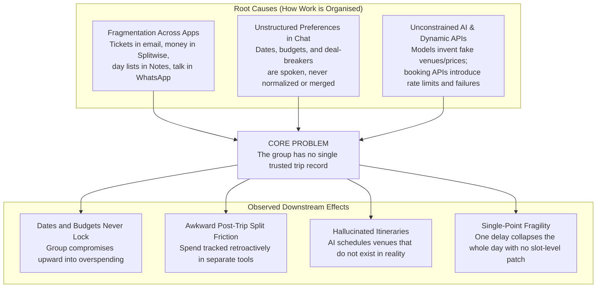

| Layer | Component | Deep Rationale |
| :--- | :--- | :--- |
| **Root Cause** | Fragmentation across apps | Bookings, shared money, and daily agendas never live in one shared state, forcing manual human synchronization. |
| **Root Cause** | Preferences lost in chat | Availability windows, budget ceilings, and hard deal-breakers are discussed informally, making automated alignment impossible. |
| **Root Cause** | Unconstrained AI & fragile APIs | Allowing an LLM to invent venues or relying on live booking APIs creates broken schedules and demo fragility. |
| **Core Problem** | **No single trusted trip record** | No participant can point to one authoritative ground truth for people, dates, budget ceiling, map pins, and schedule rows. |
| **Effect** | Endless negotiation & overspend | Without a computed group ceiling (minimum individual cap), groups default to the highest spender's wishes. |
| **Effect** | Post-trip settlement friction | Disconnected receipts produce awkward calculations days after returning home. |
| **Effect** | Fake shops and hallucinated venues | Itineraries look full on paper but fail on the ground. |
| **Effect** | Domino-effect trip failure | A missed train or closed cafe breaks the entire remaining schedule because there is no mechanism to patch just that hour. |

---

#### 2.2.2 System Boundary Use Case Diagram
**Logic:** Formal UML representation of the Plan B workspace boundary, distinguishing interactions between **Travelers**, the **Room Owner**, and the autonomous, trip-scoped **Gemini Agent**.

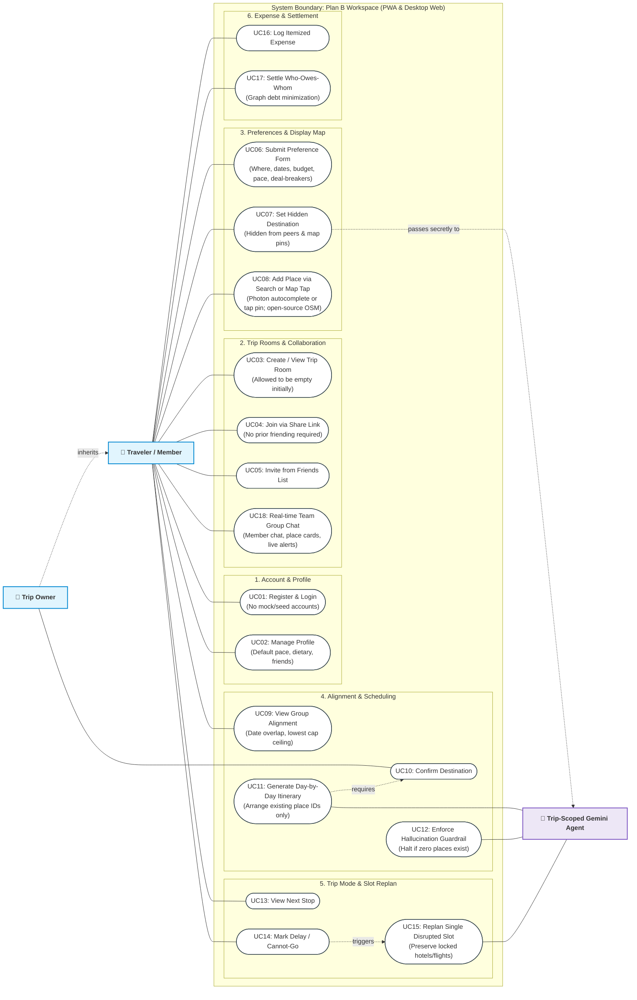

| Use Case ID | Name | Actor(s) | Preconditions & Business Rules |
| :--- | :--- | :--- | :--- |
| **UC01** | Register & Login | Traveler | Clean user authentication via Supabase Auth. Zero pre-seeded or fake users. |
| **UC02** | Manage Profile | Traveler | Sets personal defaults for travel pace, dietary requirements, and access to friends. |
| **UC03** | Create / View Room | Traveler | Can create solo trips or group rooms. Trips list is allowed to be empty initially. |
| **UC04** | Join via Share Link | Traveler | Anyone with the link can join; mutual friending is explicitly not required. |
| **UC05** | Invite from Friends | Traveler | Pulls from the user's friend connection list. |
| **UC06** | Submit Preference Form | Traveler | Submits destination wish, date window, budget ceiling, pace, interests, deal-breakers, and must-visits. |
| **UC07** | Set Hidden Destination | Traveler | Destination toggle hides the place from peers and map display. Only Gemini reads it server-side. |
| **UC08** | Add Place (Search / Tap) | Traveler | Search places with Photon fuzzy autocomplete (OSM) or click map to drop custom pin. Open-source geocoding with no booking lock-in. |
| **UC09** | View Group Alignment | Traveler | Shows computed date overlaps, the group budget ceiling (`min(individual caps)`), and deal-breakers. |
| **UC10** | Confirm Destination | Trip Owner / Group | Prerequisite: Destination must be locked before daily itinerary generation is unlocked. |
| **UC11** | Generate Itinerary | Gemini Agent | Sequences member-added place IDs into days. Gemini is forbidden from inventing place names or prices. |
| **UC12** | Enforce Guardrail | Gemini Agent | If zero member-added places exist, agent halts immediately and asks members to add places. |
| **UC13** | View Next Stop | Traveler | Displays current stop, arrival time, and countdown in Trip Mode. |
| **UC14** | Mark Delay / Cannot-Go | Traveler | Flags a specific itinerary slot as disrupted during transit. |
| **UC15** | Replan Single Slot | Gemini Agent | Rewrites *only* the affected time block using remaining valid place IDs. Locked stays and flights remain fixed. |
| **UC16** | Log Itemized Expense | Traveler | Logs actual spend tied directly to an itinerary item. |
| **UC17** | Settle Who-Owes-Whom | Traveler | Computes debt graph and splits without dynamic ticket lookup. |
| **UC18** | Team Group Chat | Traveler | Real-time chat powered by Supabase Realtime; share place cards, discuss plans, and receive live system disruption notices. |

---

#### 2.2.3 End-to-End Activity Diagram
**Logic:** Swimlane activity diagram mapping the complete journey across **Traveler**, **System Engine**, **Trip-Scoped Gemini Agent**, and **Trip Execution/Money**.

```mermaid
flowchart TD
  subgraph MEMBER["👤 Traveler / Trip Member"]
    Start(["Start"]) --> Auth["Login / Register<br/>(No seed users)"]
    Auth --> Profile["Update Profile Defaults<br/>(Pace, Dietary, Friends list)"]
    Profile --> RoomAction{"Create or Join Trip?"}
    RoomAction -->|Create Solo or Group| Create["Create Empty Trip Room"]
    RoomAction -->|Join via Share Link| JoinLink["Join Trip via Link<br/>(No prior friendship required)"]
    RoomAction -->|Join via Friend Invite| JoinFriend["Accept Friend Invite"]

    Create --> FillPrefs["Submit Member Preference Form<br/>(Where, dates, budget cap, pace,<br/>interests, deal-breakers, must-visit)"]
    JoinLink --> FillPrefs
    JoinFriend --> FillPrefs

    FillPrefs --> HideToggle{"Hide Destination?"}
    HideToggle -->|Yes| MarkHidden["Toggle 'Hide from members'<br/>(Omitted from shared map pins)"]
    HideToggle -->|No| MarkPublic["Keep Destination Public"]

    MarkHidden --> AddPlace["Add Place: Search via Photon<br/>OR Tap Map for Custom Pin"]
    MarkPublic --> AddPlace

    AddPlace --> CheckAlign["Review Group Alignment Dashboard"]
  end

  subgraph SYSTEM["⚙️ Plan B System Engine"]
    CheckAlign --> RunAlign["Compute Alignment Metrics:<br/>1. Find date overlap windows<br/>2. Budget ceiling = lowest individual cap<br/>3. Aggregate shared deal-breakers"]
    RunAlign --> DestConfirm{"Destination Confirmed<br/>by Group?"}
    DestConfirm -->|No| CheckAlign
    DestConfirm -->|Yes| ValidatePlaces{"Member-Added Place IDs > 0?"}
  end

  subgraph GEMINI["🤖 Trip-Scoped Gemini Agent"]
    ValidatePlaces -->|No| Halt["STOP SCHEDULING<br/>(Zero fake venues or prices invented.<br/>Prompts members to add places)"]
    Halt -.-> AddPlace

    ValidatePlaces -->|Yes| IngestData["Ingest Trip Data Server-Side:<br/>- Allowed place IDs<br/>- Hidden destination (Secretly)<br/>- Group budget cap & Pace"]
    IngestData --> ScheduleDays["Generate Day-by-Day Itinerary<br/>(Restricted to existing place IDs;<br/>NEVER reveals hidden destination name)"]
  end

  subgraph TRIP_MONEY["🚀 Trip Execution & Expense Settlement"]
    ScheduleDays --> SwitchTrip["Switch to Trip Mode"]
    SwitchTrip --> NextStop["Display Next Stop & Countdown"]

    NextStop --> EventCheck{"Trip Status"}
    EventCheck -->|Normal Progress| LogSpend["Log Actual Expense<br/>on Itinerary Item"]
    EventCheck -->|Disruption Occurs| MarkIssue["Mark Slot: Delay / Cannot Go"]

    MarkIssue --> LockTrip["Lock Remaining Itinerary:<br/>Flights & booked stays untouched"]
    LockTrip --> ReplanSlot["Gemini: Replan ONLY Disrupted Slot<br/>using available valid place IDs"]
    ReplanSlot --> NextStop

    LogSpend --> DebtCalc["Calculate Debt Graph:<br/>Settle who owes whom (No live fares)"]
    DebtCalc --> EndTrip(["Trip Complete & Settled"])
  end
```

---

#### 2.2.4 Dedicated Functional Architecture Diagrams

##### Function 1: Automated Alignment & Destination Lock Engine
**Description:** Calculates the overlapping availability window, locks the group budget ceiling strictly to the lowest individual cap, aggregates deal-breaker constraints, and enforces a mandatory destination confirmation lock before itinerary generation unlocks.

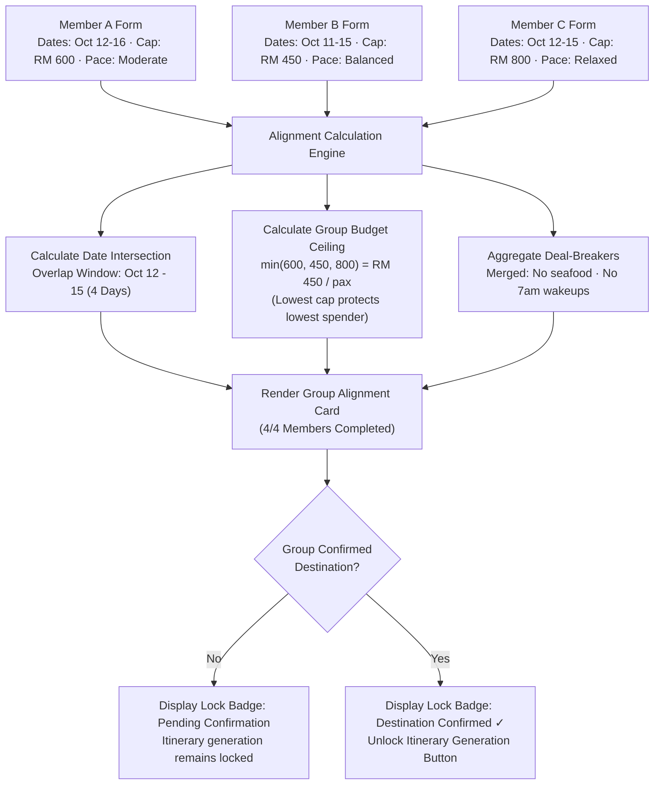

---

##### Function 2: Hidden Destination Privacy & Server-Side Shielding
**Description:** Ensures private surprise wishlists are never leaked to peers via UI or map pins. Client queries are blocked by PostgreSQL Row-Level Security (RLS), while Gemini processes the destination server-side under a strict system prompt forbidding it from ever revealing the name.

```mermaid
flowchart TD
  User["Traveler (Member A)"] --> InputDest["Input Wishlist: 'Surprise Beach Villa'"]
  InputDest --> Toggle["Toggle: [ Hide Destination from Group ]"]
  
  Toggle --> ClientUI["Client UI State (Member A)"]
  Toggle --> ServerAPI["Server API: /api/preferences/submit"]

  ServerAPI --> DB[(Supabase PostgreSQL)]
  DB --> RLS["Row-Level Security (RLS) Policy<br/>is_hidden = true"]

  RLS -->|Peers (Member B & C)| BlockPeers["Map Query: Excluded from pins<br/>Peers cannot see coordinate or venue name"]
  RLS -->|Member A (Owner)| AllowOwner["Member A can see private indicator badge"]

  DB --> ServerGemini["Trip-Scoped Gemini Server Route<br/>(Reads is_hidden destination securely)"]
  ServerGemini --> Prompt["System Instruction Guardrail:<br/>'Factor in private destination characteristics,<br/>but NEVER state its name in outputs.'"]
  Prompt --> ItineraryOut["Generated Itinerary Response<br/>(Secretly incorporates slot without leaking venue)"]
```

---

##### Function 3: Grounded Dual-Mode Map Engine
**Description:** Open-source map integration without commercial API dependencies. Combines real-time Photon fuzzy search autocomplete on OpenStreetMap data with direct canvas tapping for arbitrary custom coordinates.

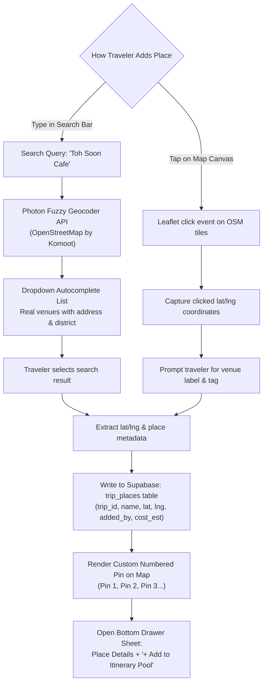

---

##### Function 4: Constrained Gemini Planner & 0-Place Guardrail
**Description:** Enforces strict grounding. The Gemini model is constrained to an allow-list of member-added place IDs. If zero places exist, the engine halts immediately and refuses to fabricate fictional restaurants or attractions.

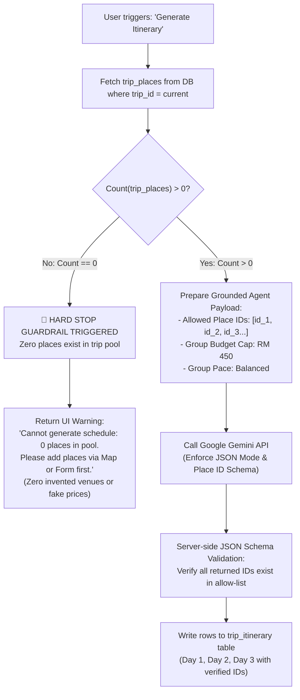

---

##### Function 5: Live Trip Mode & Surgical Single-Slot Replan
**Description:** The core product differentiator. In Trip Mode, when a delay or closure occurs, the system preserves all locked flights and hotel stays while instructing Gemini to recalculate only the single disrupted time block.

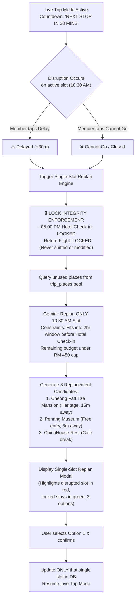

---

##### Function 6: Who-Owes-Whom Debt Graph Settlement Engine
**Description:** Itemized receipts tied directly to itinerary items are parsed by a graph minimization algorithm that computes the minimal number of peer-to-peer transfers required to settle all debts.

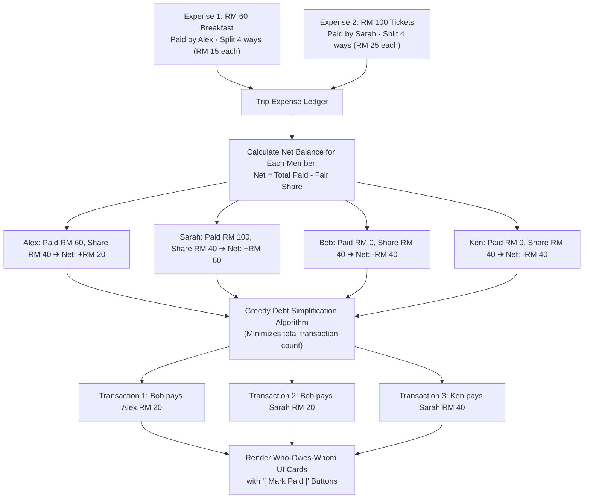

---

##### Function 7: Real-Time Team Group Chat & Broadcast Feed
**Description:** Powers intra-room communication via Supabase Realtime websocket channels. Unifies human chat messages with automatic system broadcast alerts whenever an itinerary slot is replanned or an expense is recorded.

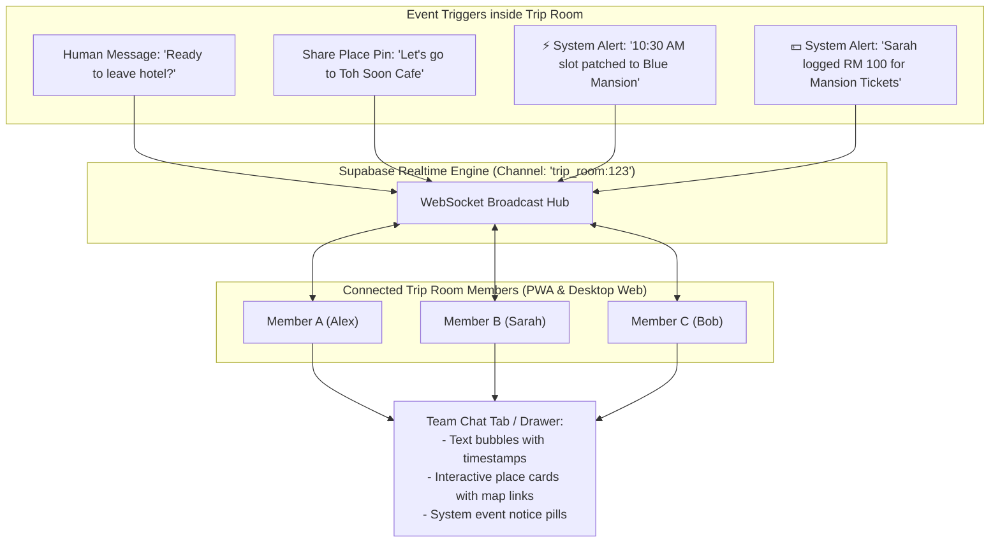

---

#### 2.2.5 14-Screen End-to-End User Flow
**Logic:** Strict sequential flow across all 14 screens. Users cannot trigger Gemini generation until destination is confirmed and real places exist.

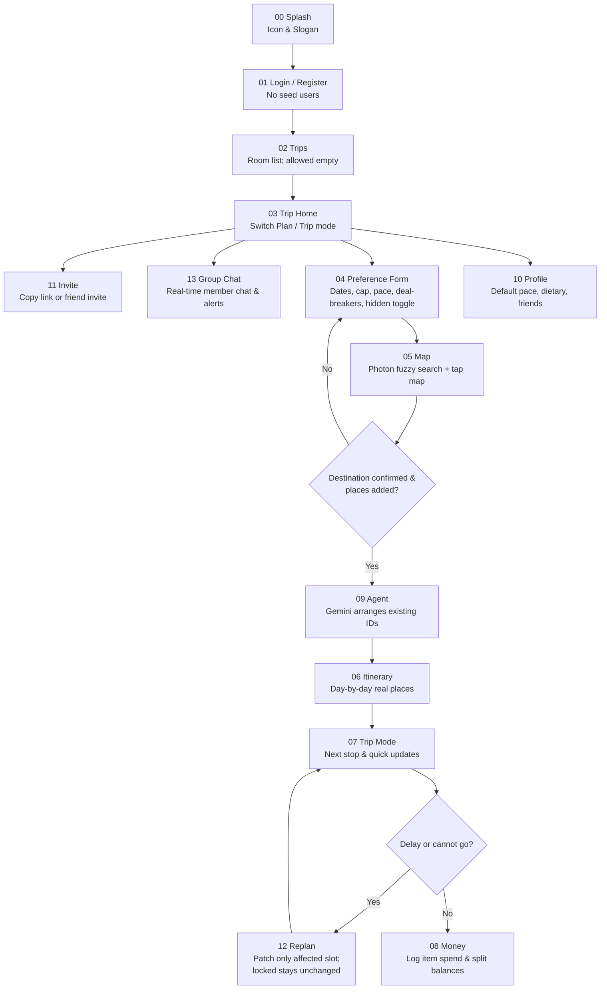

Bottom navigation tabs (always accessible in PWA): **Trips · Map · Plan · Money · You · Chat**

---

#### 2.2.6 Idea Evolution
**Logic:** Each architectural pivot deliberately eliminated a **source of untrue data** and architectural complexity. Product guardrails (no fake pins, no invented shops, no checkout failures) are the direct outcome of this progression.

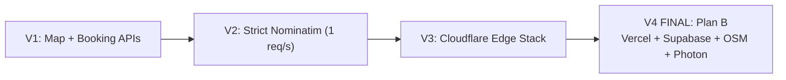

| Architecture Pivot | What We Explored | Why It Failed / Was Discarded | Source of Untrue Data / Complexity Removed |
| :--- | :--- | :--- | :--- |
| **V1: Booking Super-App** | Integrated live flight, hotel, and attraction booking APIs | API keys fail, rate limits hit, and failure modes produce fake prices and broken demo flows. | In-app ticket checkout, dynamic live fares, fake availability counters. |
| **V2: Fragile Geocoding** | Free-text search geocoded via public Nominatim / Google Places | Public Nominatim enforces 1 req/s, fails on informal names, and drops pins in the wrong country. | Unreliable commercial geocoding APIs and misplaced coordinate pins. |
| **V3: Edge-Only Serverless (Cloudflare Stack)** | Cloudflare Pages + Workers + D1 (SQLite) + KV | D1 lacks PostgreSQL Row-Level Security (RLS) required for hidden destination privacy; Workers V8 isolates lack full Node.js API compatibility for SSR libraries; lacks native CDC websockets for real-time group chat without expensive Durable Objects state orchestration. | Edge runtime compatibility friction, insecure manual data filtering, and custom websocket server management. |
| **V4 (Final Production Stack): Plan B on Vercel + Supabase** | Nuxt 3 (Nitro) on Vercel Serverless + Supabase (PostgreSQL with RLS, Auth, Realtime CDC) + Leaflet OSM & Photon geocoder + Scoped Gemini Agent. | 100% buildable, native Vue SSR hydration, battle-tested PostgreSQL RLS isolation, instant managed websockets for group chat, fast fuzzy OSM autocomplete, and 0-place halt guardrail. | Hallucinated shops, invented venue names, seed cities, fake reviews, checkout API drop-offs, and state synchronization leaks. |

---

#### 2.2.7 Alternative Ideas Comparison
**Logic:** Evaluated three distinct paradigms for the hackathon brief. Idea C (Plan B Workspace) was selected because it directly solves the organizational gap without relying on fragile external data.

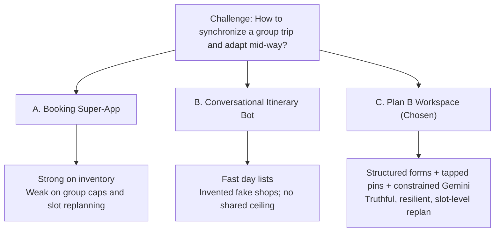

| Evaluation Criteria | A. Booking Super-App | B. Conversational Itinerary Bot | **C. Plan B Workspace (Chosen)** |
| :--- | :--- | :--- | :--- |
| **Core Job** | Purchase flights and hotel stays | Generate full travel text from a prompt | Maintain one trusted record, then rearrange it |
| **Data Source** | Live commercial booking APIs | LLM parametric weights | Member preference forms + tapped map pins |
| **Group Sync** | Poor (individual checkout only) | None (single-user chat session) | **Native** (Solo or group, join by link) |
| **Budget Handling** | Shows price per item; ignores caps | Ignores collective financial constraints | **Strict ceiling** (`min(individual caps)`) |
| **Disruption Replan** | Start inventory search over again | Regenerates entire multi-day prompt | **Patches only the single affected slot** |
| **Data Honesty** | Fragile API failure modes | High rate of hallucinated shops & places | **Zero hallucinations** (hard halt if 0 places) |
| **Hackathon Viability** | High quota cost, brittle live demo | Looks neat, breaks on inspection | **100% buildable, reliable, and truthful** |

---

#### 2.2.8 System Topology Mindmap

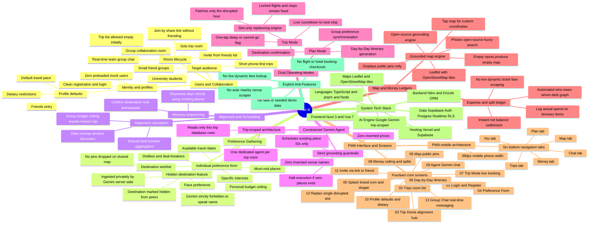

##### Mindmap Pillar Summary

```text
Plan B System Topology
├── 1. Users & Collaboration: Students & friends | Solo or group | Real-time chat | Link join (no friending) | Clean auth
├── 2. Preference Gathering: 7-point form | Hidden destination (no map pin, Gemini reads privately)
├── 3. Alignment & Scheduling: Date overlaps | Budget ceiling = min(caps) | Destination lock prerequisite
├── 4. Constrained Gemini Agent: Scoped to single trip | Existing place IDs only | Stop on 0 places | Zero fake shops
├── 5. Dual Operating Modes: Plan Mode (align/schedule) | Trip Mode (next stop, delay flag, single-slot replan, stay lock)
├── 6. Map & Money Ledgers: Photon search + tap-to-pin (open-source OSM) | Itemized spend | Debt graph who-owes-whom (no live fares)
├── 7. PWA Interface & Screens: 390px mobile layout | 6 bottom tabs (Trips, Map, Plan, Money, You, Chat) | 14 screens (00-13)
├── 8. System Tech Stack: Nuxt 3 + Vue 3 | Nitro Server | Drizzle ORM | Supabase (RLS, Realtime) | Gemini | Leaflet OSM | Vercel
└── 9. Explicit Anti-Features: No seed users/trips | No booking checkout APIs | No auto venue scraping | No dynamic fares
```

---

### 2.3 Mentor Consultation

| Date | Mentor | Feedback Received | What Was Changed |
| :--- | :--- | :--- | :--- |
| `[Session 1]` | `[Mentor Name]` | *Feedback on scoping, grounding, or feasibility will be recorded here.* | *Corresponding architectural or UI changes.* |
| `[Session 2]` | `[Mentor Name]` | *Feedback on presentation, user flow, or edge cases will be recorded here.* | *Corresponding refinements made to submission.* |

---

## 3. Design & Prototype

**UI Prototype:** [ Public Link ]

### Key Screens & User Interactions

The user interface is designed with complete feature parity across two viewing modes: a **mobile-first PWA layout (390px viewport)** optimized for on-the-ground mobile usage with a persistent 6-tab bottom navigation bar (`Trips · Map · Plan · Money · You · Chat`), and a **responsive 3-column desktop web layout** that arranges the itinerary agenda, the interactive map canvas, and the real-time group chat side-by-side.

1. **Screen 03: Trip Home & Alignment Hub**
   - *PWA (Mobile):* Single-column scrollable command center. Displays the 4/4 member submission progress bar, the computed overlapping date window (`Oct 12–15`), the locked group budget ceiling (`RM 450/pax`, strictly derived from the lowest individual cap), and the green destination confirmation lock badge. Features a prominent segmented control toggle between Plan Mode and Trip Mode.
   - *Desktop Web:* Expands the alignment dashboard into the left command panel, providing instant visibility into member availability and budget bars while preserving the main workspace for quick actions.
2. **Screen 04: Preference Form & Hidden Destination Privacy Toggle**
   - *PWA (Mobile):* Structured 7-point vertical form. Travelers enter their dates, budget ceiling, pace pills (Relaxed / Balanced / Intense), and deal-breakers. Activating the "Hide destination from group" toggle isolates the destination: it never renders on peers' maps, passes secretly to Gemini server-side, and is strictly shielded from being named.
   - *Desktop Web:* Form appears as a centered modal with real-time field validation and explanatory tooltips explaining how the privacy shield functions.
3. **Screen 05: Grounded Dual-Mode Map**
   - *PWA (Mobile):* Full-screen interactive Leaflet OSM map showing member-added public pins (1–6). Travelers type in the top Photon search bar for instant fuzzy autocomplete to auto-center and pin venues, or tap directly on the map canvas to drop custom coordinates. Selecting a pin slides up a bottom drawer sheet with venue details and an "+ Add to Pool" button.
   - *Desktop Web:* Map renders in the center column alongside an always-open left sidebar listing all places in the trip pool, allowing drag-and-drop or click-to-center functionality.
4. **Screen 06: Day-by-Day Grounded Itinerary**
   - *PWA (Mobile):* Chronological timeline constructed strictly from member-added place IDs. Shows arrival times, venue tags, and walk/drive transit estimates. Crucially, booked flights and hotel check-ins are badged with a prominent green lock icon: `🔒 Locked Stay (Never moved by replan)`.
   - *Desktop Web:* Displays a multi-day kanban view where each day is a vertical column, allowing side-by-side schedule comparison.
5. **Screen 07: Live Trip Mode & Next Stop Countdown**
   - *PWA (Mobile):* On-the-ground live execution screen. Features a live pulsating status dot, an arrival countdown card (*"NEXT STOP IN 28 MINS: Peranakan Mansion"*), a quick "+ Log Expense" button, and two prominent disruption buttons: `[ ⚠️ Delayed (+30m) ]` and `[ ❌ Cannot Go / Skip ]`.
   - *Desktop Web:* Embeds the live status card in a persistent floating top header while keeping the current day's map route highlighted.
6. **Screen 12: Single-Slot Replan Modal (The Plan B Twist)**
   - *PWA (Mobile):* Triggered instantly when a stop is marked delayed or skipped. Highlights the disrupted time slot in red, displays a prominent green banner confirming locked hotel/flight bookings are 100% protected, and presents 3 alternative replacements sourced strictly from existing member places. Tapping "Confirm Patch" rewrites only that slot.
   - *Desktop Web:* Opens a side-by-side comparison modal showing the original timeline, the isolated disrupted slot, and the updated schedule preview before confirming.
7. **Screen 08: Money & Debt Ledger**
   - *PWA (Mobile):* Transparent financial tracking. Displays a top budget gauge showing current per-person spend against the locked group ceiling. Below, the Who-Owes-Whom settlement matrix presents minimal peer-to-peer transaction cards (*"Bob owes Alex RM 15.00"* with a `[ Mark Paid ]` button), resolving group debts without separate accounting apps.
   - *Desktop Web:* Renders an itemized expense ledger table on the left and the interactive visual settlement graph on the right.
8. **Screen 13: Real-Time Team Group Chat**
   - *PWA (Mobile):* Dedicated in-room messaging tab (`Chat` on the far right of the 6-tab bottom bar). Team members discuss ideas in real time, share interactive place cards directly into the message feed, and receive automatic system broadcast banners whenever a slot is replanned or a new expense is logged.
   - *Desktop Web:* Positioned as a persistent collapsible right rail (320px width), allowing real-time communication without ever navigating away from the active map or itinerary view.

---

## 4. What Makes It Different

| Evaluation Dimension | Traditional Travel Apps (Wanderlog, TripIt) | Group Chat + Splitwise | Generic Travel AI Bots | **Plan B (Our Solution)** |
| :--- | :--- | :--- | :--- | :--- |
| **Itinerary Construction** | Manual email parsing or static lists | None; fragmented text in notes | Unconstrained hallucinated venues & fake prices | **Sequenced strictly from real member-added place IDs** |
| **Group Preference Alignment** | Weak; assumes one person plans everything | Endless unstructured debates in chat | Single-user prompt; no group context | **Structured 7-point form + automated overlap engine** |
| **Budget Enforcement** | Passive cost display; ignores caps | Retroactive accounting after overspending | Ignores budgets or invents fake costs | **Upfront group ceiling locked to lowest individual cap** |
| **Surprise / Private Wishlists** | Non-existent; everything is public | Leaked immediately in group chat | N/A | **Hidden destination toggle (server-side Gemini isolation)** |
| **Mid-Trip Disruption Response** | Manual multi-day rescheduling | Panic in chat; manual reshuffling | Re-generates entire itinerary from scratch | **Surgical single-slot replan (preserves locked stays/flights)** |
| **Expense Settlement** | Requires paid tier or external app | Separate app disconnected from agenda | None | **In-room debt graph tied directly to itinerary items** |
| **Team Communication** | External (WhatsApp / Telegram) | Fragmented across chat history | Single-player chatbot session | **In-room group chat with live itinerary broadcast** |

### Novel Features & The Architectural Twist:
1. **The Lowest-Cap Ceiling (`min(individual caps)`):** Most group trips overspend because the highest-budget member dominates. Plan B programmatically locks the group ceiling to the lowest member cap, ensuring travel remains accessible to everyone in the group.
2. **Hidden Destination Privacy:** Solves peer friction when planning surprises or sensitive destinations. A member can propose a destination without exposing it on the shared map; Gemini factors it in secretly while being strictly forbidden from naming it.
3. **The Constrained Gemini Guardrail:** The AI is not an open-ended writer; it is an itinerary optimizer restricted to an allow-list of member place IDs. If zero places exist, it immediately halts. It is architecturally prevented from inventing fake restaurants or prices.
4. **Surgical Single-Slot Replanning:** When travel disruptions happen, travelers do not need to rewrite the entire trip. Plan B isolates the single broken hour, evaluates candidate replacements from the existing place pool, and patches only that slot—keeping booked flights and hotel reservations permanently locked.

---

## 5. Technical Architecture & Feasibility

### Tech Stack

| Layer | Technology Chosen | Why We Chose It | Constraints & How We Address Them |
| :--- | :--- | :--- | :--- |
| **Frontend Framework** | **Nuxt 3 (Vue 3, TypeScript)** | Full-stack Vue ecosystem, native `<ClientOnly>` wrappers for client-side Leaflet rendering, auto-imports, and first-class PWA support via `@vite-pwa/nuxt`. | SSR hydration mismatch with browser-only Leaflet maps. Resolved cleanly using Nuxt's `<ClientOnly>` component boundary. |
| **Backend / Server Engine** | **Nitro Engine (Nuxt 3 Server Handlers)** | Zero-config, ultra-fast serverless route handlers deployed natively to Vercel with minimal cold-start times. | Stateless execution prevents persistent background timers. Handled by reactive client webhooks and Supabase Realtime subscriptions. |
| **Database & ORM** | **Supabase (PostgreSQL) + Drizzle ORM** | Drizzle offers pure TypeScript schema definitions with zero Rust/engine binaries, ensuring instant serverless cold starts. Supabase provides managed Postgres, Row Level Security (RLS), and Realtime websockets. | Connection pooling limits in serverless. Addressed by utilizing Supabase's transaction connection pooler on port 6543. |
| **Realtime Services** | **Supabase Realtime** | Native PostgreSQL change-data-capture websockets for instant chat messaging, shared map pin updates, and live replan broadcast. | Free-tier concurrent websocket connections. Sufficient for hackathon multi-user demo rooms; channels are scoped per trip room ID. |
| **AI Engine** | **Google Gemini (Trip-Scoped)** | High context efficiency, rapid JSON structured outputs, and excellent adherence to strict system instructions. | Potential LLM hallucination. Addressed by enforcing a server-side JSON schema validator that rejects any response containing place IDs outside the trip's allowed pool. |
| **Mapping & Geocoding** | **Leaflet + OpenStreetMap + Photon** | Open-source mapping stack. Leaflet provides smooth tile rendering; Photon (by Komoot on OSM data) provides fuzzy autocomplete without API keys or commercial rate limits. | Photon fair use and coverage edge cases. Mitigated by allowing direct map tapping to drop precise latitude/longitude coordinates anywhere. |
| **Hosting & Deployment** | **Vercel + Supabase Cloud** | Global edge network with zero server maintenance, automated CI/CD from GitHub, and production HTTPS out of the box. | Serverless function timeout limits (10s on hobby). Gemini and Drizzle queries execute within 1.5–2.5s, well within thresholds. |

---

### System Architecture Diagram

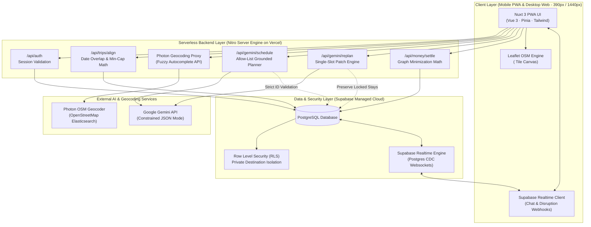

---

### Build Plan & Scope

To ensure 100% technical feasibility, the scope for the build phase is strictly bounded:

#### In-Scope (What We Plan to Build):
- [x] Full authentication flow with personal travel defaults (pace, dietary restrictions, friends entry).
- [x] Solo and group trip room lifecycle with instant link sharing (no mutual friending required).
- [x] 7-parameter preference submission form with the "Hidden Destination" privacy toggle.
- [x] System alignment engine computing date intersections, deal-breaker clashes, and group budget ceiling (`min(individual caps)`).
- [x] Interactive Leaflet OSM map with Photon fuzzy search autocomplete and direct tap-to-pin coordinate saving.
- [x] Server-side Gemini itinerary sequencing constrained to existing place IDs, with a hard halt guardrail if 0 places exist.
- [x] Plan Mode (preparation) and Trip Mode (live next-stop countdown) state machine.
- [x] Surgical Single-Slot Replan modal replacing only the disrupted hour while preserving locked flights and hotel stays.
- [x] Itinerary-tied expense logging with automated who-owes-whom debt graph calculation.
- [x] Real-time in-room team group chat powered by Supabase Realtime with place card sharing and live disruption broadcast.
- [x] Mobile-first PWA interface (6 bottom tabs: `Trips · Map · Plan · Money · You · Chat`) responsive to desktop web.

#### Out-of-Scope (Explicit Anti-Features):
- ❌ **Commercial Flight & Hotel Booking APIs:** No live ticket checkouts or dynamic inventory scrapers. Bookings are represented as user-entered, locked anchor items.
- ❌ **Mock Demo Seed Data:** No pre-seeded fake users, sample trips, or canned venue reviews; the app operates entirely on user-entered data.
- ❌ **Nearby Auto-Scrapers:** The app never pulls unverified external restaurant lists; it schedules only venues intentionally added by travelers.
- ❌ **Dynamic Currency Fare Speculation:** Expense splitting is based on actual logged receipts, not speculative live foreign exchange scrapers.
