# Plan B by we are the champions

> **When Plan A fails, Plan B saves the trip.**

**Track:** Lifestyle · Planning an Escape
**Team:** we are the champions
**Members:** Tan Poh Zhai, Lee Wai Loong, Yap Chun Hoong, Yap Shern Yu

---

## 1. Project Overview

### The Problem
Planning a group getaway with friends should be exciting, but in reality, it is usually stressful and chaotic:
- **Scattered Details:** Flight tickets get buried in email, date polls disappear in WhatsApp, places live in Instagram saves, and expenses get dumped into Splitwise days later.
- **Awkward Money Talks:** Friends have different budgets. Students or junior members often feel uncomfortable saying *"that restaurant is too expensive for me"*, so the group defaults to the highest spender's habits.
- **Sleep & Pace Clashes:** One friend wants to wake up at 6:00 AM to hike, while another refuses to get out of bed before 10:00 AM.
- **Fake AI Hallucinations:** Generic travel chatbots spit out generic tourist essays, often recommending closed shops, fake prices, or impossible routes.
- **Fragile Plans (The Domino Effect):** When heavy rain hits Penang or a ferry gets delayed, the entire day collapses. Nobody knows what to do next, and the trip leader ends up stressed out and blamed.

**Who This Is For:**
College students, young working adults, and small friend groups (2–6 people or solo travelers) who want a quick, easy, mobile-first way to plan weekend escapes without the drama.

---

### Why Existing Apps Fall Short
- **Wanderlog & TripIt:** Built for solo business travelers parsing corporate travel receipts. They feel clunky on mobile, lock basic collaboration behind paid paywalls, ignore individual budget limits, and have no way to quickly rescue a ruined afternoon.
- **Splitwise:** Strictly calculates debts *after* money is already spent. It has no connection to daily plans, so it cannot prevent groups from overspending upfront.
- **Google Maps Lists:** Great for saving bookmarks, but completely static. They cannot find common dates, respect travel pace, or help you adapt when unexpected delays happen.

---

### Our Solution: Plan B
**Plan B** is a phone-first Progressive Web App (PWA) and grounded AI assistant that helps friends plan, coordinate, and travel together smoothly:
1. **Painless Setup:** One friend creates a room and shares a 6-digit code or link. Friends join instantly on their phone browser without mandatory app store downloads.
2. **Upfront Alignment:** Everyone fills a quick 4-step form. Plan B automatically finds overlapping free dates and **locks the group budget to the lowest member's budget cap**, so no friend is ever priced out or embarrassed.
3. **Secret Wishlists:** Want to surprise a friend for their birthday? A private toggle lets you suggest a spot that stays hidden from the group, while the AI secretly routes it into the day.
4. **Real Maps, Zero Fake Venues:** Uses open-source OpenStreetMap with fast Photon autocomplete. Travelers search and tap real places onto their map canvas—the AI only arranges places members actually pinned. If zero places are added, the AI politely halts rather than inventing fake shops.
5. **The Plan B Rescue (Our Core Twist):** During the trip, if it pours rain or a venue is closed, tap **Delay**. Plan B recalculates **only that single disrupted hour**, suggesting 3 nearby dry indoor backups while keeping your booked flights and hotels 100% locked!
6. **Fair & Painless Bill Splitting:** Log expenses against daily activities with even or custom splits. The built-in debt equalizer figures out the fewest transfers needed to settle up.
7. **Dual-Channel AI (Private 1-on-1 & In-Room Group Chat):** Whether in **Plan Mode** (pre-trip) or **Trip Mode** (on the road), travelers can privately open the dedicated AI Agent (Screen 14) to ask 1-on-1 questions about their trip (*"Where is our hotel check-in?"*, *"How much budget do I have left?"*) without cluttering the group chat, or mention `@PlanB` in the shared team chat (Screen 20/21) when decisions need team visibility or consensus summaries.

#### The Core User Journey:
`Open Link / Code → Quick 4-Step Preferences → Align Dates & Lowest Budget → Pin Real Spots on Map → AI Drafts Schedule → Chat & @PlanB Consensus → Live Trip Mode (Done / Delay) → 1-Hour Plan B Rescue → Fair Bill Settlement.`

---

## 2. Ideation & Process

### 2.1 Ideas We Considered

| Approach | Verdict | Why We Chose or Dropped It |
| :--- | :--- | :--- |
| **A. Plan B Collaborative Workspace (Chosen)** | **Kept (Our Product)** | Replaces 5 fragmented apps with one clean mobile space. Automatically protects the lowest budget, uses only real map pins, and provides instant 1-hour replanning when plans fail. |
| **B. Vercel Serverless + Supabase Cloud (Chosen)** | **Kept (Tech Stack)** | Blazing-fast Nuxt 3 serverless rendering, secure PostgreSQL database for private wishlists, and built-in WebSockets for real-time group chat without running heavy servers. |
| **C. OpenStreetMap + Photon Search (Chosen)** | **Kept (Mapping)** | Fast search-as-you-type autocomplete and tap-to-pin without commercial Google Maps API fees, credit cards, or rate limits. |
| **D. In-Room Chat with @PlanB Concierge (Chosen)** | **Kept (Collaboration)** | Keeps communication inside the trip room. Friends can mention `@PlanB` to get instant answers or summarize 100+ chat messages into actionable agreements. |
| **E. All-in-One Booking Super-App with Live Flight/Hotel APIs** | **Dropped** | Airline and hotel booking APIs are notorious for rate limits, high fees, and checkout errors. Travelers book flights separately anyway; fake booking checkouts only create fragile demos. |
| **F. Free-Form Conversational Chatbot** | **Dropped** | Open-ended chatbots hallucinate closed restaurants, fake prices, and ignore group budget caps. |
| **G. Strict Public Nominatim Geocoder** | **Dropped** | Enforces a rigid 1-request-per-second limit that breaks smooth autocomplete typing. Replaced with Photon. |

---

### 2.2 System & User Flow Diagrams

All diagrams below illustrate how friends actually use Plan B in real life, from initial planning to live road trips.

#### 2.2.1 Why Group Trips Break Down (The Problem Story)
**The Breakdown:** Three common real-world friction points cause group trips to fall apart, leading to overspending, arguments, and ruined days.

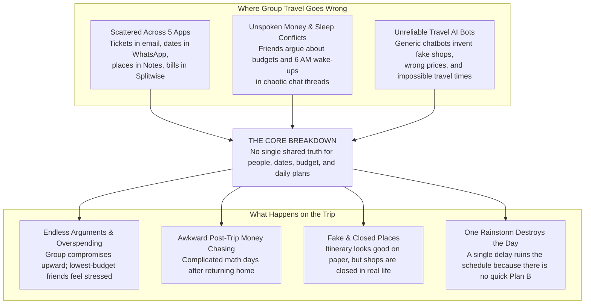

---

#### 2.2.2 How Friends Experience Plan B (User Journey)
**The Flow:** How a group of friends (Alex, Jamie, Sam, Riley) plans, coordinates, and escapes together step-by-step.

```mermaid
flowchart LR
  Step1["1. Quick Invite<br/>Host creates room & shares<br/>6-digit code or link"] --> Step2["2. 4-Step Intake<br/>Friends enter dates, budget,<br/>pace, deal-breakers & secret spots"]

  Step2 --> Step3["3. Group Alignment<br/>App finds overlapping dates &<br/>locks budget to lowest cap (RM 450)"]

  Step3 --> Step4["4. Pin Real Places<br/>Friends search & tap favorite spots<br/>on OpenStreetMap canvas"]

  Step4 --> Step5["5. AI Drafts Days<br/>Gemini arranges real pinned stops<br/>into Day 1 & Day 2 by travel pace"]

  Step5 --> Step6["6. Chat & @PlanB<br/>Friends discuss in group chat;<br/>ask @PlanB to summarize agreements"]

  Step6 --> Step7["7. Live Trip Mode<br/>On the road: Next stop countdown,<br/>1-tap 'Done' or 'Delay'"]

  Step7 --> Step8["8. 1-Hour Plan B Rescue<br/>Rain hits? AI patches that 1 hour;<br/>hotels & flights stay 100% locked"]

  Step8 --> Step9["9. Fair Bill Split<br/>Log expenses anytime; equalizer<br/>settles debts in fewest transfers"]
```

---

#### 2.2.3 End-to-End Activity Flow
**How It Works Behind the Scenes:** Seamless collaboration between the Travelers, Plan B Engine, AI Assistant, and On-the-Ground Trip Mode.

```mermaid
flowchart TD
  subgraph THE_GANG["👥 The Travel Gang (Alex, Jamie, Sam, Riley)"]
    Start(["Start Planning"]) --> Join["Join via 6-Digit Code (688422)"]
    Join --> FillForm["Submit 4-Step Preferences<br/>(Dates, Budget, Pace, Deal-breakers)"]
    FillForm --> SecretChoice{"Want to plan a surprise?"}
    SecretChoice -->|Yes: Birthday / Date| HideSpot["Toggle 'Hide from group'<br/>(Kept secret from peer screens)"]
    SecretChoice -->|No: Regular Stop| PublicSpot["Save as Public Suggestion"]
    HideSpot --> PinSpots["Search & Pin Real Places on Map<br/>(Tek Sen, Kek Lok Si, Penang Hill)"]
    PublicSpot --> PinSpots
    PinSpots --> GroupChat["Coordinate in Group Chat<br/>(Share pins & discuss timing)"]
    GroupChat --> AskSummary["Ask '@PlanB summarize opinions'<br/>(AI extracts agreed stops & open items)"]
  end

  subgraph PLAN_B_APP["⚙️ Plan B System Engine"]
    FillForm --> CalcOverlap["Find Overlapping Free Dates (Oct 10-14)"]
    CalcOverlap --> LockBudget["Lock Group Budget Ceiling to Lowest Cap:<br/>min(2000, 800, 450) = RM 450/person"]
    LockBudget --> ReadyDashboard["Display Group Alignment Dashboard"]
    ReadyDashboard --> ConfirmCity{"Destination Confirmed<br/>by Group?"}
    ConfirmCity -->|Yes: Penang, Malaysia| CheckPins{"Any real places pinned?"}
  end

  subgraph AI_ASSISTANT["🤖 Trip-Scoped AI Assistant"]
    AskSummary --> SummarizeDebate["Summarize Chat Discussion:<br/>1. Agreed: Tek Sen dinner<br/>2. Desired: Relaxed Day 2 afternoon<br/>3. Action: One-tap apply to schedule"]
    SummarizeDebate --> PostDiff["Post Consensus Card into Group Chat"]
    PostDiff -.-> ConfirmCity

    CheckPins -->|No: 0 places| StopAlert["🛑 Guardrail Triggered:<br/>'No places pinned yet! Please add spots first.'<br/>(Refuses to invent fake places)"]
    StopAlert -.-> PinSpots

    CheckPins -->|Yes: Real pins exist| BuildDays["Draft Day-by-Day Itinerary:<br/>- Sequences real places by travel pace<br/>- Secretly routes surprise spot without leaking name<br/>- Keeps total estimated spend under RM 450 cap"]
  end

  subgraph ON_THE_ROAD["🚗 Live Trip & Fair Bill Splitting"]
    BuildDays --> GoTrip["Switch to Live Trip Mode on Travel Day"]
    GoTrip --> ActiveCard["NEXT STOP Card & Arrival Countdown<br/>(Kek Lok Si Temple · 09:00 AM)"]

    ActiveCard --> RoadStatus{"What happens on the road?"}
    RoadStatus -->|All Good| HitDone["Tap 'Done' (Arrived)"]
    RoadStatus -->|Disruption / Rain| HitDelay["Tap 'Delay' (+30m)<br/>Reason: Heavy rain at Air Itam"]

    HitDelay --> SaveStays["🔒 Protect Anchors:<br/>Booked hotels & return flights remain locked"]
    SaveStays --> QuickFix["AI: Suggest 3 dry indoor backup spots<br/>from your saved place pool"]
    QuickFix --> ActiveCard

    HitDone --> LogBill["Log Expense on Itinerary Stop<br/>(e.g. RM 120 Grab ride, split 4 ways)"]
    LogBill --> SettleDebt["Balance Equalizer:<br/>Shows exactly who pays who in 2 clean transfers"]
    SettleDebt --> FinishTrip(["Trip Complete & Fairly Settled!"])
  end
```

---

#### 2.2.4 Core Feature Flows (How Each Part Works)

##### 1. Finding Common Ground (Date Overlap & Lowest Budget Ceiling)
**The Problem Solved:** Friends talk about dates and budgets in circles. Plan B automatically finds when everyone is free and locks the budget to the lowest spender so nobody feels excluded.

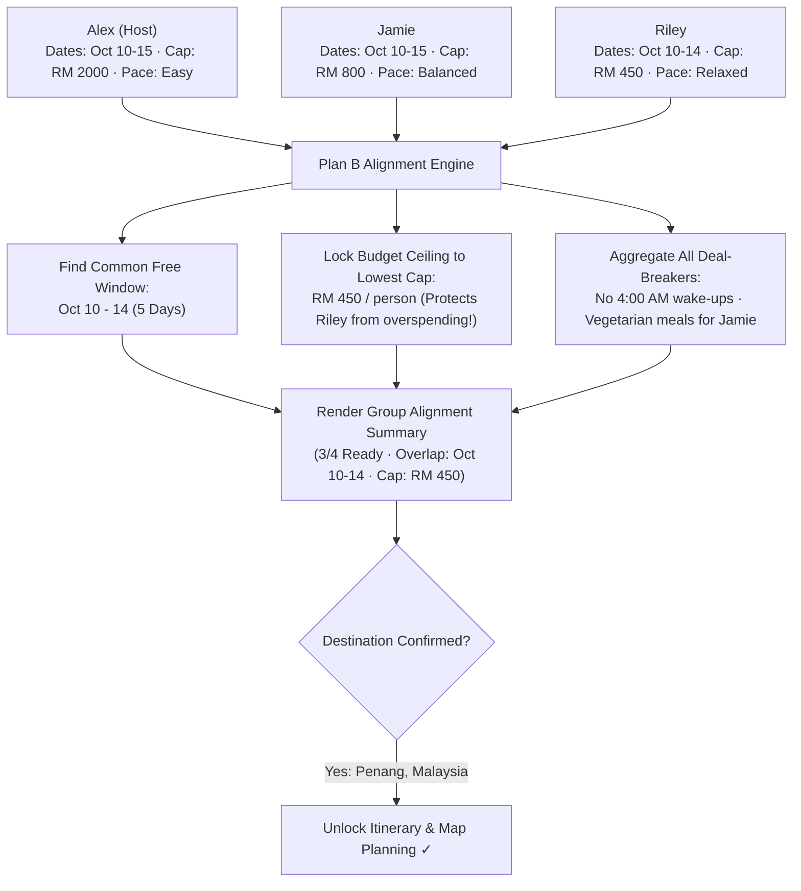

---

##### 2. Keeping a Secret Surprise (Hidden Wishlists)
**The Problem Solved:** Planning a birthday cake pickup or surprise dinner usually gets leaked in group chats. Plan B lets a member submit a private spot that peers cannot see, while the AI secretly routes it into the day.

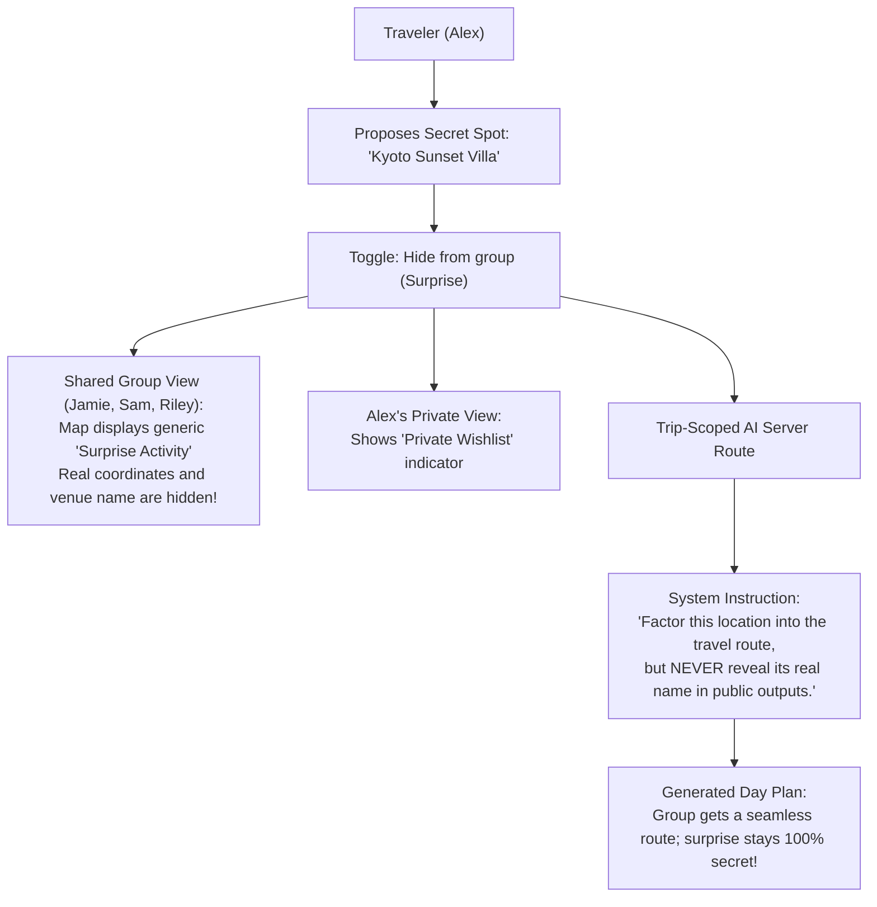

---

##### 3. Pinning Real Places on OpenStreetMap
**The Problem Solved:** No reliance on expensive commercial Google Maps keys or broken booking engines. Search real spots in seconds with Photon autocomplete or tap anywhere on the map to pin custom coordinates.

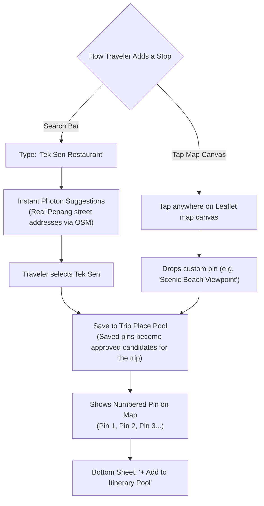

---

##### 4. AI Drafting the Schedule (Strictly Grounded, No Fake Shops)
**The Problem Solved:** Travel bots often invent restaurants that closed three years ago. Plan B's AI is strictly forbidden from inventing places—it only sequences the spots your group actually pinned, and halts if zero places exist.

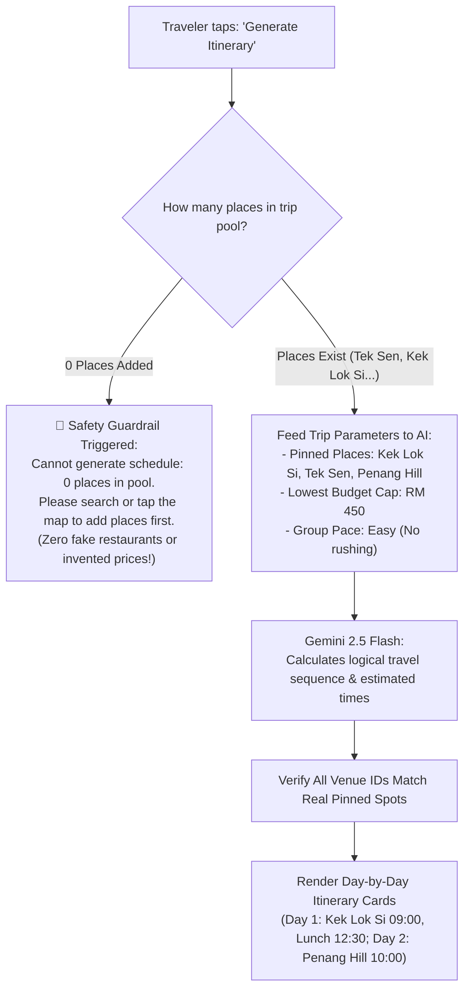

---

##### 5. The Plan B Rescue (Sudden Rain or Delay in Trip Mode)
**The Problem Solved (Our Core Innovation):** When a storm hits or an attraction is closed, traditional apps make you redo the entire 3-day schedule. Plan B patches **only that specific 1-hour slot**, keeping your booked hotel and flight times 100% locked!

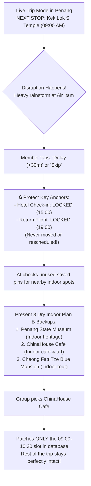

---

##### 6. Fair & Painless Bill Splitting (Zero Awkward Money Talks)
**The Problem Solved:** Splitwise only tracks money days later when everyone has already overspent. Plan B logs receipts directly against itinerary stops and minimizes the number of transfers so friends don't make 10 tiny payments.

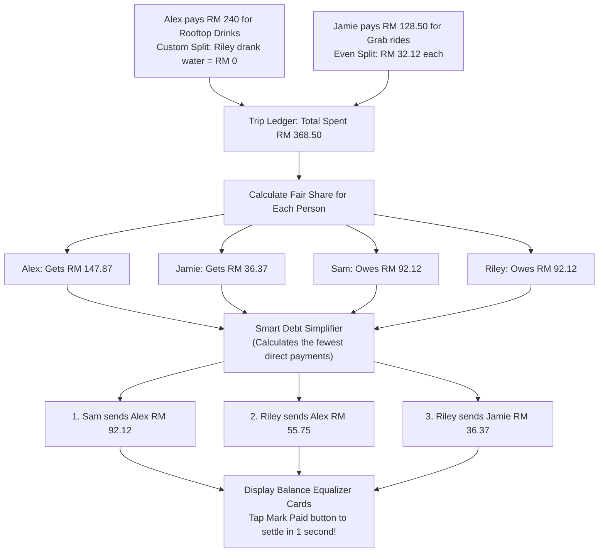

---

##### 7. In-Room Group Chat with @PlanB Concierge & Consensus Summarizer
**The Problem Solved:** 100+ WhatsApp messages make trip leaders go crazy trying to figure out what everyone agreed on. Inside Plan B's chat room, friends can mention `@PlanB` to get instant answers or summarize long debates into clean decisions.

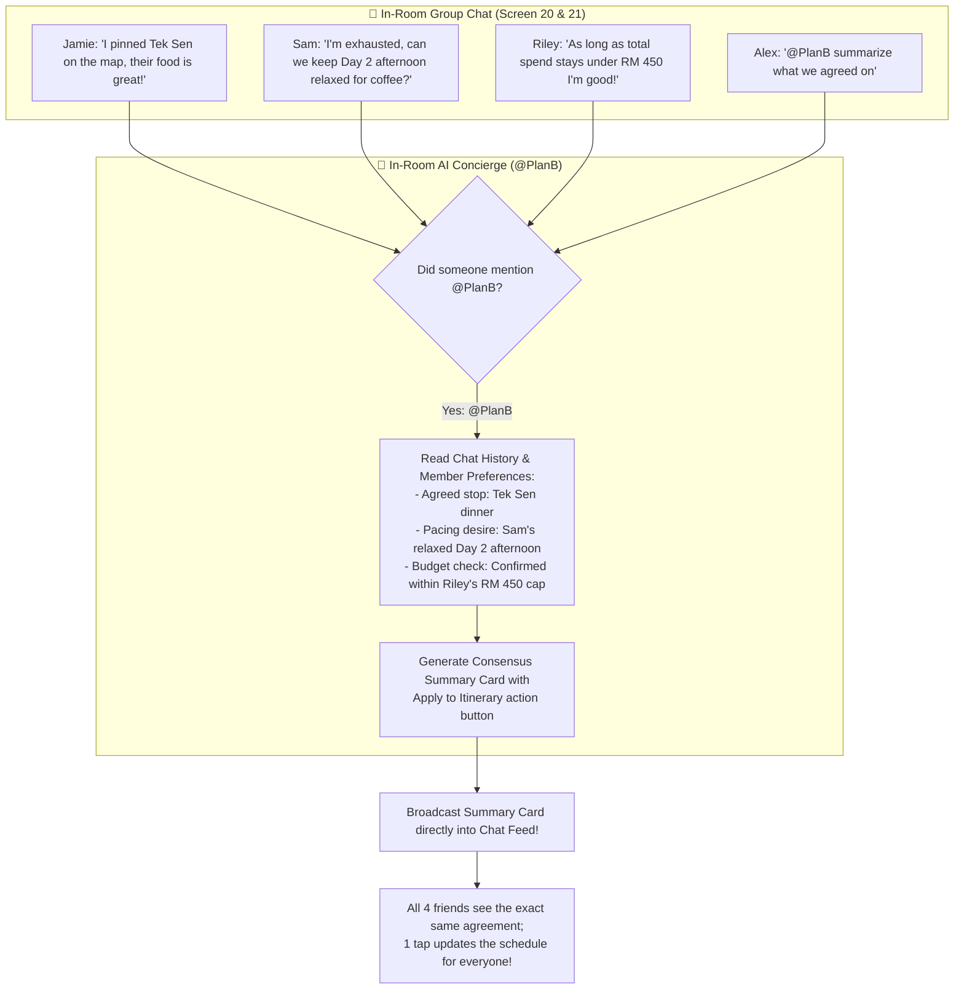

---

#### 2.2.5 Screen-by-Screen Walkthrough (Mapped to 21 Figma Screens)
**The Complete App Flow:** Seamless progression from onboarding to live travel.

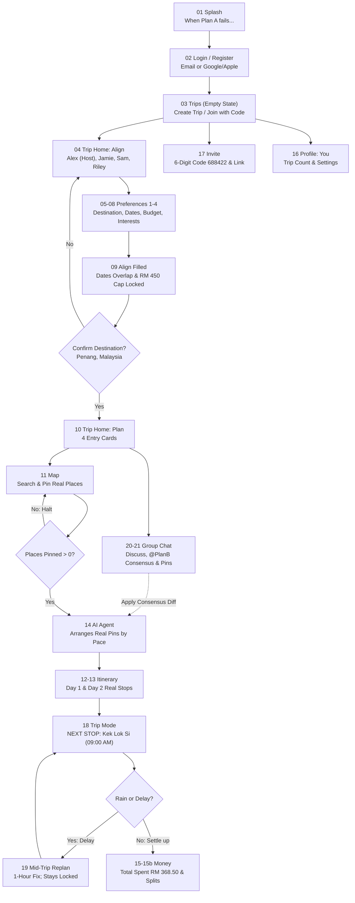

> **Persistent Bottom Navigation Tabs (Always Accessible):**
> `Trips · Map · Plan · Money · Chat · You`

---

#### 2.2.6 How Our Architecture Evolved
**Why We Built It This Way:** We intentionally threw out fragile components (commercial booking APIs, strict geocoders) to keep the app 100% reliable and realistic.

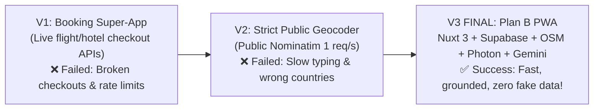

---

#### 2.2.7 Why Plan B Beats Traditional Alternatives

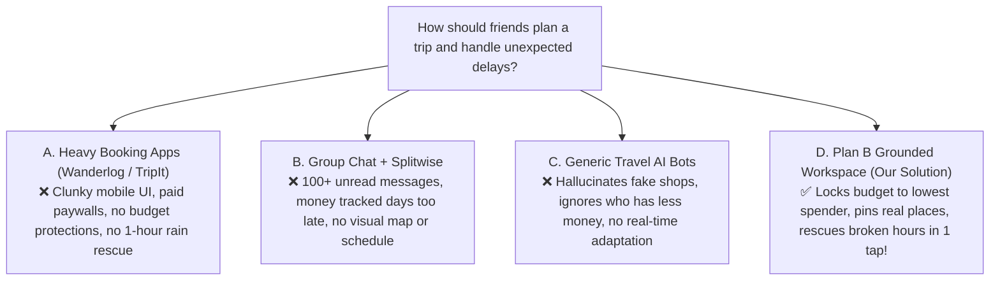

---

### 2.3 Mentor Consultation

*Notes and key feedback from mentor consultations will be recorded here during development.*

---

## 3. Design & Prototype

### Key Screens & User Interactions

Plan B is designed as a phone-first Progressive Web App (PWA) with a persistent 6-tab bottom navigation bar (`Trips · Map · Plan · Money · Chat · You`), allowing travelers to navigate with one hand on the move.

1. **Screen 01 & 02: Splash & Authentication**
   Clean brand opening with our slogan (*"When Plan A fails, Plan B saves the trip"*). Quick sign-up and login with email or Google/Apple accounts.

2. **Screen 03: Trips Home (Empty State)**
   Warm greeting with a `+ New Trip` button and a direct `Join with code` link.

3. **Screen 04: Trip Home (Align Mode)**
   Shows trip name (*"Penang with the gang"*), 4 members (Alex Host, Jamie, Sam, Riley), and an `+ Invite` button. Segmented control toggles between **Align** and **Plan** modes.

4. **Screen 05–08: 4-Step Preference Intake Wizard**
   - **Step 1 (Destination):** Suggest destinations with a `Hide from group` toggle for secret surprises.
   - **Step 2 (Dates):** Enter available date windows (`10/10/2026 to 10/15/2026`).
   - **Step 3 (Budget & Pace):** Set personal spending limit and pace (`Slow`, `Easy`, or `Fast`).
   - **Step 4 (Interests & Deal-Breakers):** Pick interest tags (`Culture`, `Food`, `Nature`, `Shopping`) and hard deal-breakers (`No 4am starts`).

5. **Screen 09 & 10: Alignment Summary & Trip Home (Plan Mode)**
   Displays computed overlapping dates, the group budget ceiling (`RM 450 / person`), and completion progress (`1/4 prefs in`). Locking the destination unlocks the 4 Plan cards: `Itinerary`, `Map`, `AI Agent`, and `Budget`.

6. **Screen 11: Grounded Dual-Mode Map**
   Interactive OpenStreetMap view. Search spots via fast Photon autocomplete or tap directly on the map to drop custom pins. Saved pins become approved stops for the trip pool—zero fake shops.

7. **Screen 12 & 13: Grounded Day-by-Day Itinerary**
   Timeline of sequenced activities (Day 1: `Kek Lok Si Temple 09:00`, `Char Koay Teow lunch 12:30`; Day 2: `Penang Hill 10:00`). Booked accommodations and flights display a green `🔒 Locked Stay` badge.

8. **Screen 14: Trip-Scoped AI Agent (Private 1-on-1 Oracle & Itinerary Controller)**  
   Accessible in **both Plan Mode (pre-trip) and Live Trip Mode (on the road)**. A dedicated 1-on-1 assistant strictly scoped to this trip's live parameters (`3 pins · 1/4 prefs · Budget cap: RM 450`). Travelers can privately ask trip-specific questions (*"What time do we leave tomorrow?"*, *"Who owes money right now?"*, *"Is lunch vegetarian-friendly for Jamie?"*) without broadcasting to the group chat, as well as tap quick chips (`Relax pace`, `Swap Day 2`) to adjust the schedule.

9. **Screen 15 & 15b: Money & Balance Equalizer**
   Itemized shared expenses showing `TOTAL SPENT RM 368.50` (`RM 92.13 / person`). Supports **Even Split** (Grab rides) and **Custom Split** (Rooftop drinks, where Riley is set to RM 0). The Balance Equalizer calculates the fewest transfers to settle up with one-tap `Mark Paid`.

10. **Screen 16 & 17: Profile (You) & Invite**
    Displays traveler profile and trip stats. The Invite screen provides a 6-digit code (`688422`) and direct link (`planb.app/join/688422`) for zero-friction guest joining.

11. **Screen 18 & 19: Live Trip Mode & Mid-Trip Replan**
    On the day of travel, Trip Mode highlights the active `NEXT STOP` card with `Done`, `Delay`, and `Skip` buttons. When rain or delays happen, the **Mid-Trip Replan** modal recalculates *only* that disrupted 1-hour slot with nearby dry indoor options, keeping all booked flights and hotels untouched.

12. **Screen 20 & 21: Real-Time Team Group Chat with In-Room AI Concierge**
    An in-room chat (via the `Chat` tab) where friends share map pins and coordinate plans. Travelers can mention `@PlanB` to ask questions or prompt *"@PlanB summarize our opinions"* to turn long debates into a clean agreement card with a one-tap update button.

---

## 4. What Makes It Different

| Feature | Traditional Travel Apps (Wanderlog, TripIt) | Group Chat + Splitwise | Generic Travel AI Bots | **Plan B (Our Solution)** |
| :--- | :--- | :--- | :--- | :--- |
| **Itinerary Creation** | Manual email parsing or static lists | None; messy text in chat notes | Hallucinates fake shops & wrong prices | **Sequenced strictly from real member-added pins** |
| **Budget Protection** | Passive cost display; ignores caps | Retroactive math after overspending | Ignores budgets or invents costs | **Locks group ceiling upfront to lowest member cap** |
| **Surprise / Private Stops** | Non-existent; everything is public | Leaked immediately in group chat | N/A | **Hidden destination toggle (server-side AI shielding)** |
| **Mid-Trip Disruption Fix** | Manual multi-day rescheduling | Panic in chat; manual reshuffling | Re-generates entire trip from scratch | **Single-slot 1-hour replan (hotels & flights stay locked)** |
| **Expense Settlement** | Requires paid tier or separate app | Disconnected from daily agenda | None | **In-room debt equalizer tied directly to daily stops** |
| **Team Communication** | External (WhatsApp / Telegram) | Fragmented across chat history | Single-player chatbot session | **In-room group chat with @PlanB concierge & consensus summary** |

### Key Product Highlights:
1. **The Lowest-Cap Ceiling (`min-cap`):** Group trips overspend because high spenders dominate. Plan B locks the ceiling to the lowest member budget (e.g. RM 450), keeping travel accessible to everyone.
2. **Hidden Wishlist Shield:** Propose a birthday surprise without spoiling it. The AI routes it secretly without naming it to peers.
3. **The Constrained Gemini Guardrail:** The AI is an optimizer, not an unconstrained writer. If zero places are pinned, it halts immediately instead of inventing fake shops.
4. **Single-Slot Replanning (The Core Plan B):** When a rainstorm hits, don't rewrite 3 days. Plan B patches only that disrupted hour, protecting all booked hotels and flights.
5. **Dual-Channel AI Assistance (Private 1-on-1 + In-Room Concierge):** Whether in **Plan Mode** (pre-trip) or **Trip Mode** (on the road), travelers have two dedicated ways to interact with AI:
   - **Private 1-on-1 Agent (Screen 14):** Open anytime to privately ask trip questions (hotel check-in, personal debts, dietary options) without cluttering the group chat.
   - **In-Room Concierge (`@PlanB` in Screen 20/21):** Mentioned directly in team chat when decisions require group visibility, agreement, and one-tap schedule updates.

---

## 5. Technical Architecture & Feasibility

### Tech Stack

| Layer | Technology Chosen | Why We Chose It | Constraints & How We Address Them |
| :--- | :--- | :--- | :--- |
| **Frontend Framework** | **Nuxt 3 (Vue 3, TypeScript)** | Modern Vue ecosystem, native `<ClientOnly>` wrappers for Leaflet maps, and first-class PWA support via `@vite-pwa/nuxt`. | SSR hydration mismatch with browser-only Leaflet maps. Resolved using Nuxt's `<ClientOnly>` component boundary. |
| **Backend / Serverless** | **Nitro Engine (Nuxt 3 Server Handlers)** | Fast, zero-config serverless route handlers deployed natively to Vercel with near-zero cold starts. | Stateless execution. Handled cleanly via client webhooks and Supabase Realtime subscriptions. |
| **Database & ORM** | **Supabase (PostgreSQL) + Drizzle ORM** | Drizzle offers pure TypeScript schemas with zero heavy binaries. Supabase provides managed PostgreSQL, Row-Level Security (RLS), and Realtime WebSockets. | Connection limits in serverless. Addressed by using Supabase's transaction connection pooler on port 6543. |
| **Realtime Services** | **Supabase Realtime** | Native PostgreSQL change-data-capture WebSockets for instant chat messaging and live disruption alerts. | Free-tier connection limits. Handled easily by scoping channels per trip room ID. |
| **AI Engine** | **Google Gemini 2.5 Flash** | High context efficiency, rapid structured JSON outputs, and strict adherence to system instructions. | Potential LLM hallucination. Prevented by strict allow-list schema validation rejecting unknown place IDs. |
| **Mapping & Geocoding** | **Leaflet + OpenStreetMap + Photon** | Open-source mapping stack. Leaflet provides smooth map rendering; Photon provides fast fuzzy search autocomplete without API keys or fees. | Coverage edge cases. Mitigated by allowing direct map canvas tapping for precise custom coordinates anywhere. |
| **Hosting & CI/CD** | **Vercel + Supabase Cloud** | Global edge network with zero server maintenance, automated GitHub deployments, and production HTTPS. | Serverless function timeout limits (10s on hobby). Gemini and Drizzle queries execute within 1.5–2.5s. |

---

### System Architecture Diagram

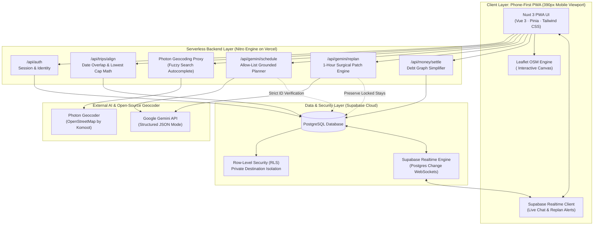

---

### Build Plan & Scope

#### In-Scope (What We Build):
- [x] Clean phone-first authentication with personal travel defaults (pace, dietary restrictions).
- [x] Trip room lifecycle with instant 6-digit code sharing (`688422`) and direct link join.
- [x] 4-step preference submission wizard with the "Hidden Destination" privacy toggle.
- [x] Automated alignment engine computing date intersections and lowest-budget ceiling (`min-cap`).
- [x] OpenStreetMap with Photon fuzzy autocomplete search and direct tap-to-pin coordinate saving.
- [x] Server-side Gemini itinerary sequencing restricted strictly to member-added place IDs, with a 0-place halt guardrail.
- [x] Plan Mode (preparation) and Trip Mode (live next-stop countdown) state machine.
- [x] Single-slot replan modal replacing only the disrupted hour while preserving locked flights and hotel stays.
- [x] Itinerary-tied expense logging with automated debt graph calculation (Balance Equalizer).
- [x] Real-time in-room team group chat powered by Supabase Realtime with place card sharing, live disruption alerts, and `@PlanB` consensus summarizer.
- [x] Mobile-first PWA interface with persistent 6-tab navigation (`Trips · Map · Plan · Money · Chat · You`).

#### Out-of-Scope (Explicit Anti-Features):
- ❌ **Commercial Flight & Hotel Booking APIs:** No live ticket checkouts or dynamic inventory scrapers. Bookings are represented as user-entered, locked anchor items.
- ❌ **Nearby Auto-Scrapers:** The app never pulls unverified external restaurant lists; it schedules only venues intentionally added by travelers.
- ❌ **Dynamic Currency Fare Speculation:** Expense splitting is based on actual logged receipts, not speculative live foreign exchange scrapers.
