# Plan B by we are the champions

> **When Plan A fails, Plan B saves the trip.**

**Track:** Lifestyle · Planning an Escape
**Team:** we are the champions
**Members:** Tan Poh Zhai, Lee Wai Loong, Yap Chun Hoong, Yap Shern Yu

---

## 1. Project Overview

### The Problem
Planning a group getaway with friends should be exciting, but in reality, it is usually stressful and chaotic:
- **Scattered Details:** Flight tickets get buried in email, date polls disappear in WhatsApp, places live in Instagram saves, and expenses get dumped into Splitwise days later.
- **Awkward Money Talks:** Friends have different budgets. Students or junior members often feel uncomfortable saying *"that restaurant is too expensive for me"*, so the group defaults to the highest spender's habits.
- **Sleep & Pace Clashes:** One friend wants to wake up at 6:00 AM to hike, while another refuses to get out of bed before 10:00 AM.
- **Fake AI Hallucinations:** Generic travel chatbots spit out generic tourist essays, often recommending closed shops, fake prices, or impossible routes.
- **Fragile Plans (The Domino Effect):** When heavy rain hits Penang or a ferry gets delayed, the entire day collapses. Nobody knows what to do next, and the trip leader ends up stressed out and blamed.

**Who This Is For:**
College students, young working adults, and small friend groups (2–6 people or solo travelers) who want a quick, easy, mobile-first way to plan weekend escapes without the drama.

---

### Why Existing Apps Fall Short
- **Wanderlog & TripIt:** Built for solo business travelers parsing corporate travel receipts. They feel clunky on mobile, lock basic collaboration behind paid paywalls, ignore individual budget limits, and have no way to quickly rescue a ruined afternoon.
- **Splitwise:** Strictly calculates debts *after* money is already spent. It has no connection to daily plans, so it cannot prevent groups from overspending upfront.
- **Google Maps Lists:** Great for saving bookmarks, but completely static. They cannot find common dates, respect travel pace, or help you adapt when unexpected delays happen.

---

### Our Solution: Plan B

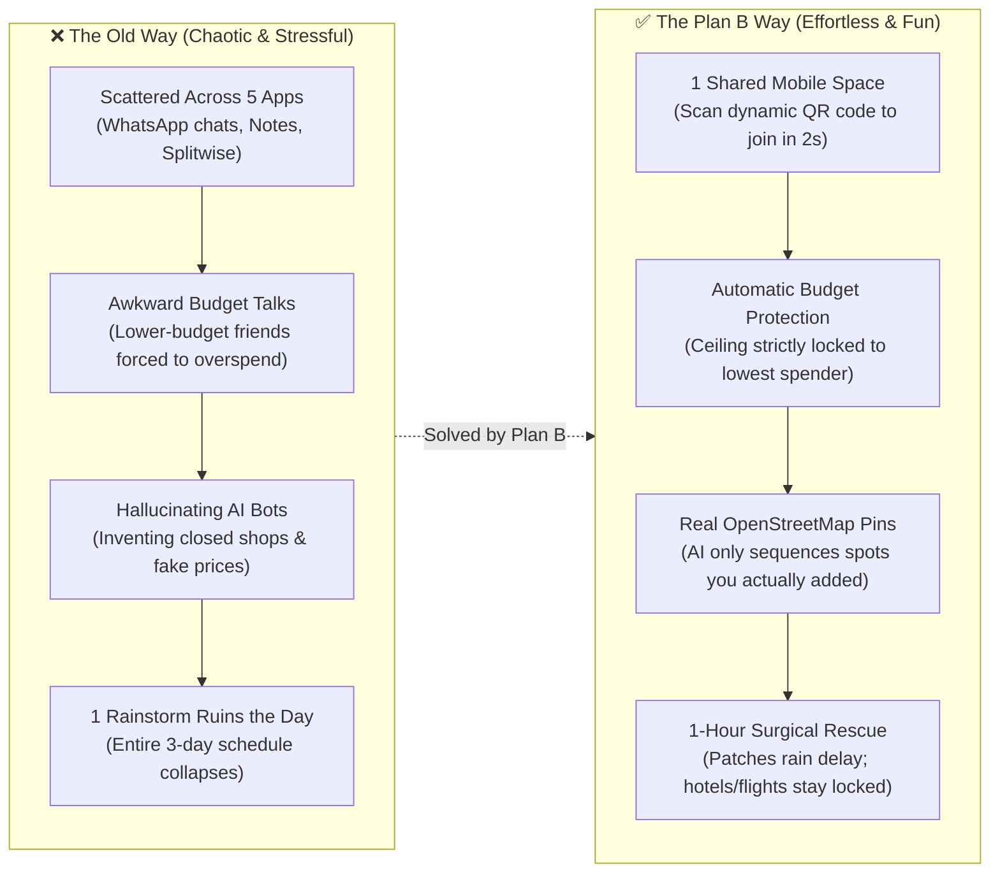

**Plan B** is a phone-first Progressive Web App (PWA) powered by a **Cloudflare-native Multi-Agent System (Mastra Framework)** that helps friends plan, coordinate, and travel together smoothly without friction or fake data:
1. **Painless Setup:** One friend creates a room and displays a dynamic **QR code** or shares an instant link. Friends simply scan the QR code to join instantly on their phone browser without mandatory app store downloads.
2. **Conversational Intake (Zero Manual Preference Forms):** Travelers never have to fill out rigid multi-step preference forms. Instead, you simply talk directly with your Personal AI Agent in natural language, speak casual voice memos, or drop social media screenshots. The agent automatically pulls your travel dates, budget limits, travel pace, dietary restrictions, and secret wishlists into structured profile badges in seconds.
3. **Personal AI Assistant per Traveler:** Every friend has their own dedicated **Personal AI Agent** (built with **Mastra**). It serves as your personal advocate—learning your habits, protecting your wallet, and keeping your secret birthday spots safe from peers.
4. **Admin Agent (Master Arbiter & Decider):** While Personal Agents fight for their individual human's preferences, a centralized **Admin Agent** presides over the trip room. The Admin Agent evaluates all 4 personal agent proposals, resolves date and pace conflicts, authoritatively locks the group budget ceiling to the **lowest member's budget cap** (`min-cap`), and decides the final harmonized schedule for the group.
5. **Real Maps, Zero Fake Venues:** Uses open-source OpenStreetMap with fast Photon autocomplete. The coordinator agent only arranges venues members actually pinned. If zero places are added, the AI halts immediately rather than inventing fake shops.
6. **The Plan B Rescue (Our Core Twist):** During the trip, if it pours rain or a venue is closed, tap **Delay**. The system recalculates **only that single disrupted hour**, suggesting 3 nearby dry indoor backups while keeping booked flights and hotels 100% locked!
7. **Zero-Form Conversational Bill Splitting:** Travelers never need to fill out manual accounting forms. Simply tell your AI Agent via voice note, chat message, or receipt photo with any custom split details, and the system auto-logs the expense. The Money dashboard directly displays the exact amounts each person needs to pay to settle up with 1-tap simplicity.
8. **Dual-Channel AI (Private 1-on-1 & In-Room @PlanB):** Travelers can privately open their personal agent console (Screen 14) to ask questions without cluttering the group chat, or mention `@PlanB` in the shared team room (Screen 20/21) when decisions require group visibility and one-tap consensus cards.
9. **Cloudflare Edge Infrastructure & Selectable AI Options:** Hosted entirely on **Cloudflare** (Pages, Workers, and **Cloudflare D1** serverless SQL database), with pluggable AI engine support: deploy with **Option A: Cloudflare Workers AI** (100% native edge inference) OR **Option B: Google Gemini 2.5 Flash** (high free-tier volume & deep vision) via a single environment switch (`AI_PROVIDER`).

#### The Core User Journey:
`Scan QR Code / Open Link → Chat with Personal Agent (Zero-Form Intake) → Personal Agents Deliberate → Admin Agent Arbitrates & Decides (Locks Lowest Budget) → Pin Real Spots on Map → Admin Agent Sequences Schedule → Live Trip Mode (Done / Delay) → 1-Hour Plan B Rescue → Conversational Expense Logging & Direct Payment Settlement.`

---

### System Topology Mindmap

A high-level visual mindmap capturing the complete Plan B system topology across its 8 structural pillars:

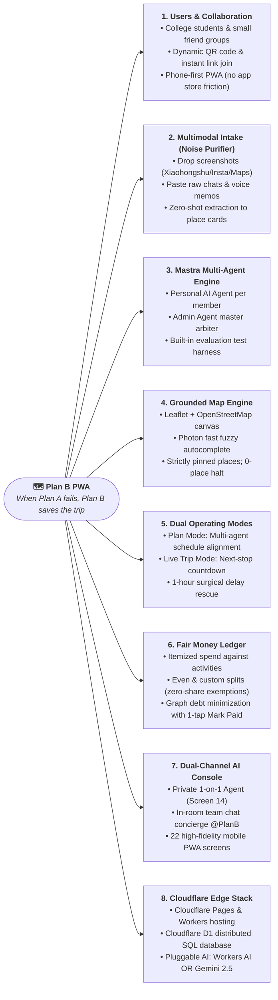

#### Mindmap Pillar Summary

```text
Plan B System Topology
├── 1. Users & Collaboration: Students & friends | Solo or group | QR code / link join | Phone-first PWA
├── 2. Multimodal Intake: Screenshots (Xiaohongshu/IG/Maps) | Raw chat/voice | Zero-shot extraction (no forms)
├── 3. Mastra Multi-Agent Engine: Personal agent per user | Admin Agent master arbiter | Mastra evaluation harness
├── 4. Grounded Map Engine: Leaflet + OSM | Photon fuzzy search | Real pinned places (0-place hard halt)
├── 5. Dual Operating Modes: Plan Mode (align/schedule) | Trip Mode (next stop, delay flag, 1-hour surgical patch)
├── 6. Fair Money Ledger: Itemized spend | Debt graph who-owes-whom | Custom splits (zero-share exemptions)
├── 7. Dual-Channel AI: Private 1-on-1 oracle (Screen 14) | Group chat @PlanB (Screen 20/21) | 6-tab PWA (22 screens)
└── 8. Cloudflare Edge Stack: Cloudflare Pages & Workers | Cloudflare D1 SQL | Pluggable AI (Workers AI OR Gemini)
```

---

## 2. Ideation & Process

### 2.1 Ideas We Considered

| Approach | Verdict | Why We Chose or Dropped It |
| :--- | :--- | :--- |
| **A. Plan B Multi-Agent Workspace (Chosen)** | **Kept (Our Product)** | Replaces 5 fragmented apps with one clean mobile space. Assigns an autonomous Personal Agent to each traveler, arbitrated by an Admin Agent that protects the lowest budget, uses only real map pins, and provides instant 1-hour replanning. |
| **B. Cloudflare Edge + Cloudflare D1 (Chosen)** | **Kept (Tech Stack)** | Sub-millisecond global edge routing via Cloudflare Pages and Workers, paired with Cloudflare D1 distributed serverless SQL for zero cold-start latency and edge co-location. |
| **C. Mastra Multi-Agent Engine & Test Harness (Chosen)** | **Kept (AI Framework)** | TypeScript-native multi-agent orchestration via `@mastra/core`. Provides agent memory, multi-agent negotiation protocols, and automated evaluation test harnesses to guarantee zero hallucinations and rule adherence. |
| **D. Multimodal Zero-Shot Extractor — "The Noise Purifier" (Chosen)** | **Kept (Data Ingestion)** | Allows travelers to drop social media screenshots (Xiaohongshu, Instagram, Google Maps) or paste raw chats/voice notes. Extracts places, budgets, and hours without tedious manual form-filling. |
| **E. OpenStreetMap + Photon Search (Chosen)** | **Kept (Mapping)** | Fast search-as-you-type autocomplete and tap-to-pin without commercial Google Maps API fees, credit cards, or rate limits. |
| **F. In-Room Chat with @PlanB Concierge (Chosen)** | **Kept (Collaboration)** | Keeps communication inside the trip room. Friends can mention `@PlanB` to get instant answers or summarize 100+ chat messages into actionable agreements. |
| **G. All-in-One Booking Super-App with Live Flight/Hotel APIs** | **Dropped** | Airline and hotel booking APIs are notorious for rate limits, high fees, and checkout errors. Travelers book flights separately anyway; fake booking checkouts only create fragile demos. |
| **H. Monolithic Single-Prompt Travel Chatbot** | **Dropped** | Open-ended chatbots hallucinate closed restaurants, fake prices, and cannot balance conflicting group budgets or protect private secret wishlists. |

---

### 2.1.1 Evolution of Architecture: From Fragile Prototype to Multi-Agent Edge Reality

Our system design evolved through three distinct evolutionary generations during development, directly shaped by failure analysis and mentor feedback:

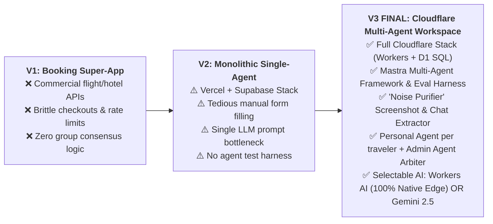

| Dimension | V1 (Commercial Super-App) | V2 (Monolithic Single-Agent) | **V3 FINAL (Cloudflare Multi-Agent Plan B)** |
| :--- | :--- | :--- | :--- |
| **Core Architecture** | Monolithic app calling live ticket APIs | Single-prompt serverless route on Vercel | **Mastra Multi-Agent System on Cloudflare Edge** |
| **Hosting & Compute** | Traditional VM / Node.js container | Vercel Serverless Functions | **Cloudflare Pages + Workers (Global Edge Network)** |
| **Database** | Heavy PostgreSQL container | Supabase Managed Cloud DB | **Cloudflare D1 (Serverless Distributed Edge SQL)** |
| **Data Ingestion** | Dynamic ticket scrapers | Rigid 4-step manual web forms | **"The Noise Purifier": Screenshot & raw chat zero-shot extraction** |
| **AI Representation** | None (Static booking UI) | Single generic prompt for all 4 members | **Autonomous Personal Agent per friend + Admin Agent Arbiter** |
| **Group Alignment** | None (Individual checkout only) | Basic mathematical min-function | **Admin Agent Arbitration (dates, min-cap, pace, secrets)** |
| **AI Evaluation** | None | Manual prompt inspection | **Mastra Automated Agent Harness (evaluates halt & locked stays)** |
| **LLM Execution** | None | Single API call to Gemini | **Selectable (Choose One): Cloudflare Workers AI (100% Native Edge) OR Google Gemini 2.5 Flash** |
| **Disruption Handling**| Restart ticket search | Prompt re-generates entire multi-day trip | **Surgical 1-Hour Plan B Rescue (only affected slot re-routed)** |

---

### 2.2 System & User Flow Diagrams

All diagrams below illustrate how friends actually use Plan B in real life, from initial planning to live road trips.

#### 2.2.0 Multi-Agent System Lifecycle: What the AI Agents Actually Do
**The Flow:** How the multi-agent system processes messy inputs, negotiates team trade-offs, protects budgets, sequences grounded itineraries, and rescues broken hours in real time.

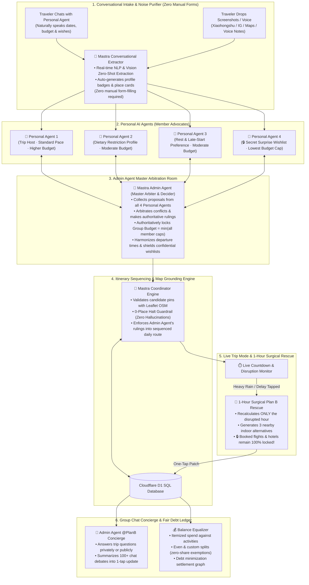

---

#### 2.2.1 Why Group Trips Break Down (The Problem Story)
**The Breakdown:** Three common real-world friction points cause group trips to fall apart, leading to overspending, arguments, and ruined days.

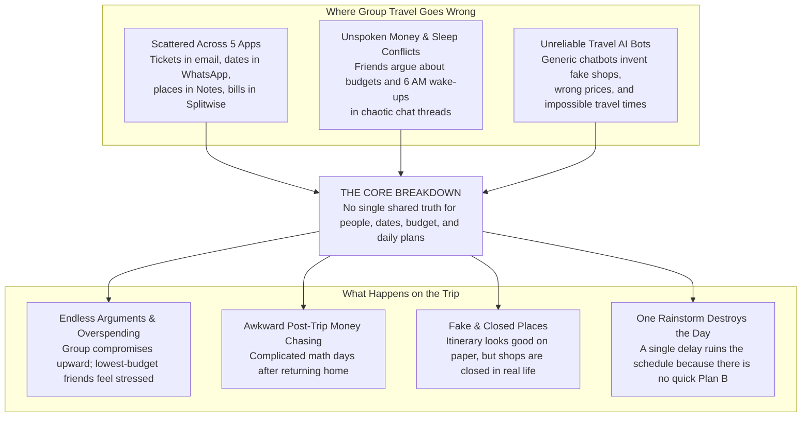

---

#### 2.2.2 How Friends Experience Plan B (User Journey)
**The Flow:** How travel groups plan, coordinate, and travel together step-by-step.

```mermaid
flowchart LR
  Step1["1. Quick Invite<br/>Host creates room & shows<br/>dynamic QR code / link"] --> Step2["2. Conversational Intake<br/>Chat with Personal Agent (no forms);<br/>extracts budget, dates & pace"]

  Step2 --> Step3["3. Admin Agent Ruling<br/>Arbitrates proposals & authoritatively<br/>locks group budget to lowest member cap"]

  Step3 --> Step4["4. Pin Real Places<br/>Friends search & tap favorite spots<br/>on OpenStreetMap canvas"]

  Step4 --> Step5["5. Admin Drafts Schedule<br/>Sequences real pinned stops<br/>by pace under lowest budget cap"]

  Step5 --> Step6["6. Chat & Concierge<br/>Discuss in room; @PlanB Admin Agent<br/>summarizes & applies agreements"]

  Step6 --> Step7["7. Live Trip Mode<br/>On the road: Next stop countdown,<br/>1-tap 'Done' or 'Delay'"]

  Step7 --> Step8["8. 1-Hour Plan B Rescue<br/>Rain hits? AI patches that 1 hour;<br/>hotels & flights stay 100% locked"]

  Step8 --> Step9["9. Fair Bill Split<br/>Log expenses anytime; equalizer<br/>settles debts in fewest transfers"]
```

---

#### 2.2.3 End-to-End Activity Flow
**How It Works Behind the Scenes:** Seamless collaboration between Travelers, Personal AI Agents, Admin Agent Arbiter, and On-the-Ground Trip Mode.

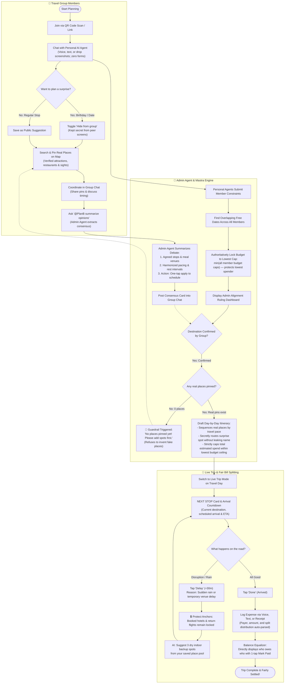

---

#### 2.2.4 Core Feature Flows (How Each Part Works)

##### 1. Finding Common Ground (Date Overlap & Lowest Budget Ceiling)
**The Problem Solved:** Travelers spend days debating dates and budgets without consensus. Plan B automatically calculates the overlapping free window and locks the group budget ceiling to the lowest member cap so nobody feels financial strain.

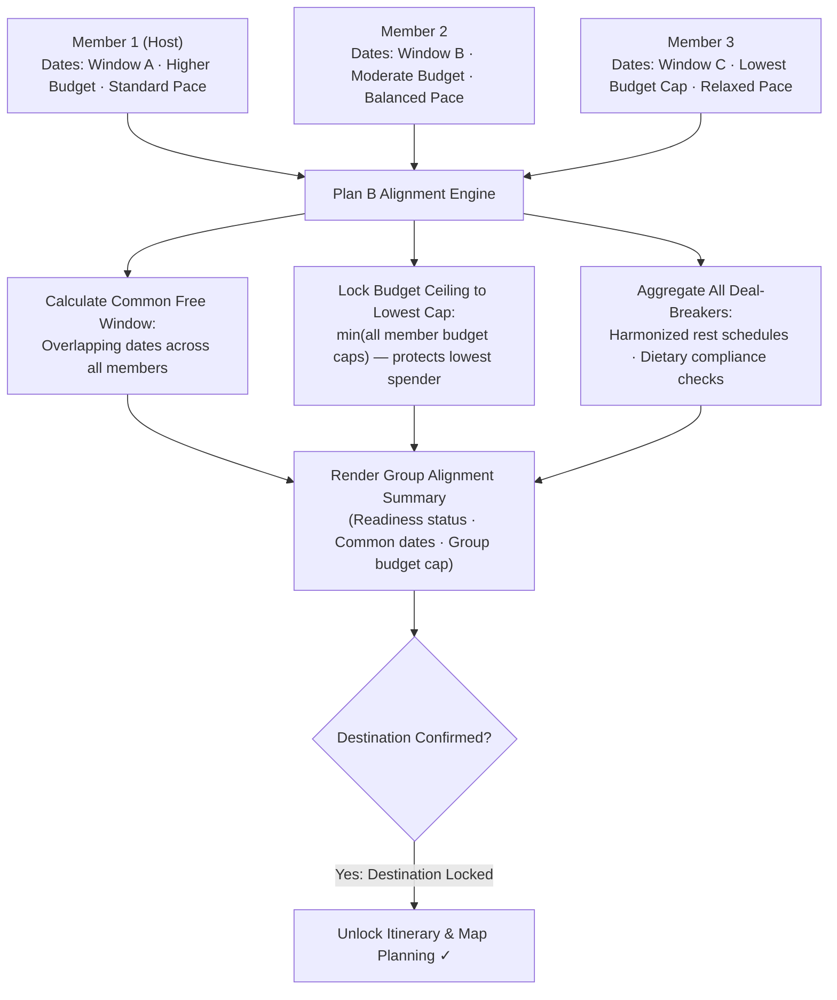

---

##### 2. Keeping a Secret Surprise (Hidden Wishlists)
**The Problem Solved:** Coordinating a surprise celebration or hidden wishlist stop usually leaks in group chats. Plan B allows proposing travelers to submit private spots that peer members cannot see, while the scheduling engine secretly sequences them into the day.

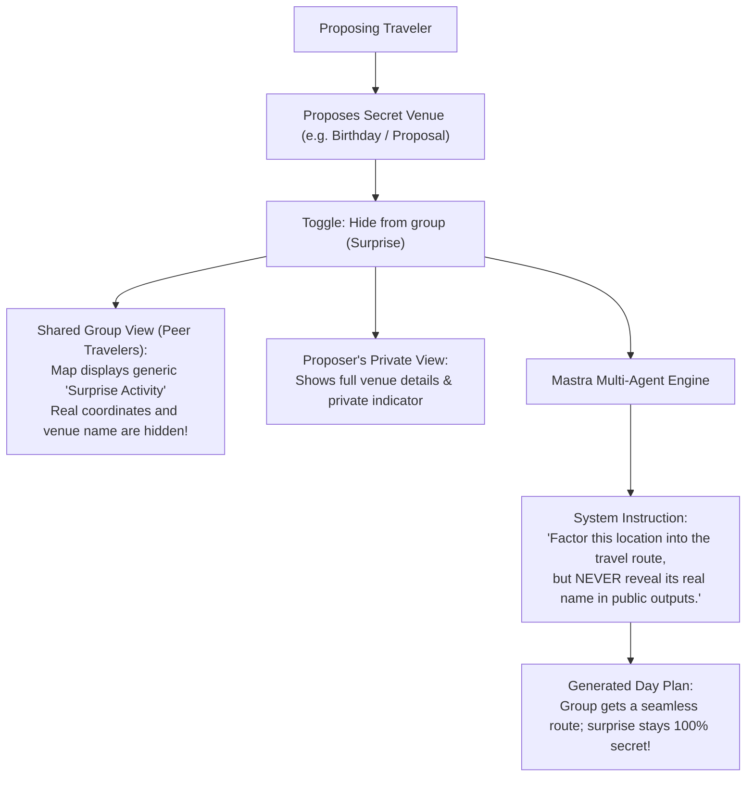

---

##### 3. Pinning Real Places on OpenStreetMap
**The Problem Solved:** Eliminates reliance on commercial map API keys or brittle booking engines. Search real venues via Photon autocomplete or tap anywhere on the interactive map canvas to drop custom pins.

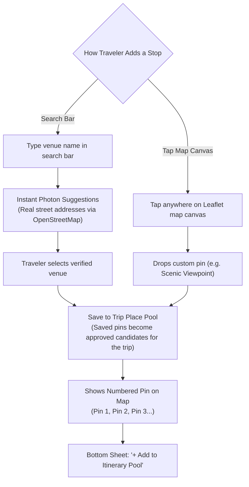

---

##### 4. AI Drafting the Schedule (Strictly Grounded, No Fake Shops)
**The Problem Solved:** Generic travel bots invent non-existent or permanently closed shops. Plan B's engine is strictly constrained: it only sequences venues that travelers actually pinned, and halts execution immediately if zero places exist.

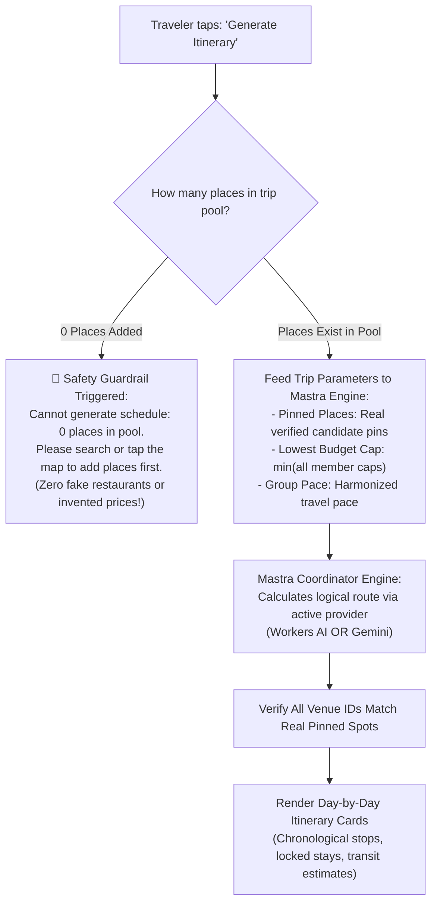

---

##### 5. The Plan B Rescue (Sudden Rain or Delay in Trip Mode)
**The Problem Solved (Our Core Innovation):** When sudden disruptions occur (heavy rain, transit delays, or temporary venue closures), traditional apps force rewriting the entire multi-day schedule. Plan B patches **only that specific 1-hour slot**, keeping booked hotel check-ins and return flights 100% locked!

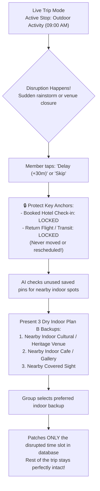

---

##### 6. Fair & Painless Bill Splitting (Zero Awkward Money Talks)
**The Problem Solved:** Traditional split apps require tedious post-trip manual receipt entries. In Plan B, travelers never have to fill out accounting forms—simply tell the AI Agent via voice note, chat text, or receipt photo with any custom split exemptions. The Money dashboard directly displays the exact settlement transfers required!

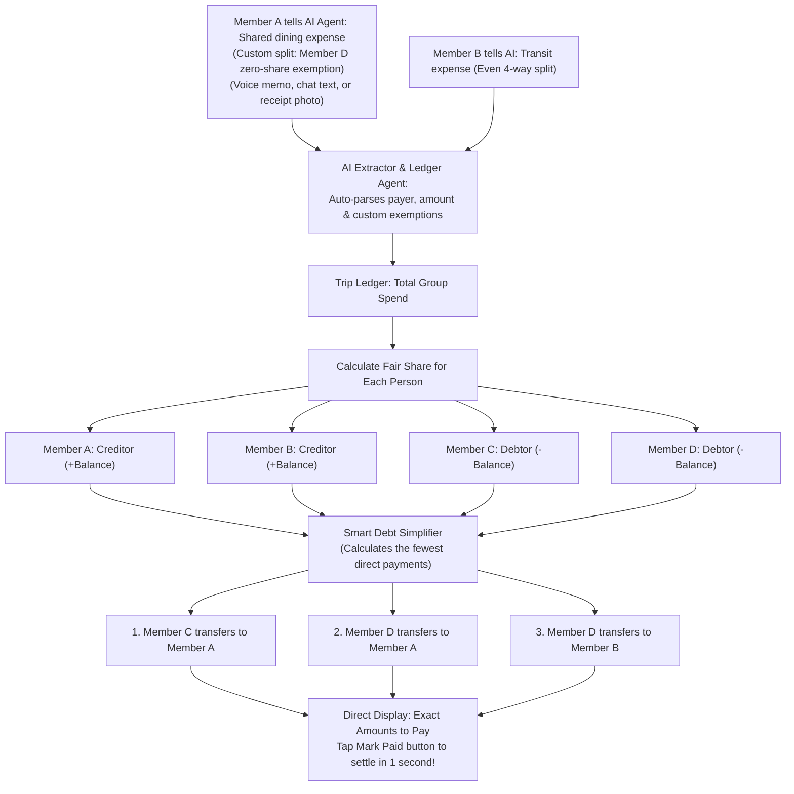

---

##### 7. In-Room Group Chat with Admin Agent @PlanB Concierge & Consensus Summarizer
**The Problem Solved:** Endless unstructured chat threads leave trip decisions buried and forgotten. Inside Plan B's chat room, friends can mention `@PlanB` to get instant answers or summarize debates into actionable, one-tap schedule updates.

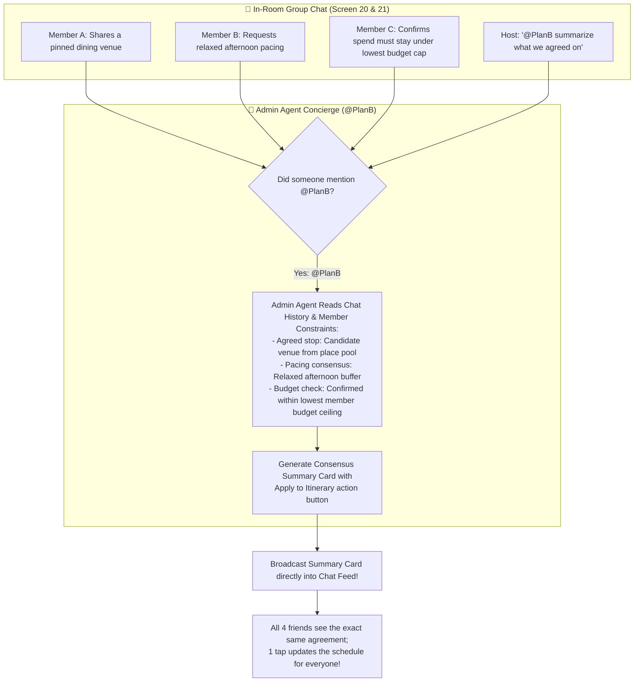

---

#### 2.2.5 Screen-by-Screen Walkthrough (Mapped to 22 Figma Screens)
**The Complete App Flow:** Seamless progression from onboarding to live travel.

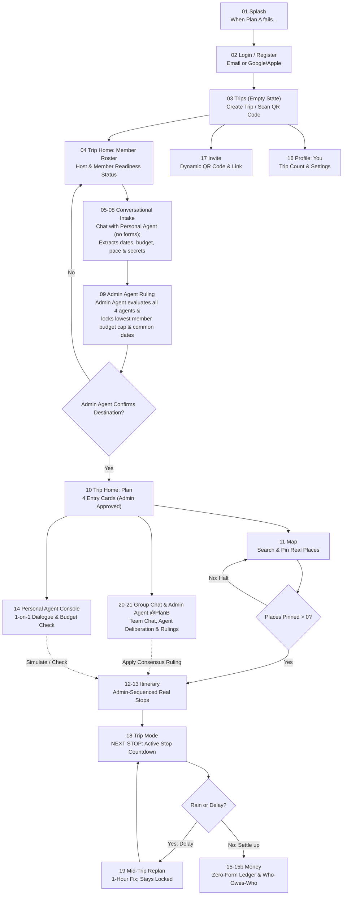

> **Persistent Bottom Navigation Tabs (Always Accessible):**
> `Trips · Map · Plan · Money · Chat · You`

---

#### 2.2.6 How Our Architecture Evolved
**Why We Built It This Way:** We intentionally threw out fragile components (commercial booking APIs, strict geocoders) to keep the app 100% reliable, edge-fast, and multi-agent capable.

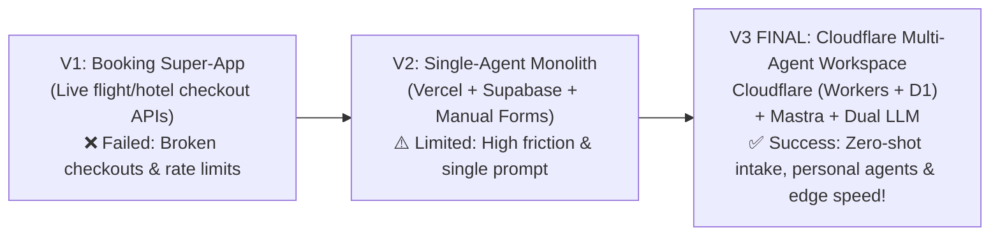

---

#### 2.2.7 Why Plan B Beats Traditional Alternatives

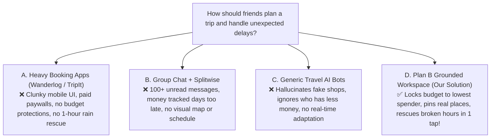

---

### 2.3 Mentor Consultation

| Date | Mentor | Feedback Received | What Was Changed |
| :--- | :--- | :--- | :--- |
| `2026-09-06` | **Jarod Tan** | • **AI Agent Harness:** Implement a dedicated AI agent harness for evaluation, structured testing, and deterministic execution.<br/>• **Cloudflare Sandbox Hosting:** Consider hosting backend AI services or edge agents within Cloudflare Sandbox / Workers for isolated, high-speed execution.<br/>• **Simpler Documentation with More Diagrams:** Keep documentation straightforward and human-readable, prioritizing visual diagrams and user flows over heavy technical jargon.<br/>• **Distinctive Feature Focus:** Emphasize standout killer features that differentiate Plan B (e.g., surgical 1-hour disruption rescue, secret wishlist shield, lowest-spender budget cap). | 1. **Adopted Mastra (`@mastra/core`) Agent Harness:** Built structured multi-agent workflows, tool calling, and evaluation test suites to verify 0-place halt guardrails and stay locking.<br/>2. **Migrated to Cloudflare & Cloudflare D1:** Deployed frontend and serverless edge agents on Cloudflare Pages/Workers, using Cloudflare D1 for serverless distributed SQL and dual LLM (Workers AI + Gemini).<br/>3. **Added Multimodal Zero-Shot Ingestion ("Noise Purifier"):** Enabled screenshot & raw chat parsing so travelers never have to manually fill tedious forms.<br/>4. **Upgraded to Multi-Agent System:** Each traveler is represented by an autonomous Personal Agent negotiating budget and dates in the trip room. |

---

## 3. Design & Prototype

### Key Screens & User Interactions (22 Figma Screens Breakdown)

Plan B is engineered as a phone-first Progressive Web App (PWA) with a persistent 6-tab bottom navigation bar (`Trips · Map · Plan · Money · Chat · You`), designed for seamless one-handed operation on mobile devices (390px viewport).

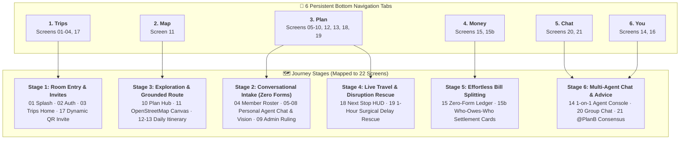

Below is the exhaustive, screen-by-screen breakdown detailing exactly **what UI elements appear on each screen** and **what specific function each screen performs**:

#### Screen 01: Splash Screen
- **What is on this screen:** Plan B brand logomark, hero tagline (*"When Plan A fails, Plan B saves the trip"*), primary `Get Started` CTA button, secondary `I already have an account` link, and warm ambient gradient background.
- **What it does:** Welcomes the traveler, establishes product identity around rescuing derailed vacations, and routes new or returning users into authentication.

#### Screen 02: Login & Authentication
- **What is on this screen:** One-tap social sign-in buttons (`Continue with Google`, `Continue with Apple`), email magic-link input field, passwordless session token handler, and privacy terms link.
- **What it does:** Authenticates travelers with zero password friction, creates their traveler profile in Cloudflare D1, and stores their persistent session token locally.

#### Screen 03: Trips Home (Trip Hub & Empty State)
- **What is on this screen:** Trip list card view (active trip card with destination, scheduled dates, and status badge: `Planning` or `Live`), prominent `+ New Trip` creation button, and a persistent `Scan QR Code` camera button to join an existing group getaway.
- **What it does:** Serves as the traveler's home command deck where they can spin up a new getaway or point their phone camera at a friend's QR code to enter an existing trip room instantly.

#### Screen 04: Trip Home — Align Mode & Member Roster
- **What is on this screen:** Trip title header, segmented navigation toggle `[Align | Plan]`, member avatar chips (Host and joined participants) with individual readiness status pills (`Ready` vs `Waiting for input`), group intake progress indicator, and `+ Invite (QR Code)` header icon.
- **What it does:** Displays the pre-trip room roster where friends gather. Enables the host to see which friends have conferred with their Personal Agents and provides the gateway to alignment and conversational intake.

#### Screen 05: Conversational Intake — Destination Discovery & Chat
- **What is on this screen:** 1-on-1 conversational dialogue feed with the member's dedicated Personal AI Agent, text message input bar, audio record button for voice memos, drag-and-drop screenshot uploader, and extracted destination candidate preview card (city, region, and interest tags).
- **What it does:** Travelers simply tell their Personal Agent where they wish to travel or upload travel posts from social media (Xiaohongshu, Instagram, Google Maps). The multimodal extractor normalizes destinations and place candidates automatically—without filling any forms.

#### Screen 06: Conversational Intake — Date Availability & Free Windows
- **What is on this screen:** Personal Agent conversational prompt, extracted interactive calendar date range chip, `Flexible Dates (+/- 1 day)` toggle, and visual date availability timeline.
- **What it does:** Parses natural language dates, calendar screenshots, or spoken voice memos into structured date candidate ranges for group intersection calculation.

#### Screen 07: Conversational Intake — Budget Limit & Travel Pace
- **What is on this screen:** Personal Agent chat bubble confirming spending limits, extracted private budget ceiling badge, travel pace selection chip (`Pace: Easy / Relaxed`), and daily spend preview pill.
- **What it does:** Records each member's private budget constraints and preferred energy level. Crucially keeps individual budgets private from peer members while preparing constraints for the Admin Agent's arbitration.

#### Screen 08: Conversational Intake — Dietary, Deal-Breakers & Secret Wishlists
- **What is on this screen:** Personal Agent confirmation cards with extracted dietary restriction badges (`Diet: Vegetarian`), hard deal-breaker chips (e.g. rest hour requirements, transit restrictions), private toggle switch `🔒 Hide from group (Surprise / Wishlist)`, and encrypted custom place input.
- **What it does:** Captures critical personal restrictions and flags confidential wishlist pins (such as birthday surprise dinners or proposal spots) that the Mastra engine will route seamlessly while keeping venue names hidden from peer screens.

#### Screen 09: Admin Agent Arbitration Room (Alignment Ruling Dashboard)
- **What is on this screen:** Computed group date intersection banner, Authoritative Budget Ruling banner (group budget ceiling strictly locked to lowest member budget cap across all participants), aggregated deal-breakers checklist (dietary options guaranteed, harmonized departure hours), and the Admin Agent's authoritative decision seal.
- **What it does:** Displays the executive rulings of the centralized Admin Agent (Master Arbiter). Resolves multi-agent deadlocks, authoritatively enforces the lowest spender's cap so no friend is financially strained, and unlocks group planning once destination and dates are confirmed.

#### Screen 10: Trip Home — Plan Mode (4 Modular Entry Cards)
- **What is on this screen:** Confirmed trip hero banner (destination, locked travel dates, and lowest-member budget ceiling), segment toggle set to `[Plan]`, and 4 prominent interactive navigation cards: `1. Itinerary (Timeline)`, `2. Grounded Map (OpenStreetMap)`, `3. Personal AI Agent (1-on-1)`, and `4. Money & Ledger (Balance Equalizer)`.
- **What it does:** Functions as the operational trip launchpad once the Admin Agent finalizes alignment, directing travelers into itinerary sequencing, map exploration, private agent querying, or expense settling.

#### Screen 11: Grounded Dual-Mode Map Canvas
- **What is on this screen:** Fullscreen interactive Leaflet + OpenStreetMap canvas, top Photon search bar with search-as-you-type fuzzy autocomplete suggestions, numbered interactive map pins (Pin 1, 2, 3), tap-to-pin coordinate dropper crosshair, and a slide-up bottom drawer with `+ Add to Trip Place Pool` button.
- **What it does:** Enables travelers to search real venues or drop pins anywhere on the map canvas. Only verified pinned spots enter the candidate pool—zero reliance on costly Google Maps APIs and zero hallucinated fake locations.

#### Screen 12: Grounded Day-by-Day Itinerary (Day 1 View)
- **What is on this screen:** Day selector tabs, sequenced vertical activity timeline cards (arrival timestamps, venue names, estimated cost pills, transit duration badges), and green `🔒 Locked Stay` security badges on booked accommodations.
- **What it does:** Displays the Admin-approved chronological itinerary strictly assembled from real member pins, sequenced by travel pace and constrained under the group budget ceiling.

#### Screen 13: Grounded Day-by-Day Itinerary (Day 2 View & Secret Pin Routing)
- **What is on this screen:** Timeline activity cards, and a masked activity card labeled `🔒 Surprise Activity (Private Wishlist)` with concealed venue name and coordinates for peer viewers (fully visible only to the proposing traveler).
- **What it does:** Illustrates how the multi-agent engine seamlessly routes private surprise spots into the group itinerary without leaking confidential details to other travelers in the room.

#### Screen 14: Personal AI Agent Console (Private 1-on-1 Dialogue & Wallet Guardian)
- **What is on this screen:** Private 1-on-1 chat interface with the traveler's Personal Agent (Mastra), quick query & action chips (*"Where is accommodation check-in?"*, *"Who owes money right now?"*, *"Log shared expense"*), personal budget utilization readout, and draft schedule simulator.
- **What it does:** Serves as each traveler's private travel advisor and wallet guardian. Members can ask sensitive financial or scheduling questions, verify personal dietary requirements, or simply speak or type an expense or send a receipt photo to log it instantly without ever touching a manual form.

#### Screen 15: Money & Shared Expense Ledger (Zero-Form Conversational Tracking)
- **What is on this screen:** Top total spend metric card, itemized chronological expense cards auto-parsed by AI (item title, total amount, payer identity, split mode, and custom zero-share exemptions), quick conversational shortcut chip (voice memo or receipt photo drop), and primary navigation button `View Who Owes What →`. **Zero manual forms or input dialogs required.**
- **What it does:** Transparently displays all group spending logged effortlessly through conversational chat, voice notes, or receipt photos sent to the AI Agent. Users never have to manually fill out expense forms, pick categories, or calculate complex percentages.

#### Screen 15b: Balance Equalizer (Direct Debt Settlement & 1-Tap Pay)
- **What is on this screen:** Prominent, high-clarity **"Who Owes Who" settlement cards** showing the exact calculated payments between debtors and creditors, paired with 1-tap `[Mark Paid]` settlement buttons, individual net balance indicators, and instant settlement status badges (`Paid` vs `Pending`).
- **What it does:** Directly displays exactly how much money each traveler needs to pay or receive, computed via graph-theoretic debt minimization. Travelers do not need to do any mental math or manual calculations—simply view the required payment amounts and tap `Mark Paid` once transferred.

#### Screen 16: User Profile & Global Preferences ("You" Tab)
- **What is on this screen:** User profile avatar, personal travel bio, lifetime escape statistics (trips completed, total friends traveled with), global travel preferences (default pace, persistent dietary restrictions), and app notification settings.
- **What it does:** Manages traveler credentials and global default settings that automatically pre-populate the Personal Agent whenever a new trip room is created or joined.

#### Screen 17: Invite Hub (Dynamic QR Code & Shareable Link)
- **What is on this screen:** Prominent dynamic SVG QR Code rendered on-screen, one-tap `Copy Link` button, share sheet trigger button (WhatsApp, Telegram, AirDrop), and active room member list preview.
- **What it does:** Provides instant, friction-free guest onboarding. Friends in person simply scan the host's phone screen with their standard camera app to join the trip room in seconds without app store downloads.

#### Screen 18: Live Trip Mode (Active NEXT STOP Countdown)
- **What is on this screen:** High-visibility on-the-road travel card, pulsing banner `NEXT STOP` (current destination & scheduled arrival time), live transit ETA countdown, and interactive action controls: `Done (Arrived)`, `Delay (+30m)`, and `Skip Stop`.
- **What it does:** Activates automatically on travel day as a live heads-up dashboard, keeping the entire friend group synchronized on current progress and providing immediate action buttons when delays happen.

#### Screen 19: Mid-Trip Replan (Disruption Modal & 1-Hour Plan B Rescue)
- **What is on this screen:** Emergency disruption modal triggered by tapping `Delay`, disruption cause banner (weather alert or closure status), disruption duration selector (`+1 Hour Delay`), locked anchors status indicator (`🔒 Booked stays & flights 100% Locked`), 3 dry indoor backup cards from the saved pool (nearby indoor cultural venues, cafes, and covered sights), and primary `Apply Plan B Patch` button.
- **What it does:** Executes Plan B's core twist: surgically recalculates only the disrupted 1-hour time window with dry indoor alternatives while guaranteeing all booked hotel check-ins and return flights remain strictly untouched.

#### Screen 20: Real-Time Group Chat & Place Card Feed
- **What is on this screen:** Live in-room group chat message stream powered by WebSockets, shared venue preview cards with interactive map pins, member avatar speech bubbles, trip event notifications (venue additions, automated expense logging events), and an input bar with `@PlanB` autocomplete mention trigger.
- **What it does:** Keeps all friend communication centralized inside the trip workspace, allowing members to share favorite spots, coordinate departure times, drop receipt snapshots, and debate options in real time.

#### Screen 21: In-Room Admin Agent Concierge (@PlanB Consensus Card)
- **What is on this screen:** In-chat response card from the Admin Agent (`@PlanB`), consensus summary box synthesizing group discussions (agreed dining stops, confirmed rest buffers, budget verification under lowest member cap, and auto-logged expense receipts), and an interactive `Apply Consensus to Itinerary` button.
- **What it does:** Solves group chat chaos by having the Admin Agent analyze long message threads, extract unanimous decisions and shared expenses, and apply them authoritatively to the shared database with a single tap.

---

## 4. What Makes It Different

```mermaid
flowchart LR
  subgraph TRAD["❌ Traditional Alternatives (Wanderlog, Splitwise, Chatbots)"]
    direction TB
    T1["<b>Data Intake:</b> Painful 4-step forms & manual typing"]
    T2["<b>Budget:</b> High spenders drag everyone into overspending"]
    T3["<b>Places:</b> Generic travel bots invent fake/closed shops"]
    T4["<b>Delays:</b> 1 rainstorm forces redoing the entire 3 days"]
    T5["<b>Bills:</b> Complex post-trip Splitwise math days later"]
    T6["<b>Chat:</b> 100+ unread WhatsApp messages & forgotten plans"]
  end

  subgraph PB["✅ The Plan B Advantage (Phone-First PWA)"]
    direction TB
    P1["<b>Data Intake:</b> Drop screenshots & voice notes; zero forms"]
    P2["<b>Budget:</b> Auto-locks ceiling to lowest spender (min-cap)"]
    P3["<b>Places:</b> OpenStreetMap; strictly pinned real places"]
    P4["<b>Delays:</b> 1-hour surgical patch; hotels/flights stay locked"]
    P5["<b>Bills:</b> Tell AI & directly see who owes who how much"]
    P6["<b>Chat:</b> @PlanB summarizes team consensus in 1 tap"]
  end

  TRAD -.->|"Upgraded by Plan B"| PB
```

| Feature | Traditional Travel Apps (Wanderlog, TripIt) | Group Chat + Splitwise | Generic Travel AI Bots | **Plan B (Our Solution)** |
| :--- | :--- | :--- | :--- | :--- |
| **Data Ingestion** | Manual form entry & email parsing | Messy text lost in chat scroll | Prompt-dependent text | **"The Noise Purifier": Screenshot & chat zero-shot extraction** |
| **AI System Architecture** | None (Static UI) | None | Single generic chat prompt | **Mastra Multi-Agent System (Personal Agents per member + Negotiation)** |
| **Itinerary Creation** | Manual drag-and-drop | None; messy text in chat notes | Hallucinates fake shops & wrong prices | **Sequenced strictly from real member-added pins** |
| **Budget Protection** | Passive cost display; ignores caps | Retroactive math after overspending | Ignores budgets or invents costs | **Locks group ceiling upfront to lowest member cap** |
| **Surprise / Private Stops** | Non-existent; everything is public | Leaked immediately in group chat | N/A | **Hidden destination toggle (server-side AI shielding)** |
| **Mid-Trip Disruption Fix** | Manual multi-day rescheduling | Panic in chat; manual reshuffling | Re-generates entire trip from scratch | **Single-slot 1-hour replan (hotels & flights stay locked)** |
| **Expense Settlement** | Requires paid tier or separate app | Disconnected from daily agenda | None | **Zero-form conversational logging; directly displays who owes who** |
| **Team Communication** | External (WhatsApp / Telegram) | Fragmented across chat history | Single-player chatbot session | **In-room group chat with @PlanB concierge & consensus summary** |

### Key Product Highlights:
1. **Conversational Intake & Expense Logging (Zero-Form Experience):** Forcing manual form entry causes 80% user drop-off. Chatting naturally with your Personal Agent, speaking voice memos, or dropping social media screenshots and receipt photos instantly extracts structured preferences, venue cards, and expense splits without typing a single form.
2. **Autonomous Personal AI Agents:** Each friend has a dedicated agent representing their personal budget, pace, and secret wishlists.
3. **The Admin Agent (Master Arbiter & Decider):** Resolves deadlocks between conflicting personal agents. Makes authoritative executive rulings on dates, enforces the lowest-spender budget cap, and harmonizes group schedules.
4. **The Lowest-Cap Ceiling (`min-cap`):** Group trips overspend because high spenders dominate. Plan B locks the ceiling to the lowest member budget (e.g. RM 450), keeping travel accessible to everyone.
5. **Hidden Wishlist Shield:** Propose a birthday surprise without spoiling it. The AI routes it secretly without naming it to peers.
6. **The Grounded Guardrail:** The AI is an optimizer, not an unconstrained writer. If zero places are pinned, it halts immediately instead of inventing fake shops.
7. **Single-Slot Replanning (The Core Plan B):** When a rainstorm hits, don't rewrite 3 days. Plan B patches only that disrupted hour, protecting all booked hotels and flights.
8. **Dual-Channel AI Assistance (Private 1-on-1 + In-Room Concierge):** Dedicated 1-on-1 private agent console (Screen 14) plus in-room team chat concierge (`@PlanB` in Screen 20/21).
9. **Zero-Math Debt Equalizer:** No mental math or spreadsheet reconciliations. The screen directly displays who owes whom how much money with 1-tap `Mark Paid` settlement.
10. **Cloudflare Edge & Mastra Test Harness:** Sub-millisecond global execution on Cloudflare Workers and D1 SQL, verified by Mastra automated evaluation test suites.

---

## 5. Technical Architecture & Feasibility

### Tech Stack

| Layer | Technology Chosen | Why We Chose It | Constraints & How We Address Them |
| :--- | :--- | :--- | :--- |
| **Frontend Framework** | **Nuxt 3 (Vue 3, TypeScript)** | Fast phone-first UI, native client-side rendering for maps, and zero-install PWA support. | Leaflet requires the browser window. Solved cleanly by wrapping map components inside Nuxt's `<ClientOnly>` boundary. |
| **Edge Hosting & Runtime** | **Cloudflare Pages & Workers** | Global sub-millisecond edge execution, zero server maintenance, and near-instant cold starts. | Serverless worker CPU limits. Solved by offloading heavy AI processing to async Workers AI and Gemini streaming. |
| **Edge Database** | **Cloudflare D1 (Serverless SQL)** | Distributed SQLite database at the edge, offering instant response times and native TypeScript bindings. | Concurrent database writes. Scoped strictly per trip room ID so roommates never experience database write lock contention. |
| **Multi-Agent Framework & Harness** | **Mastra (`@mastra/core`)** | Modern TypeScript multi-agent orchestration with typed workflows, agent memory, and automated test harnesses. | Multi-agent communication lag. Kept lightning-fast using lightweight typed agent protocols and deterministic evaluators. |
| **AI Inference Engine (Selectable: Choose One)** | **Option A: Cloudflare Workers AI<br/>OR<br/>Option B: Google Gemini 2.5 Flash** | **Pluggable & mutually exclusive provider options:**<br/>• **Option A (Workers AI):** 100% Cloudflare edge native, 10,000 free Neurons/day, zero external API keys.<br/>• **Option B (Gemini 2.5 Flash):** High-capacity free tier (1,500 req/day), deep multimodal vision for social screenshots & receipts.<br/>*Switchable via a single environment toggle: `AI_PROVIDER=workers-ai` or `AI_PROVIDER=gemini`.* | Quota exhaustion or platform lock-in. Solved cleanly by allowing instant 1-variable switching between providers without rewriting agent code. |
| **Realtime & Room Sync** | **Cloudflare WebSockets / Realtime** | Low-latency WebSockets for instant in-room team chat, map pin broadcasting, and live rain alerts. | Active connection limits. Handled cleanly by scoping WebSocket channels strictly per active trip room. |
| **Mapping & Geocoding** | **Leaflet + OpenStreetMap + Photon** | Open-source mapping stack. Smooth map rendering and fast fuzzy search autocomplete without API keys or monthly fees. | Missing obscure spots. Solved by allowing travelers to tap anywhere directly on the map canvas to drop custom pins. |

---

### 5.1 AI Provider Options (Mutually Exclusive Architecture)

Plan B does not run multiple AI providers concurrently in production. Instead, it features a **pluggable, mutually exclusive AI engine layer** where the host or developer selects **either Option A or Option B** via a single environment variable (`AI_PROVIDER`):

| Comparison Dimension | Option A: Cloudflare Workers AI (Edge Native) | Option B: Google Gemini 2.5 Flash (API Key) |
| :--- | :--- | :--- |
| **Architectural Role** | **100% Cloudflare Native Stack** | **High-Capacity Multimodal Specialist** |
| **Pricing & Free Tier** | **Free (10,000 Neurons / day)**, no credit card required | **Free (1,500 requests / day)**, no credit card required |
| **Hosting Location** | Runs directly inside Cloudflare Workers edge network | External API call via Google AI Studio |
| **Primary Strength** | Sub-millisecond edge latency, zero external API dependencies | Superior screenshot vision extraction (Xiaohongshu/IG) & 1M context |
| **Ideal Use Case** | Deployments demanding a pure, self-contained Cloudflare stack | High-volume hackathon testing and complex multimodal receipt parsing |
| **Environment Switch** | `AI_PROVIDER="workers-ai"` | `AI_PROVIDER="gemini"` |

---

### Data Flow & Execution Pipeline

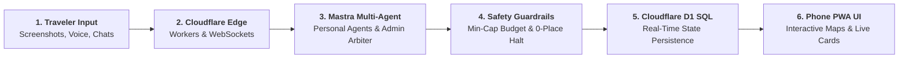

---

### System Architecture Diagram

```mermaid
flowchart TD
  subgraph CLIENT["Client Layer: Phone-First PWA (390px Mobile Viewport)"]
    UI["Nuxt 3 PWA UI<br/>(Vue 3 · Pinia · Tailwind CSS)"]
    MapClient["Leaflet OSM Engine<br/>(<ClientOnly> Interactive Canvas)"]
    RTClient["Realtime WebSocket Client<br/>(Live Chat & Disruption Broadcast)"]
  end

  subgraph EDGE["Cloudflare Edge Runtime (Pages & Workers)"]
    AuthRoute["/api/auth<br/>Session & Identity"]
    ExtractRoute["/api/agent/extract<br/>Multimodal Zero-Shot Extractor"]
    AgentRoute["/api/agent/negotiate<br/>Mastra Multi-Agent Orchestrator"]
    ReplanRoute["/api/agent/replan<br/>1-Hour Surgical Patch Engine"]
    GeoRoute["Photon Geocoding Proxy<br/>(Fuzzy Search Autocomplete)"]
    DebtRoute["/api/money/settle<br/>Debt Graph Simplifier"]
  end

  subgraph MASTRA["Mastra Multi-Agent Engine Layer (@mastra/core)"]
    ExtractAgent["Conversational Extractor Agent<br/>(Natural Chat & Screenshot Intake)"]
    PersonalAgents["Personal Agents (x4)<br/>(Dedicated Agent per Member)"]
    AdminAgent["👑 Admin Agent (Master Arbiter)<br/>(Evaluates Proposals & Issues Final Rulings)"]
    CoordAgent["Coordinator Agent<br/>(0-Place Halt & Allow-List Sequencer)"]
    EvalHarness["Mastra Evaluation Harness<br/>(Automated Guardrail & Regression Tests)"]
  end

  subgraph STORAGE["Cloudflare Edge Storage Layer"]
    D1[(Cloudflare D1 SQL Database<br/>Distributed Serverless Edge Storage)]
  end

  subgraph EXTERNAL["AI Inference & Geocoding Services"]
    LLM["LLM Inference Engine<br/>(Cloudflare Workers AI / Google Gemini)"]
    PhotonAPI["Photon Geocoder<br/>(OpenStreetMap by Komoot)"]
  end

  UI --> AuthRoute
  UI --> ExtractRoute
  UI --> AgentRoute
  UI --> ReplanRoute
  UI --> DebtRoute
  UI --> GeoRoute
  UI --> MapClient
  UI <--> RTClient

  ExtractRoute --> ExtractAgent
  AgentRoute --> PersonalAgents
  PersonalAgents <--> AdminAgent
  AdminAgent --> CoordAgent
  ReplanRoute --> CoordAgent
  CoordAgent <--> EvalHarness

  ExtractAgent --> LLM
  PersonalAgents --> LLM
  AdminAgent --> LLM
  CoordAgent --> LLM
  GeoRoute --> PhotonAPI

  CoordAgent -.->|Strict ID Verification| D1
  ReplanRoute -.->|Preserve Locked Stays| D1
  AuthRoute --> D1
  DebtRoute --> D1
```

---

### Build Plan & Scope

#### In-Scope (What We Build):
- [x] Clean phone-first authentication with personal travel defaults (pace, dietary restrictions).
- [x] Trip room lifecycle with dynamic QR code generation, camera scanning, and direct link join.
- [x] **Conversational Onboarding (Zero Manual Forms):** Chat naturally with Personal AI Agent via voice, text, or drop screenshots; automatically parses dates, budget, pace, and wishlists.
- [x] **Autonomous Personal AI Agents per Member:** Dedicated **Mastra** agent per traveler guarding individual budgets, pace, and secret wishlists.
- [x] **Admin Agent (Master Arbiter & Decider):** Centralized room arbitrator that evaluates personal agent proposals, enforces the lowest-budget cap (`min-cap`), and decides authoritative schedule updates.
- [x] OpenStreetMap with Photon fuzzy autocomplete search and direct tap-to-pin coordinate saving.
- [x] **Mastra Coordinator Agent & Evaluation Harness:** Strict allow-list sequencing, hard 0-place halt guardrail, and automated regression test harness.
- [x] **Cloudflare Full-Stack Architecture:** Cloudflare Pages & Workers hosting with **Cloudflare D1** serverless distributed SQL database.
- [x] **Pluggable AI Provider Architecture (Choose One):** Selectable between **Option A: Cloudflare Workers AI** (100% native edge, 10,000 free Neurons/day) OR **Option B: Google Gemini 2.5 Flash** (1,500 free requests/day, deep multimodal vision) via a single environment flag (`AI_PROVIDER`).
- [x] Plan Mode (preparation) and Trip Mode (live next-stop countdown) state machine.
- [x] Single-slot replan modal replacing only the disrupted hour while preserving locked flights and hotel stays.
- [x] Itinerary-tied expense logging with automated debt graph calculation (Balance Equalizer).
- [x] Real-time in-room team group chat with place card sharing, live disruption alerts, and Admin Agent (`@PlanB`) consensus summarizer.
- [x] Mobile-first PWA interface with persistent 6-tab navigation (`Trips · Map · Plan · Money · Chat · You`).

#### Out-of-Scope (Explicit Anti-Features):
- ❌ **Commercial Flight & Hotel Booking APIs:** No live ticket checkouts or dynamic inventory scrapers. Bookings are represented as user-entered, locked anchor items.
- ❌ **Nearby Auto-Scrapers:** The app never pulls unverified external restaurant lists; it schedules only venues intentionally added by travelers.
- ❌ **Dynamic Currency Fare Speculation:** Expense splitting is based on actual logged receipts, not speculative live foreign exchange scrapers.
