# Plan B by we are the champions

> **When Plan A fails, Plan B saves the trip.**

**Track:** Lifestyle · Planning an Escape
**Team:** we are the champions
**Members:** Tan Poh Zhai, Lee Wai Loong, Yap Chun Hoong, Yap Shern Yu

---

## 1. Project Overview

### The Problem
Planning a group getaway with friends should be exciting, but in reality, it is usually stressful and chaotic:
- **Scattered Details:** Flight tickets get buried in email, date polls disappear in WhatsApp, places live in Instagram saves, and expenses get dumped into Splitwise days later.
- **Awkward Money Talks:** Friends have different budgets. Students or junior members often feel uncomfortable saying *"that restaurant is too expensive for me"*, so the group defaults to the highest spender's habits.
- **Sleep & Pace Clashes:** One friend wants to wake up at 6:00 AM to hike, while another refuses to get out of bed before 10:00 AM.
- **Fake AI Hallucinations:** Generic travel chatbots spit out generic tourist essays, often recommending closed shops, fake prices, or impossible routes.
- **Fragile Plans (The Domino Effect):** When heavy rain hits Penang or a ferry gets delayed, the entire day collapses. Nobody knows what to do next, and the trip leader ends up stressed out and blamed.

**Who This Is For:**
College students, young working adults, and small friend groups (2–6 people or solo travelers) who want a quick, easy, mobile-first way to plan weekend escapes without the drama.

---

### Why Existing Apps Fall Short
- **Wanderlog & TripIt:** Built for solo business travelers parsing corporate travel receipts. They feel clunky on mobile, lock basic collaboration behind paid paywalls, ignore individual budget limits, and have no way to quickly rescue a ruined afternoon.
- **Splitwise:** Strictly calculates debts *after* money is already spent. It has no connection to daily plans, so it cannot prevent groups from overspending upfront.
- **Google Maps Lists:** Great for saving bookmarks, but completely static. They cannot find common dates, respect travel pace, or help you adapt when unexpected delays happen.

---

### Our Solution: Plan B

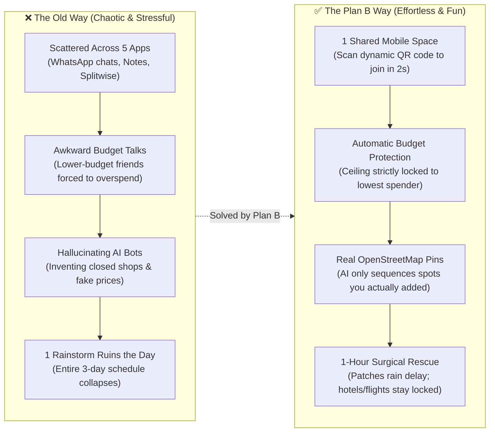

**Plan B** is a phone-first Progressive Web App (PWA) powered by a **Cloudflare-native Multi-Agent System (Mastra Framework)**. It helps friends plan, coordinate, and travel together smoothly without stress or fake data:
1. **Easy 2-Second Join:** One friend creates a room and shows a **QR code** or shares a link. Friends scan the QR code with their phone camera to jump right into the room—no app store downloads needed.
2. **No Boring Forms:** You never have to fill out long, rigid travel forms. Just chat with your Personal AI Agent, send a voice memo, or drop screenshots from Xiaohongshu or Instagram. The AI automatically grabs your dates, budget limits, travel pace, food allergies, and secret wishlists in seconds.
3. **Your Own Personal AI Helper:** Every friend gets their own dedicated **Personal AI Agent** (built on **Mastra**). It works for you—learning your habits, protecting your wallet, and keeping your surprise birthday plans hidden from your friends.
4. **The Admin Agent (The Group Arbiter):** While your personal agent looks out for you, one central **Admin Agent** manages the trip room. It checks everyone's availability, finds dates when all friends are free, and caps the group budget to match the friend with the least money (`min-cap`). This ensures nobody feels broke, left out, or pressured to overspend.
5. **Real Map Spots, Zero Fake Shops:** Uses open-source OpenStreetMap with fast Photon search. The AI only arranges places that you and your friends actually pinned on the map. If you haven't pinned any places yet, the AI stops immediately instead of making up fake cafes or closed restaurants.
6. **The Plan B Rescue (Our Core Twist):** If it pours rain or an attraction is closed during the trip, just tap **Delay**. The AI fixes **only that ruined 1 hour** by finding 3 dry indoor backup spots nearby—while keeping your booked flights and hotels 100% untouched!
7. **Easy Bill Splitting Without Math:** Never fill out manual accounting forms. Just tell your AI agent what you spent via voice note, text, or a photo of your receipt. The Money tab directly shows simple cards of who owes whom, with a 1-tap "Mark Paid" button.
8. **Two Ways to Talk to AI:** Talk privately with your Personal Agent (Screen 14) without spamming the group chat, or type `@PlanB` in the group room (Screen 20/21) to get quick answers and turn long debates into a 1-tap agreement card.
9. **Fast Cloudflare Speed & Flexible AI:** Hosted entirely on **Cloudflare** (Pages, Workers, and **Cloudflare D1** serverless SQL database) so everything loads instantly on your phone. You can run it with 100% free **Cloudflare Workers AI** or switch to **Google Gemini 2.5 Flash** for heavy photo scanning.

#### The Core User Journey:
`Scan QR Code / Open Link → Chat with Personal Agent (No Forms) → Personal Agents Deliberate → Admin Agent Sets Lowest Budget Cap → Pin Real Spots on Map → AI Sequences Schedule → Live Trip Mode (Done / Delay) → 1-Hour Plan B Rescue → Easy Expense Voice Logging & 1-Tap Bill Settlement.`

---

### System Topology Mindmap

A clear bird's-eye view of how Plan B works across its 8 main building blocks:

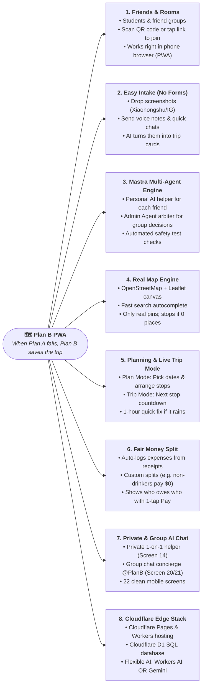

#### Mindmap Pillar Summary

```text
Plan B System Topology
├── 1. Friends & Rooms: Students & friends | Solo or group | QR code & link join | Phone-first PWA
├── 2. Easy Intake: Screenshots (Xiaohongshu/IG/Maps) | Voice memos & text | Zero-shot extraction (no forms)
├── 3. Mastra Multi-Agent Engine: Personal helper per friend | Admin Agent arbiter | Automatic safety checks
├── 4. Real Map Engine: Leaflet + OpenStreetMap | Fast search | Real pinned spots only (stops if 0 places)
├── 5. Dual Modes: Plan Mode (align dates & schedule) | Trip Mode (next stop countdown & 1-hour rain rescue)
├── 6. Fair Money Split: Auto-logged spending | Who-owes-who cards | Custom splits (exemptions for non-drinkers)
├── 7. Dual-Channel AI: Private helper (Screen 14) | Group chat @PlanB (Screen 20/21) | 6-tab PWA (22 screens)
└── 8. Cloudflare Edge Stack: Cloudflare Pages & Workers | Cloudflare D1 SQL | Flexible AI (Workers AI OR Gemini)
```

---

## 2. Ideation & Process

### 2.1 Ideas We Considered

| Idea | What We Decided | Why We Chose or Dropped It |
| :--- | :--- | :--- |
| **A. Plan B Multi-Agent App (Our Choice)** | **Kept (Our Product)** | Replaces 5 messy apps with one clean mobile space. Gives every friend their own AI advocate, while an Admin AI caps the budget to protect the lowest spender and fixes delays in 1 hour. |
| **B. Cloudflare Pages + Workers + D1 Database** | **Kept (Tech Stack)** | Super fast mobile loading worldwide. Saves everything instantly to Cloudflare D1 with zero waiting and zero server setup. |
| **C. Mastra Multi-Agent Framework** | **Kept (AI Framework)** | Keeps AI agents organized in clean TypeScript. Gives each agent memory, lets them talk to each other, and runs automatic tests to prevent hallucinated places. |
| **D. Photo & Voice Scanner ("No-Form" AI)** | **Kept (Easy Input)** | Lets friends drop screenshots from Xiaohongshu, Instagram, or Google Maps, or send quick voice notes. Pulls places, dates, and costs without filling forms. |
| **E. OpenStreetMap + Photon Search** | **Kept (Mapping)** | Fast search-as-you-type autocomplete and tap-to-pin. Completely free with no credit card, no expensive Google Maps fees, and no rate limits. |
| **F. In-Room Chat with @PlanB Concierge** | **Kept (Team Chat)** | Keeps trip planning right inside the chat. Friends can tag `@PlanB` to get instant answers or turn 100+ messy messages into a 1-tap agreed schedule. |
| **G. All-in-One Booking App with Live Flight/Hotel APIs** | **Dropped** | Flight and hotel booking APIs are slow, expensive, and constantly break. Friends book their flights separately anyway; fake booking buttons only make demos fragile. |
| **H. One Big Generic Chatbot Prompt** | **Dropped** | Open-ended chatbots make up closed restaurants and fake prices. A single prompt cannot protect private budgets or keep secret surprise plans hidden. |

---

### 2.1.1 How Our Architecture Evolved

Our system went through three versions based on testing and mentor advice:

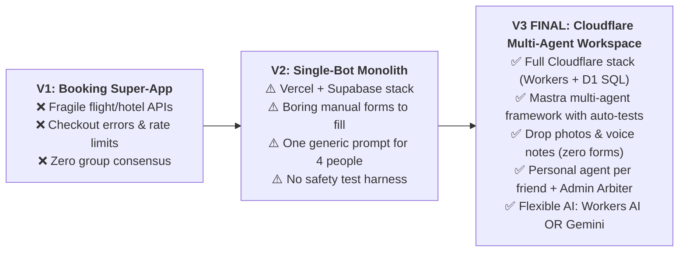

| Feature | V1 (Booking Super-App) | V2 (Single-Bot Setup) | **V3 FINAL (Plan B Multi-Agent)** |
| :--- | :--- | :--- | :--- |
| **Architecture** | Big app calling live booking APIs | One serverless route on Vercel | **Mastra Multi-Agent on Cloudflare** |
| **Hosting** | Traditional server container | Vercel serverless functions | **Cloudflare Pages + Workers (Super fast edge)** |
| **Database** | Heavy PostgreSQL container | Supabase cloud database | **Cloudflare D1 (Fast, lightweight edge SQL)** |
| **How You Input Info**| Scraped booking sites | Boring 4-step manual web forms | **Drop screenshots & voice notes (No forms!)** |
| **AI Helpers** | None (Static booking UI) | One generic prompt for all 4 people | **Your own Personal Agent + Admin Agent for the group** |
| **Group Decisions** | None (Only solo checkout) | Simple lowest-number math | **Admin Agent balances dates, budgets, and rest time** |
| **Safety Testing** | None | Checked prompts manually | **Automated tests to make sure AI follows rules** |
| **AI Engine** | None | Single API call to Gemini | **Selectable: Cloudflare Workers AI OR Google Gemini** |
| **Fixing Delays** | Start flight search all over | Bot rewrites the entire 3-day trip | **1-Hour Quick Fix (only patches the ruined hour)** |

---

### 2.2 System & User Flow Diagrams

All diagrams below show how real friend groups use Plan B, from the first chat to on-the-road travel.

#### 2.2.0 Multi-Agent System Lifecycle: What Each AI Agent Does
**How It Works:** How the multi-agent system cleans up messy inputs, balances friend preferences, caps budgets, schedules real map spots, and rescues ruined hours in real time.

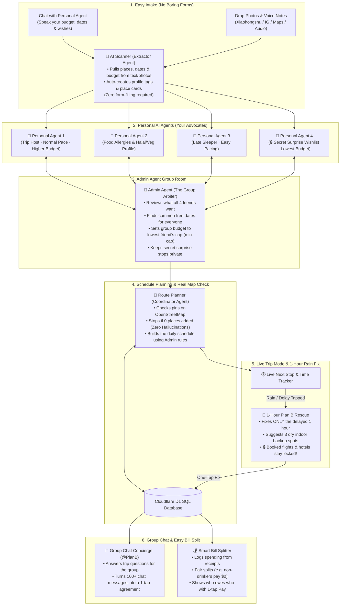

---

#### 2.2.1 Why Group Trips Break Down (The Real Story)
**The Problem:** Three common frustrations cause friends to fight and ruin vacations:

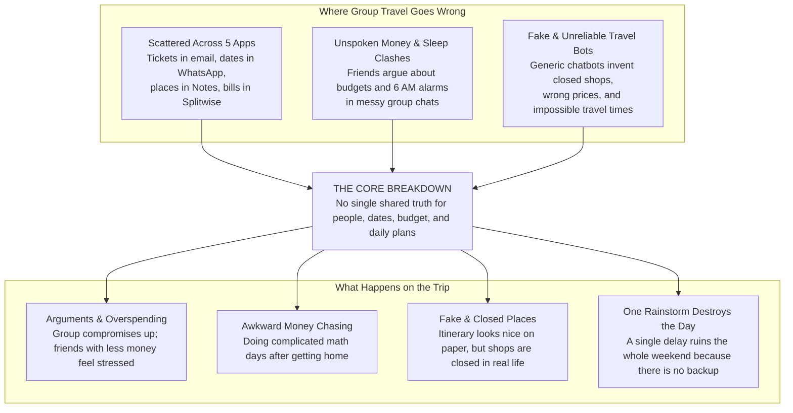

---

#### 2.2.2 How Friends Experience Plan B (User Journey)
**The Step-by-Step Flow:** How a group of friends plans, travels, and splits costs together smoothly.

```mermaid
flowchart LR
  Step1["1. Quick Invite<br/>Host shows dynamic<br/>QR code or link"] --> Step2["2. Easy Intake<br/>Chat with your AI helper (no forms);<br/>picks dates, budget & pace"]

  Step2 --> Step3["3. Admin Ruling<br/>Finds common dates & caps<br/>budget to lowest friend's limit"]

  Step3 --> Step4["4. Pin Real Places<br/>Friends search & tap favorite spots<br/>on OpenStreetMap canvas"]

  Step4 --> Step5["5. AI Drafts Schedule<br/>Arranges real pinned spots<br/>by travel pace under budget cap"]

  Step5 --> Step6["6. Chat & Concierge<br/>Talk in room; tag @PlanB<br/>to turn debates into 1-tap updates"]

  Step6 --> Step7["7. Live Trip Mode<br/>On the road: Next stop countdown,<br/>1-tap 'Done' or 'Delay'"]

  Step7 --> Step8["8. 1-Hour Rain Rescue<br/>Rain hits? AI patches that 1 hour;<br/>hotels & flights stay 100% locked"]

  Step8 --> Step9["9. Easy Bill Split<br/>Log bills anytime; see who<br/>owes whom in fewest payments"]
```

---

#### 2.2.3 End-to-End Activity Flow
**How It Works Behind the Scenes:** How friends, personal AI helpers, the Admin Agent, and live trip mode work together smoothly.

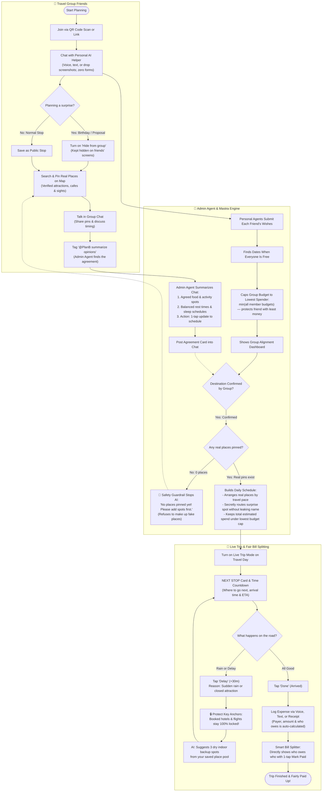

---

#### 2.2.4 Core Feature Flows (How Each Part Works)

##### 1. Finding Common Ground (Shared Dates & Lowest Budget Cap)
**The Problem Solved:** Friends spend days debating dates and budgets without deciding. Plan B automatically finds overlapping free days and caps the budget to the lowest friend's limit so nobody overspends.

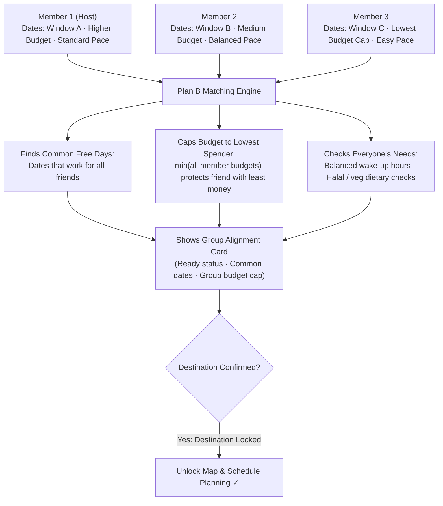

---

##### 2. Keeping a Secret Surprise (Hidden Wishlists)
**The Problem Solved:** Coordinating a surprise celebration or hidden wishlist stop usually leaks in group chats. Plan B lets you add private spots that friends can't see, while the AI quietly plans them into the day's route.

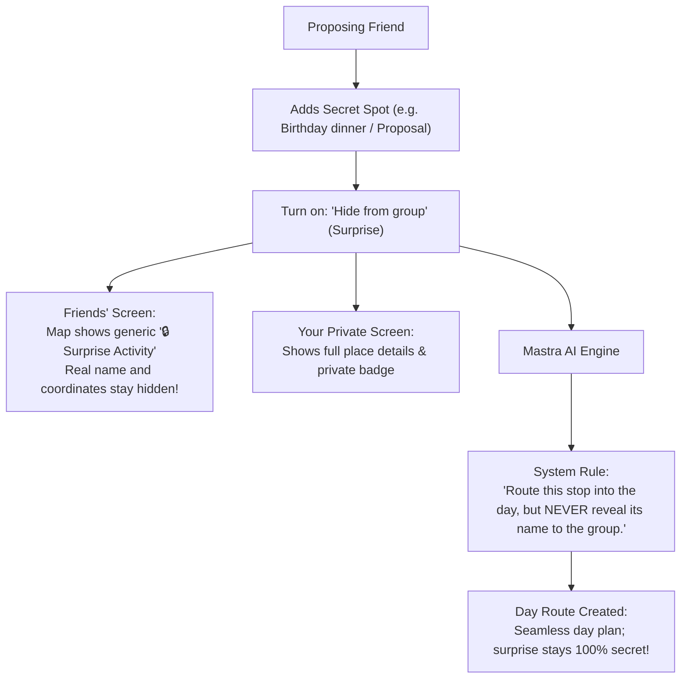

---

##### 3. Pinning Real Places on OpenStreetMap
**The Problem Solved:** Eliminates reliance on commercial map API keys or brittle booking engines. Search real venues via fast Photon autocomplete or tap anywhere on the interactive map canvas to drop custom pins.

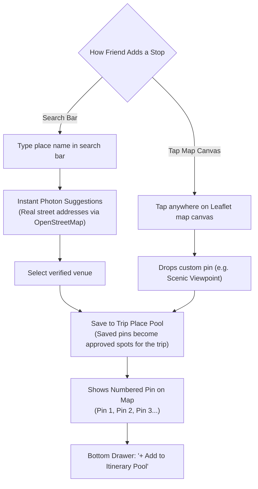

---

##### 4. AI Drafting the Schedule (Real Places Only, No Fake Shops)
**The Problem Solved:** Generic travel bots make up closed shops or fake prices. Plan B's engine is strictly constrained: it only sequences venues that friends actually pinned, and halts execution immediately if zero places exist.

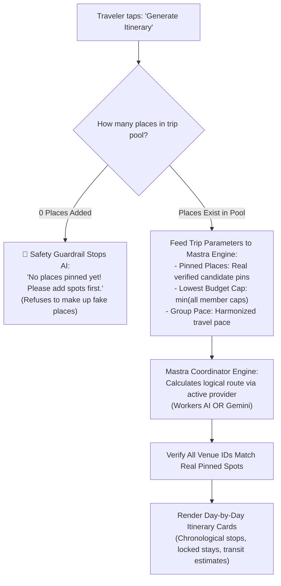

---

##### 5. The Plan B Rescue (Sudden Rain or Delay in Trip Mode)
**The Problem Solved (Our Core Innovation):** When sudden disruptions occur (heavy rain, transit delays, or temporary venue closures), traditional apps force rewriting the entire multi-day schedule. Plan B patches **only that specific 1-hour slot**, keeping booked hotel check-ins and return flights 100% locked!

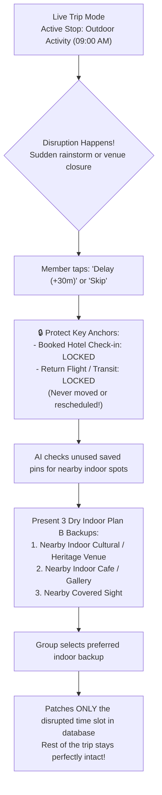

---

##### 6. Fair & Painless Bill Splitting (Zero Awkward Money Talks)
**The Problem Solved:** Traditional split apps require tedious post-trip manual receipt entries. In Plan B, travelers never have to fill out accounting forms—simply tell the AI Agent via voice note, chat text, or receipt photo with any custom split exemptions. The Money dashboard directly displays the exact settlement transfers required!

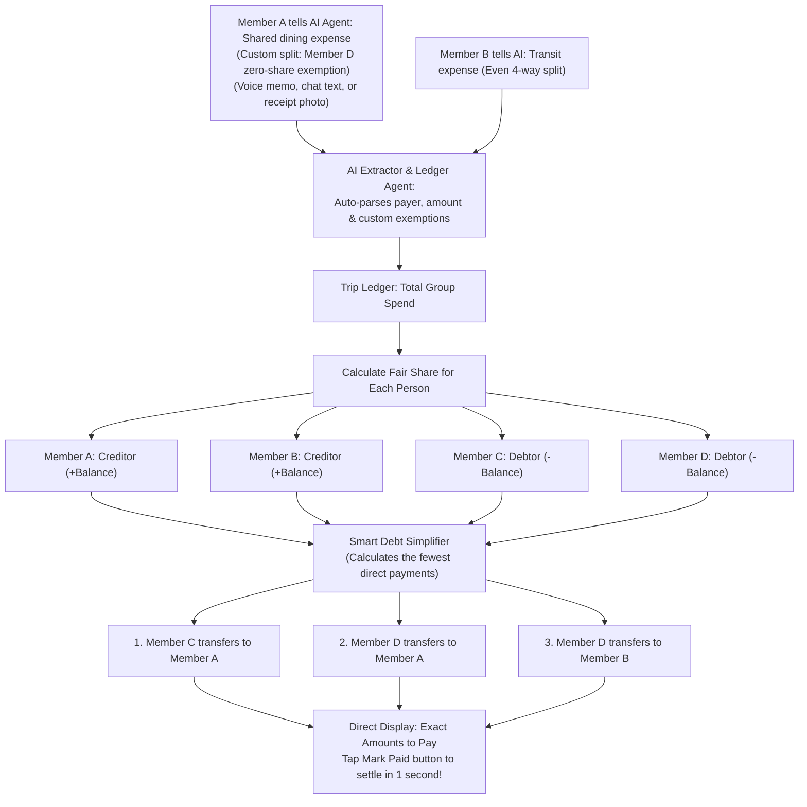

---

##### 7. In-Room Group Chat with Admin Agent @PlanB Concierge & Consensus Summarizer
**The Problem Solved:** Endless unstructured chat threads leave trip decisions buried and forgotten. Inside Plan B's chat room, friends can mention `@PlanB` to get instant answers or summarize debates into actionable, one-tap schedule updates.

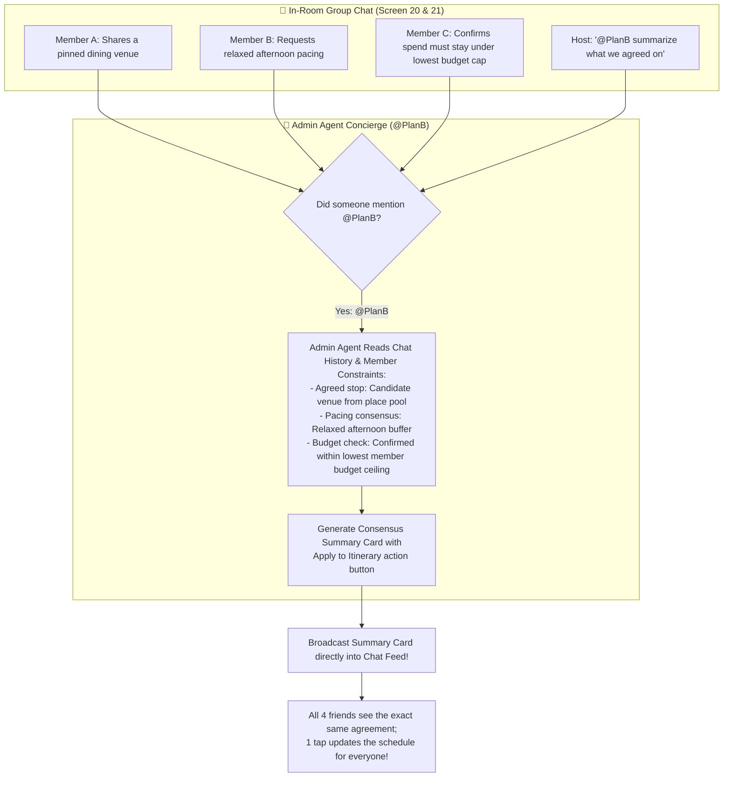

---

#### 2.2.5 Screen-by-Screen Walkthrough (Mapped to 22 Figma Screens)
**The Complete App Flow:** Seamless progression from onboarding to live travel.

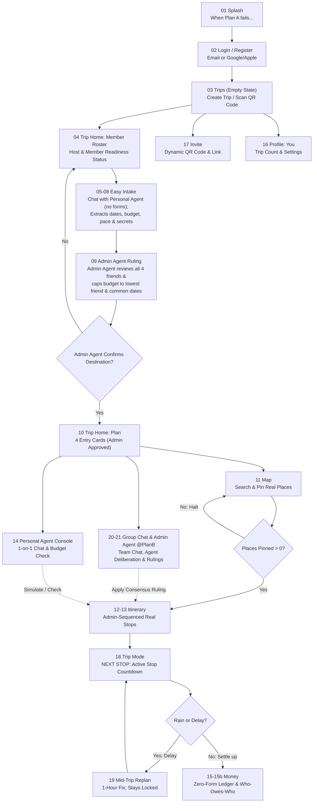

> **Persistent Bottom Navigation Tabs (Always Accessible):**
> `Trips · Map · Plan · Money · Chat · You`

---

#### 2.2.6 How Our Architecture Evolved
**Why We Built It This Way:** We deliberately tossed out fragile parts (like commercial booking checkouts and strict geocoders) to keep the app 100% reliable, blazing fast at the edge, and powered by teamwork between AI agents.

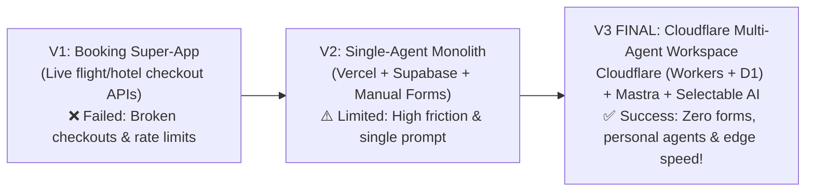

---

#### 2.2.7 Why Plan B Beats Traditional Alternatives

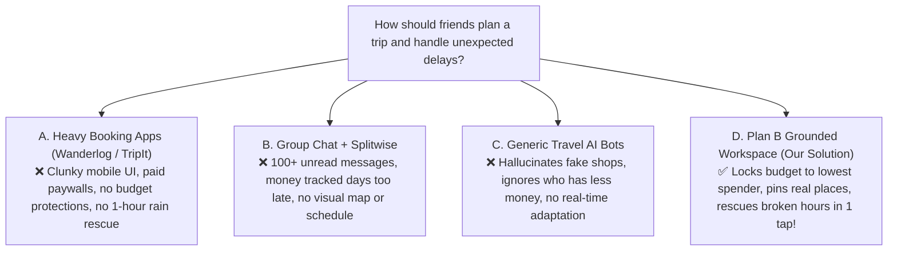

---

### 2.3 Mentor Consultation

| Date | Mentor | Feedback Received | What Was Changed |
| :--- | :--- | :--- | :--- |
| `2026-09-06` | **Jarod Tan** | • **AI Agent Harness:** Use a dedicated AI agent harness for evaluation, structured testing, and reliable execution.<br/>• **Cloudflare Sandbox Hosting:** Host backend AI services and edge agents on Cloudflare Workers for isolated, high-speed execution.<br/>• **Simpler Documentation with More Diagrams:** Keep documentation straightforward and easy to read, with clear visual diagrams instead of heavy technical buzzwords.<br/>• **Distinctive Feature Focus:** Highlight killer features that make Plan B special (like the 1-hour rain rescue, secret wishlist shield, and lowest-spender budget cap). | 1. **Adopted Mastra (`@mastra/core`) Agent Harness:** Built structured multi-agent workflows, tool calling, and automated test suites to verify safety guardrails (like stopping if no places are pinned, and protecting booked hotels).<br/>2. **Migrated to Cloudflare & Cloudflare D1:** Deployed the frontend and edge agents on Cloudflare Pages/Workers, using Cloudflare D1 for instant serverless database storage, with selectable AI (Workers AI or Gemini).<br/>3. **Added Zero-Form Intake:** Enabled travelers to drop social media screenshots, voice memos, and casual chat messages so nobody ever has to fill out annoying forms.<br/>4. **Upgraded to Multi-Agent System:** Gave each friend their own autonomous Personal AI to protect their budget and free dates during group planning. |

---

## 3. Design & Prototype

### Key Screens & User Interactions (22 Figma Screens Breakdown)

Plan B is built as a phone-friendly web app that fits right in your hand (390px mobile screen). It has 6 handy bottom tabs that stay on screen all the time: `Trips · Map · Plan · Money · Chat · You`.

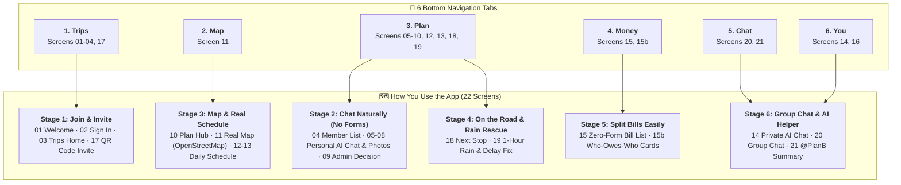

Here is the complete screen-by-screen breakdown showing **what you see on each screen** and **what it does for you**:

#### Screen 01: Welcome (Splash Screen)
- **What is on this screen:** Plan B logo, slogan (*"When Plan A fails, Plan B saves the trip"*), a big `Get Started` button, a sign-in link if you already have an account, and a warm background.
- **What it does:** Welcomes you, shows what Plan B is all about, and guides you to sign in or create an account.

#### Screen 02: Quick Sign In
- **What is on this screen:** Easy 1-tap sign-in with Google or Apple, an email magic link option (no password required), and privacy terms.
- **What it does:** Logs you in smoothly without remembering passwords, saves your profile safely, and keeps you logged in.

#### Screen 03: Trips Home (Your Trips Hub)
- **What is on this screen:** Cards of your upcoming or active trips (destination, dates, and `Planning` or `Live` tags), a big `+ New Trip` button, and a handy `Scan QR Code` camera button to join a friend's trip right away.
- **What it does:** Your main trip home. Start a new getaway or point your phone camera at a friend's QR code to jump straight into their trip room.

#### Screen 04: Trip Room — Getting on the Same Page (Align Mode & Member List)
- **What is on this screen:** Trip name, a simple tab switch `[Align | Plan]`, friend profile icons with status tags (`Ready` vs `Waiting for input`), a progress bar showing who's finished chatting with their AI, and an `+ Invite (QR Code)` button.
- **What it does:** Shows everyone who joined the trip room. The host can see who finished sharing preferences with their Personal AI, and tap to display the invite QR code so more friends can jump in.

#### Screen 05: Chatting With Your AI — Destination Ideas
- **What is on this screen:** 1-on-1 private chat with your Personal AI Agent, text box, mic button to record voice memos, drop zone for social media screenshots, and preview cards of places you liked.
- **What it does:** Tell your AI where you want to go or drop screenshots from Xiaohongshu, Instagram, or Google Maps. The AI reads them and pulls out real place ideas automatically—no tedious forms to fill out.

#### Screen 06: Chatting With Your AI — When Are You Free?
- **What is on this screen:** Friendly AI chat prompt, interactive calendar chips showing your free dates, a `Flexible (+/- 1 day)` toggle switch, and a clear timeline visual.
- **What it does:** Understands your dates from plain messages, calendar screenshots, or voice notes (like *"I'm free next weekend"*), and marks when you can travel so the group can find overlapping dates.

#### Screen 07: Chatting With Your AI — Budget & Travel Pace
- **What is on this screen:** AI chat bubbles confirming your budget limits, a private spending badge (kept secret from your friends), simple pace chips (`Easy / Relaxed` vs `Packed / Fast`), and estimated daily cost tags.
- **What it does:** Saves how much you can spend and how chill or fast you want your days to be. It keeps your budget private so nobody feels judged, while helping the Admin AI protect your wallet.

#### Screen 08: Chatting With Your AI — Food Rules & Secret Wishlists
- **What is on this screen:** AI cards showing dietary tags (like `Diet: Vegetarian` or `No seafood`), hard deal-breakers (like no early mornings), and a special toggle: `🔒 Hide from group (Surprise / Wishlist)`.
- **What it does:** Remembers what you can't eat and what you want to avoid. If you have a secret plan (like a birthday cake surprise or a proposal spot), turn on the secret toggle—the AI will work it into the schedule without showing the venue name to your friends.

#### Screen 09: Admin AI Decision Room (Group Alignment)
- **What is on this screen:** The best overlapping trip dates, the locked group budget cap (set to match the friend with the least budget), a checklist of everyone's dietary needs, and the Admin AI's final decision summary.
- **What it does:** Acts as the unbiased group judge. It settles any schedule conflicts, caps the trip budget so the friend with the tightest wallet never feels pressured, and unlocks trip planning once dates and places are locked.

#### Screen 10: Trip Home — Plan Mode (4 Main Hub Cards)
- **What is on this screen:** Trip banner with destination, confirmed dates, and budget cap; tab switch set to `[Plan]`; and 4 large quick-access cards: `1. Schedule (Itinerary)`, `2. Real Map (OpenStreetMap)`, `3. Personal AI (1-on-1 Chat)`, and `4. Money & Bills (Who-Owes-Who)`.
- **What it does:** Your main command centre once the trip is planned. Jump straight to your daily schedule, explore the map, talk privately to your AI, or check and settle bills.

#### Screen 11: Real Map Canvas (OpenStreetMap + Search)
- **What is on this screen:** Fullscreen interactive map (Leaflet + OpenStreetMap), a fast search bar with instant type-ahead suggestions, numbered map pins, tap-anywhere pin dropper, and a slide-up tray with an `+ Add to Trip` button.
- **What it does:** Search real spots or tap directly on the map to pin places you want to visit. Only real places you actually pinned go into your schedule—no fake or closed spots invented by AI, and no expensive map fees.

#### Screen 12: Daily Schedule (Day 1)
- **What is on this screen:** Day tabs (Day 1, Day 2...), step-by-step activity cards with arrival times, stop names, estimated costs, travel time badges, and green `🔒 Locked` badges on booked hotels and flights.
- **What it does:** Displays the daily plan organized cleanly by the Admin AI. It uses only real pins from the group, fits everyone's preferred pace, and stays strictly within the group budget.

#### Screen 13: Daily Schedule (Day 2 & Secret Surprise Stops)
- **What is on this screen:** Step-by-step timeline cards, plus a special card shown as `🔒 Surprise Activity (Private Wishlist)` with hidden name and details for your friends (fully visible only to you).
- **What it does:** Proves that the AI can seamlessly schedule surprise stops into the route while hiding the secret venue details from other travelers until you arrive.

#### Screen 14: Personal AI Console (Private Chat & Wallet Guard)
- **What is on this screen:** Private 1-on-1 chat with your own AI helper, quick-question buttons (*"What time is hotel check-in?"*, *"Who owes money right now?"*, *"Log an expense"*), your personal budget meter, and a draft schedule checker.
- **What it does:** Your private travel buddy and budget guardian. Ask personal questions, double-check food spots for allergies, or just send a quick voice memo or receipt photo to log an expense instantly without touching any form.

#### Screen 15: Money & Expenses (No-Form Bill List)
- **What is on this screen:** Total trip spending card at the top, clear list of all expenses auto-read by the AI (what was bought, total price, who paid, who shared), a shortcut button to drop a receipt photo or voice note, and a big button: `View Who Owes What →`.
- **What it does:** Shows every group purchase clearly. Every bill is logged effortlessly through voice notes, chat messages, or receipt pictures sent to the AI. You never have to fill out complicated forms or calculate percentages yourself.

#### Screen 15b: Who Owes Who (Direct Debt Settlement & 1-Tap Pay)
- **What is on this screen:** Clean, crystal-clear **Who-Owes-Who cards** showing exact payments between who owes and who gets paid, simple 1-tap `[Mark Paid]` buttons, everyone's net balance, and status tags (`Paid` vs `Pending`).
- **What it does:** Tells you straight up who needs to pay whom, worked out so you make the fewest transfers possible. No math, no spreadsheets, and no confusion—just see who you owe, transfer the money, and tap `Mark Paid`.

#### Screen 16: Your Profile ("You" Tab)
- **What is on this screen:** Your avatar and travel bio, trip stats (trips finished, friends traveled with), default travel preferences (your usual pace and dietary rules), and notification toggles.
- **What it does:** Holds your traveler settings. When you join or start a new trip, your Personal AI already knows your preferences so you never have to re-enter them.

#### Screen 17: Invite Friends (QR Code & Quick Link)
- **What is on this screen:** A large, clear QR code displayed on screen, a 1-tap `Copy Link` button, instant share options for WhatsApp and Telegram, and a list of friends already in the room.
- **What it does:** The fastest way to get friends into your trip. Friends standing next to you just scan your phone screen with their phone camera and they're in immediately—no app install required.

#### Screen 18: Live Trip Mode (Active "Next Stop" Countdown)
- **What is on this screen:** Big on-the-road travel card, bright `NEXT STOP` banner (place name and arrival time), live countdown timer, and 3 clear action buttons: `Done (Arrived)`, `Delay (+30m)`, and `Skip Stop`.
- **What it does:** Turns on automatically during trip days. Keeps everyone in sync on where to go next, and gives you instant buttons if you run late or want to move on.

#### Screen 19: Mid-Trip Rescue (1-Hour Rain & Delay Fix)
- **What is on this screen:** Emergency popup triggered by tapping `Delay`, delay reason alert (like bad weather or sudden closure), delay length picker (`+1 Hour Delay`), safe anchor badge (`🔒 Booked hotels & flights 100% Safe`), 3 indoor backup ideas from your saved pins (indoor cafes, museums, covered spots), and an `Apply Plan B Patch` button.
- **What it does:** The true magic of Plan B: it fixes only that 1 ruined hour with fun indoor backup plans, while keeping your booked hotels and return flights completely locked and safe.

#### Screen 20: Group Chat & Place Sharing
- **What is on this screen:** Real-time group chat room, interactive venue cards with map pin previews, friend avatars, auto-alerts when someone adds a pin or logs a bill, and an `@PlanB` mention shortcut.
- **What it does:** Keeps all group chatting in one spot. Friends can share cool spots, agree on meeting times, drop receipt photos, and discuss plans together in real time.

#### Screen 21: Admin AI In Chat (@PlanB Summary Card)
- **What is on this screen:** Direct reply card from `@PlanB` in the chat, a tidy consensus summary box pulling together what everyone agreed on (dinner choices, rest times, budget checks, and auto-logged bills), and an `Apply to Itinerary` button.
- **What it does:** Stops group chat arguments and chaos. The Admin AI reads through the back-and-forth messages, summarizes what everyone actually agreed on, and updates the shared trip schedule with a single tap.

---

## 4. What Makes It Different

```mermaid
flowchart LR
  subgraph TRAD["❌ Traditional Ways (Wanderlog, Splitwise, Chatbots)"]
    direction TB
    T1["<b>Data Intake:</b> Painful 4-step forms & manual typing"]
    T2["<b>Budget:</b> High spenders drag everyone into overspending"]
    T3["<b>Places:</b> Generic travel bots invent fake/closed shops"]
    T4["<b>Delays:</b> 1 rainstorm forces redoing the entire 3 days"]
    T5["<b>Bills:</b> Complex post-trip Splitwise math days later"]
    T6["<b>Chat:</b> 100+ unread WhatsApp messages & lost plans"]
  end

  subgraph PB["✅ The Plan B Advantage (Phone-First PWA)"]
    direction TB
    P1["<b>Data Intake:</b> Drop screenshots & voice notes; zero forms"]
    P2["<b>Budget:</b> Auto-locks ceiling to lowest spender (min-cap)"]
    P3["<b>Places:</b> OpenStreetMap; strictly pinned real places"]
    P4["<b>Delays:</b> 1-hour surgical patch; hotels/flights stay locked"]
    P5["<b>Bills:</b> Tell AI & directly see who owes who how much"]
    P6["<b>Chat:</b> @PlanB summarizes team consensus in 1 tap"]
  end

  TRAD -.->|"Upgraded by Plan B"| PB
```

| Feature | Traditional Travel Apps (Wanderlog, TripIt) | Group Chat + Splitwise | Generic Travel AI Bots | **Plan B (Our Solution)** |
| :--- | :--- | :--- | :--- | :--- |
| **Sharing Your Preferences** | Manual forms & email forward | Messy texts lost in chat | Needs long manual prompt typing | **Zero Forms: Drop screenshots, voice notes, or chat naturally** |
| **AI System Design** | None (Static UI) | None | Single generic chatbot | **Multi-Agent: Dedicated AI for each friend + Admin AI Arbiter** |
| **Building the Itinerary** | Drag-and-drop on desktop | None; text in chat notes | Invents fake shops & wrong prices | **Real Places Only: Built strictly from pins you added** |
| **Budget Protection** | Passive cost display; ignores caps | Retroactive math after overspending | Ignores budgets or makes up prices | **Fair Budget Cap: Group ceiling locked to lowest member cap** |
| **Secret & Surprise Stops** | Not supported; everything is public | Leaked immediately in group chat | N/A | **Secret Wishlist Shield: AI schedules it without showing friends the venue** |
| **Rain & Delay Fix** | Manually reschedule multiple days | Panic in chat; manual scrambling | Re-writes the whole trip from scratch | **1-Hour Rain Fix: Swaps only the ruined hour; stays & flights stay locked** |
| **Splitting Bills** | Paywalled or requires another app | Messy math days after the trip | None | **Zero-Form Bill Split: Log by voice or receipt; screen shows who owes who** |
| **Group Communication** | External (WhatsApp / Telegram) | Messy, noisy, easy to miss things | Solo 1-player chat | **In-App Group Chat: @PlanB reads chat and summarizes consensus in 1 tap** |

### Key Product Highlights:
1. **Zero-Form Experience (Chat, Voice & Photo Drop):** Nobody wants to fill out forms on vacation. Just talk to your Personal AI, send a quick voice memo, or drop a screenshot or receipt photo. The AI automatically grabs the dates, places, and bill splits.
2. **Your Own Personal AI Helper:** Every traveler gets a dedicated AI helper in the app that remembers their personal budget, travel pace, food rules, and secret wishlists.
3. **The Admin AI (Fair Group Arbiter):** When friends disagree on dates or times, the Admin AI steps in, resolves the conflict fairly, enforces the budget cap, and keeps everyone aligned.
4. **Lowest-Spender Budget Cap (`min-cap`):** Group trips get awkward when higher spenders pick pricey places. Plan B caps the group budget to match the friend with the least to spend (e.g. RM 450), so everyone travels comfortably without financial stress.
5. **Secret Surprise Shield:** Want to plan a birthday surprise or proposal? Turn on the secret toggle. The AI routes the stop into the day's trip smoothly without revealing the venue name to your friends.
6. **No Fake Places Guardrail:** The AI only organizes places you actually care about—it never hallucinates fake or closed spots. If no places are pinned, the AI stops and reminds you to drop real pins on the map first.
7. **1-Hour Rain & Delay Rescue (The Core Twist):** When sudden rain hits or an attraction is closed, don't throw away your whole 3-day itinerary. Plan B swaps out just that 1 ruined hour with dry indoor backups, keeping your booked hotels and flights untouched.
8. **Private AI + In-Room Group Concierge:** You have a private 1-on-1 chat with your own AI to ask personal questions or log expenses, plus `@PlanB` in the group chat to summarize team decisions.
9. **No-Math Bill Splitting:** Forget confusing spreadsheets. After logging purchases, the app shows clear Who-Owes-Who cards with exact payment amounts and a 1-tap `Mark Paid` button.
10. **Fast Edge Tech & Tested Safety:** Runs at sub-millisecond edge speeds on Cloudflare with automated test suites that guarantee your locked bookings and budget caps never break.

---

## 5. Technical Architecture & Feasibility

### Tech Stack

| Layer | Technology Chosen | Why We Chose It | Constraints & How We Address Them |
| :--- | :--- | :--- | :--- |
| **Frontend Framework** | **Nuxt 3 (Vue 3, TypeScript)** | Fast mobile web app, smooth map rendering, and works right in your phone's browser without downloading an app. | Leaflet maps need the browser window. We wrap map components in Nuxt's `<ClientOnly>` tags so they load seamlessly. |
| **Edge Hosting & Runtime** | **Cloudflare Pages & Workers** | Instant global speed, zero server maintenance, and near-instant load times. | Serverless CPU limits. Solved by streaming AI responses and running background tasks smoothly. |
| **Edge Database** | **Cloudflare D1 (Serverless SQL)** | Fast SQL database running right at the edge with instant response times. | Multiple people writing at the same time. Handled cleanly by organizing data per trip room so friends never lock each other out. |
| **Multi-Agent Framework & Harness** | **Mastra (`@mastra/core`)** | Orchestrates our AI agents with structured workflows, agent memory, and automated test checks. | Multi-agent communication speed. Kept fast using lightweight typed messages and strict guardrails. |
| **AI Inference Engine (Selectable: Choose One)** | **Option A: Cloudflare Workers AI<br/>OR<br/>Option B: Google Gemini 2.5 Flash** | **Pluggable provider options (pick either one):**<br/>• **Option A (Workers AI):** 100% Cloudflare edge native, 10,000 free Neurons/day, zero external API keys.<br/>• **Option B (Gemini 2.5 Flash):** High-capacity free tier (1,500 req/day), powerful vision for social media screenshots & receipts.<br/>*Switch anytime via a single setting: `AI_PROVIDER=workers-ai` or `AI_PROVIDER=gemini`.* | Quota limits or platform lock-in. Solved cleanly by letting you switch between providers with a single setting without touching any code. |
| **Realtime & Room Sync** | **Cloudflare WebSockets / Realtime** | Instant updates for in-room group chat, new map pins, and live delay alerts. | Active connection limits. Handled cleanly by grouping connections per active trip room. |
| **Mapping & Search** | **Leaflet + OpenStreetMap + Photon** | Free, open-source map and search. Smooth map interactions and instant type-ahead search with zero API keys or monthly bills. | Missing obscure spots. Solved by letting you tap directly anywhere on the map canvas to drop custom pins. |

---

### 5.1 AI Provider Options (Mutually Exclusive Architecture)

Plan B does not run multiple AI providers at the same time. Instead, you pick **either Option A or Option B** using a single environment variable (`AI_PROVIDER`):

| Comparison Dimension | Option A: Cloudflare Workers AI (Edge Native) | Option B: Google Gemini 2.5 Flash (API Key) |
| :--- | :--- | :--- |
| **Architectural Role** | **100% Cloudflare Native Stack** | **High-Capacity Multimodal Specialist** |
| **Pricing & Free Tier** | **Free (10,000 Neurons / day)**, no credit card required | **Free (1,500 requests / day)**, no credit card required |
| **Hosting Location** | Runs directly inside Cloudflare Workers edge network | Direct API call to Google AI Studio |
| **Primary Strength** | Blazing-fast edge speed, zero external API keys needed | Superior vision for screenshots (Xiaohongshu/IG) & receipts, 1M context |
| **Ideal Use Case** | Deployments wanting a pure, self-contained Cloudflare stack | High-volume hackathon testing and heavy receipt photo uploads |
| **Environment Switch** | `AI_PROVIDER="workers-ai"` | `AI_PROVIDER="gemini"` |

---

### Data Flow & Execution Pipeline

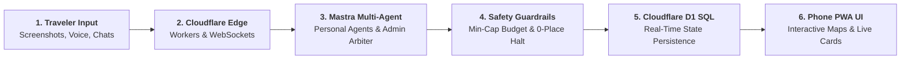

---

### System Architecture Diagram

```mermaid
flowchart TD
  subgraph CLIENT["Client Layer: Phone-First PWA (390px Mobile Viewport)"]
    UI["Nuxt 3 PWA UI<br/>(Vue 3 · Pinia · Tailwind CSS)"]
    MapClient["Leaflet OSM Engine<br/>(<ClientOnly> Interactive Canvas)"]
    RTClient["Realtime WebSocket Client<br/>(Live Chat & Disruption Broadcast)"]
  end

  subgraph EDGE["Cloudflare Edge Runtime (Pages & Workers)"]
    AuthRoute["/api/auth<br/>Session & Identity"]
    ExtractRoute["/api/agent/extract<br/>Photo & Voice Scanner (Zero Forms)"]
    AgentRoute["/api/agent/negotiate<br/>Mastra Multi-Agent Orchestrator"]
    ReplanRoute["/api/agent/replan<br/>1-Hour Delay Rescue Engine"]
    GeoRoute["Photon Geocoding Proxy<br/>(Fuzzy Search Autocomplete)"]
    DebtRoute["/api/money/settle<br/>Who-Owes-Who Debt Simplifier"]
  end

  subgraph MASTRA["Mastra Multi-Agent Engine Layer (@mastra/core)"]
    ExtractAgent["Conversational Extractor Agent<br/>(Natural Chat & Screenshot Intake)"]
    PersonalAgents["Personal Agents (x4)<br/>(Dedicated Agent per Member)"]
    AdminAgent["👑 Admin Agent (Master Arbiter)<br/>(Evaluates Proposals & Issues Final Rulings)"]
    CoordAgent["Coordinator Agent<br/>(0-Place Halt & Allow-List Sequencer)"]
    EvalHarness["Mastra Evaluation Harness<br/>(Automated Guardrail & Regression Tests)"]
  end

  subgraph STORAGE["Cloudflare Edge Storage Layer"]
    D1[(Cloudflare D1 SQL Database<br/>Distributed Serverless Edge Storage)]
  end

  subgraph EXTERNAL["AI Inference & Geocoding Services"]
    LLM["LLM Inference Engine<br/>(Cloudflare Workers AI / Google Gemini)"]
    PhotonAPI["Photon Geocoder<br/>(OpenStreetMap by Komoot)"]
  end

  UI --> AuthRoute
  UI --> ExtractRoute
  UI --> AgentRoute
  UI --> ReplanRoute
  UI --> DebtRoute
  UI --> GeoRoute
  UI --> MapClient
  UI <--> RTClient

  ExtractRoute --> ExtractAgent
  AgentRoute --> PersonalAgents
  PersonalAgents <--> AdminAgent
  AdminAgent --> CoordAgent
  ReplanRoute --> CoordAgent
  CoordAgent <--> EvalHarness

  ExtractAgent --> LLM
  PersonalAgents --> LLM
  AdminAgent --> LLM
  CoordAgent --> LLM
  GeoRoute --> PhotonAPI

  CoordAgent -.->|Strict ID Verification| D1
  ReplanRoute -.->|Preserve Locked Stays| D1
  AuthRoute --> D1
  DebtRoute --> D1
```

---

### Build Plan & Scope

#### In-Scope (What We Build):
- [x] Clean phone-first login with personal travel preferences (pace, dietary restrictions).
- [x] Trip room lifecycle with instant QR code generation, camera scanning, and direct link invite.
- [x] **Conversational Intake (Zero Forms):** Chat naturally with your Personal AI via voice, text, or drop screenshots; automatically parses dates, budget, pace, and wishlists.
- [x] **Autonomous Personal AI per Member:** Dedicated **Mastra** agent per traveler guarding individual budgets, pace, and secret wishlists.
- [x] **Admin Agent (Master Arbiter & Decider):** Centralized room arbitrator that evaluates personal agent proposals, enforces the lowest-budget cap (`min-cap`), and decides authoritative schedule updates.
- [x] OpenStreetMap with Photon fuzzy autocomplete search and direct tap-to-pin coordinate saving.
- [x] **Mastra Coordinator Agent & Safety Harness:** Strict allow-list sequencing, hard 0-place halt safety stop, and automated test checks.
- [x] **Cloudflare Full-Stack Architecture:** Cloudflare Pages & Workers hosting with **Cloudflare D1** serverless distributed SQL database.
- [x] **Pluggable AI Architecture (Choose One):** Selectable between **Option A: Cloudflare Workers AI** (100% native edge, 10,000 free Neurons/day) OR **Option B: Google Gemini 2.5 Flash** (1,500 free requests/day, deep multimodal vision) via a single environment setting (`AI_PROVIDER`).
- [x] Plan Mode (trip preparation) and Trip Mode (live next-stop countdown) states.
- [x] 1-hour delay rescue modal replacing only the disrupted hour while preserving locked flights and hotel stays.
- [x] Zero-form shared bill logging with direct Who-Owes-Who settlement cards (Balance Equalizer).
- [x] Real-time in-room team group chat with place card sharing, live delay alerts, and Admin Agent (`@PlanB`) consensus summarizer.
- [x] Mobile-friendly PWA interface with persistent 6-tab navigation (`Trips · Map · Plan · Money · Chat · You`).

#### Out-of-Scope (Explicit Anti-Features):
- ❌ **Commercial Flight & Hotel Booking APIs:** No live ticket checkouts or flaky booking APIs. Bookings are saved as locked anchor stops.
- ❌ **Unverified Web Auto-Scrapers:** The app never pulls unverified external restaurant lists; it only schedules places you and your friends actually pinned.
- ❌ **Live Currency Speculation:** Expense splitting is based on actual logged receipts, not speculative live foreign exchange scrapers.
