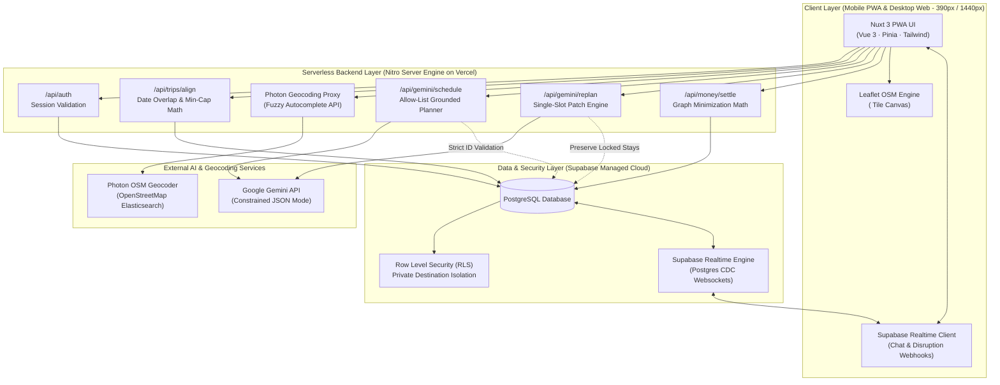

# Plan B by We Are The Champions

**Team:** Tan Poh Zhai, Lee Wai Loong, Yap Chun Hoong, Yap Shern Yu  
**Problem Statement:** Travel Planner  
**Video Presentation:** [Unlisted Youtube Link]  
**Presentation Slides:** [Public Link]  

---

## 1. Project Overview

### The Problem
Trip planning today is fragmented across five disconnected apps and an unstructured group chat: flight confirmations are buried in email, shared budgets rot in Splitwise, day lists sit in Apple Notes, and real-time debates get lost in WhatsApp. 

This fragmentation causes three fundamental organizational breakdowns:
1. **Unstructured Preferences Lost in Chat:** Availability dates, personal budgets, and deal-breakers (雷区) are discussed verbally. Without a structured way to normalize and intersect them, groups compromise upward into overspending or settle on dates that do not work for everyone.
2. **Fragile, Unconstrained AI & Fake Data:** Generic travel bots hallucinate non-existent shops, closed cafes, and fabricated ticket prices, while commercial booking APIs introduce strict rate limits, unexpected checkout failures, and demo fragility.
3. **Single-Point Fragility During the Trip:** When a venue is unexpectedly closed or transit is delayed by 30 minutes, traditional tools force users to manually reshuffle the rest of the multi-day trip, frequently cascading into missed hotel check-ins or abandoned plans.

**Stakeholders:** University students, young working adults, and small friend groups (solo or 2–6 travelers) embarking on short, phone-first weekend or holiday escapes.

**Existing Apps & Why They Fall Short:**
- **Wanderlog / TripIt:** Primarily serve individual corporate travelers or heavy itineraries by parsing email booking confirmations. They are bloated, require paid subscriptions for real collaboration, ignore personal budget ceilings, and provide zero automated mechanisms to patch a single disrupted hour on the fly.
- **Splitwise:** Strictly an accounting tool after expenses occur. It has no integration with daily itinerary slots, meaning groups cannot enforce an upfront budget ceiling before money is spent.
- **Google Maps Lists:** Great for saving bookmarks, but completely static. They do not calculate date overlaps, cannot sequence stops based on group pace, and cannot re-route an afternoon when a plan breaks.

### Our Solution
Plan B is a unified trip workspace and constrained AI agent that coordinates travelers from initial alignment to post-trip settlement—whether traveling solo or with a group. It captures individual preferences, locks the group budget ceiling strictly to the lowest personal cap, and displays a grounded map powered by open-source OpenStreetMap and Photon geocoding without external booking dependencies. During transit, its dedicated Trip Mode tracks stops with live countdowns; if a venue is delayed or skipped, Plan B surgically rewrites only that disrupted time slot while keeping booked flights and hotel stays permanently locked.

#### Core Feature-Set:
1. **Clean Identity & Rooms:** Frictionless Supabase authentication. Solo or group trip rooms that can start completely empty without fake preloaded data.
2. **7-Parameter Preference Form:** Captures destination wishlist, dates, budget cap, travel pace (relaxed/moderate/intense), interests, deal-breakers (雷区), and must-visit spots.
3. **Hidden Destination Privacy Toggle:** A traveler can mark a destination hidden from peers. It never drops a pin on the shared map; only the trip's Gemini agent reads it privately server-side to build surprise options without revealing its name.
4. **Automated Alignment Engine:** System calculates shared date windows, aggregates deal-breakers, locks the group budget ceiling to `min(individual caps)`, and requires group destination confirmation before itinerary generation unlocks.
5. **Grounded Dual-Mode Map:** Displays only public, member-added points. Travelers search places via open-source Photon fuzzy autocomplete or tap the map directly for custom coordinates.
6. **Constrained Gemini Agent:** Scoped strictly to one trip room. Generates itineraries using existing place IDs only; immediately halts if 0 places exist and never hallucinates venues or prices.
7. **Dual Operating Modes:** Clean separation between **Plan Mode** (pre-trip alignment & scheduling) and **Trip Mode** (on-the-ground live execution & countdowns).
8. **Single-Slot Replan (Core Innovation):** Marking a delay or cancellation rewrites *only* that single affected time slot using available places, while booked hotel stays and flights remain permanently locked.
9. **Itinerary-Tied Debt Ledger:** Expenses are logged directly against specific itinerary items, calculating a minimal-transaction "who owes whom" debt graph.
10. **Real-time Team Group Chat:** In-room chat powered by Supabase Realtime where members discuss plans, share place cards, and receive automated system event alerts (delays, replans, expense logs).
11. **Cross-Platform Interface:** 390px mobile-first PWA with a 6-tab persistent bottom bar (`Trips · Map · Plan · Money · You · Chat`) and a responsive 3-column desktop web command center.

---

## 2. Ideation & Process

### 2.1 Ideas We Considered

| Idea | Status | Why it was Kept / Dropped |
| :--- | :--- | :--- |
| **A. Plan B Grounded Collaborative Workspace (Chosen)** | **Kept (Chosen)** | Directly solves the root organizational gap: replaces 5 fragmented tools with one trusted record for people, money, and days. Constrained Gemini agent schedules only member-added places, eliminating AI hallucinations and brittle booking API failures while delivering surgical single-slot replanning. |
| **B. Grounded Dual-Mode Map: Photon Search + Tap-to-Pin (Chosen)** | **Kept (Chosen)** | Combines open-source Photon geocoding (OpenStreetMap data) for fast, free-text fuzzy autocomplete with direct map tapping for custom points. Provides a responsive, 100% reliable mapping experience with zero external booking dependencies. |
| **C. Real-time Team Group Chat with Event Feed (Chosen)** | **Kept (Chosen)** | Consolidates trip communication inside the room via Supabase Realtime. Eliminates switching to external messaging apps by allowing members to share place cards and receive automated broadcast notifications whenever a slot is replanned or an expense is logged. |
| **D. All-in-One Booking Super-App with Live Flight/Hotel APIs** | **Dropped** | Commercial booking APIs impose rigid rate limits, high quota costs, and frequent checkout error states. Group travelers book accommodations individually or outside apps anyway; building checkout flows introduces fake availability and brittle failure modes. |
| **E. Conversational Free-Form Travel Chatbot** | **Dropped** | Unconstrained LLMs generate generic, hallucinated tourist itineraries with fake venue names, inaccurate pricing, and zero awareness of real group constraints or lowest-budget ceilings. |
| **F. Strict Public Nominatim Geocoder** | **Dropped** | Public Nominatim enforces a strict 1 request/second fair-use rate limit which breaks real-time search-as-you-type autocomplete and often misplaces pins for informal local venue names. Replaced by Photon. |

### 2.2 Ideation Boards & Separate Functional Diagrams
To keep this project overview readable, all system architecture models and functional flows have been organized into separate, dedicated engineering diagrams. 

- Full diagram source code & technical documentation: [docs/ideation.md](docs/ideation.md)
- Standalone interactive visual previewer (renderable in any browser for slides & reviews): [docs/diagrams.html](docs/diagrams.html)

#### Summary of Separate Functional Diagrams:
1. **Problem Tree:** Traces three root organizational failures through the single trusted trip record gap to downstream failure modes.
2. **System Use Case Diagram:** Formal UML boundary mapping 18 distinct use cases across Traveler, Room Owner, and Trip-Scoped Gemini Agent.
3. **End-to-End Activity Diagram:** 4-swimlane workflow spanning Traveler actions, System Engine calculations, Gemini execution, and Money settlement.
4. **Alignment & Destination Lock Flow:** Demonstrates automated date intersection, `min(caps)` budget ceiling enforcement, and prerequisite destination lock.
5. **Hidden Destination Privacy & Data Flow:** Shows cryptographic/RLS isolation ensuring private destinations never drop map pins or get exposed by Gemini.
6. **Grounded Dual-Mode Map Engine:** Illustrates Photon fuzzy search geocoding and tap-to-pin coordinate handling on OpenStreetMap tiles.
7. **Constrained Gemini Guardrail Flow:** Detail of the server-side validator enforcing place ID allow-lists and the 0-place halt guardrail.
8. **Trip Mode & Single-Slot Replan Flow:** Step-by-step logic of flagging a delay, preserving locked stays/flights, and patching only the disrupted hour.
9. **Who-Owes-Whom Debt Graph Engine:** Flow showing how itemized expenses generate a minimal-transaction debt settlement matrix.
10. **Real-time Team Group Chat & Broadcast Flow:** Supabase Realtime channel architecture for chat messages, place card shares, and trip alerts.
11. **14-Screen End-to-End User Flow:** Complete screen-by-screen state progression from Splash to Single-Slot Replan.
12. **8-Pillar System Mindmap:** Comprehensive topology mapping the complete Plan B product architecture.

### 2.3 Mentor Consultation

| Date | Mentor | Feedback Received | What Was Changed |
| :--- | :--- | :--- | :--- |
| `[Session 1]` | `[Mentor Name]` | *Feedback on scoping, grounding, or feasibility will be recorded here.* | *Corresponding architectural or UI changes.* |
| `[Session 2]` | `[Mentor Name]` | *Feedback on presentation, user flow, or edge cases will be recorded here.* | *Corresponding refinements made to submission.* |

---

## 3. Design & Prototype

**UI Prototype:** [ Public Link ]

### Key Screens & User Interactions

1. **Screen 03: Trip Home & Alignment Hub**
   - *Interaction:* Acts as the collaborative command center. Displays the 4/4 member submission progress bar, the computed overlapping date window (`Oct 12–15`), the locked group budget ceiling (`RM 450/pax`, strictly derived from the lowest individual cap), and the green destination confirmation lock. Features a prominent toggle between Plan Mode and Trip Mode.
2. **Screen 04: Preference Form & Hidden Destination Privacy Toggle**
   - *Interaction:* Structured 7-point intake form. Travelers enter their dates, budget ceiling, pace pills, and deal-breakers. Activating the "Hide destination from group" switch isolates the destination: it never renders on peers' maps, passes secretly to Gemini server-side, and is strictly shielded from being named.
3. **Screen 05: Grounded Dual-Mode Map**
   - *Interaction:* Interactive Leaflet OSM map showing member-added public pins (1–6). Travelers type in the top Photon search bar for instant fuzzy autocomplete to auto-center and pin venues, or tap directly on the map canvas to drop custom coordinates. Selecting a pin slides up a bottom drawer with venue details and an "+ Add to Pool" button.
4. **Screen 06: Day-by-Day Grounded Itinerary**
   - *Interaction:* Chronological timeline constructed strictly from member-added place IDs. Shows arrival times, venue tags, and walk/drive transit estimates. Crucially, booked flights and hotel check-ins are badged with a green lock icon: `🔒 Locked Stay (Never moved by replan)`.
5. **Screen 07: Live Trip Mode & Next Stop Countdown**
   - *Interaction:* On-the-ground execution screen. Features a live pulsating status dot, an arrival countdown card (*"NEXT STOP IN 28 MINS: Peranakan Mansion"*), a quick "+ Log Expense" button, and two prominent disruption buttons: `[ ⚠️ Delayed (+30m) ]` and `[ ❌ Cannot Go / Skip ]`.
6. **Screen 12: Single-Slot Replan Modal (The Plan B Twist)**
   - *Interaction:* Triggered instantly when a stop is marked delayed or skipped. Highlights the disrupted time slot in red, displays a prominent green banner confirming locked hotel/flight bookings are 100% protected, and presents 3 alternative replacements sourced strictly from existing member places. Tapping "Confirm Patch" rewrites only that slot.
7. **Screen 08: Money & Debt Ledger**
   - *Interaction:* Transparent financial tracking. Displays a top budget gauge showing current per-person spend against the locked group ceiling. Below, the Who-Owes-Whom settlement matrix presents minimal peer-to-peer transaction cards (*"Bob owes Alex RM 15.00"* with a `[ Mark Paid ]` button), resolving group debts without separate accounting apps.
8. **Screen 13: Real-Time Team Group Chat**
   - *Interaction:* Dedicated in-room messaging tab (`Chat` on the far right of the 6-tab bottom bar). Team members discuss ideas in real time, share interactive place cards directly into the message feed, and receive automatic system broadcast banners whenever a slot is replanned or a new expense is logged.

---

## 4. What Makes It Different

| Evaluation Dimension | Traditional Travel Apps (Wanderlog, TripIt) | Group Chat + Splitwise | Generic Travel AI Bots | **Plan B (Our Solution)** |
| :--- | :--- | :--- | :--- | :--- |
| **Itinerary Construction** | Manual email parsing or static lists | None; fragmented text in notes | Unconstrained hallucinated venues & fake prices | **Sequenced strictly from real member-added place IDs** |
| **Group Preference Alignment** | Weak; assumes one person plans everything | Endless unstructured debates in chat | Single-user prompt; no group context | **Structured 7-point form + automated overlap engine** |
| **Budget Enforcement** | Passive cost display; ignores caps | Retroactive accounting after overspending | Ignores budgets or invents fake costs | **Upfront group ceiling locked to lowest individual cap** |
| **Surprise / Private Wishlists** | Non-existent; everything is public | Leaked immediately in group chat | N/A | **Hidden destination toggle (server-side Gemini isolation)** |
| **Mid-Trip Disruption Response** | Manual multi-day rescheduling | Panic in chat; manual reshuffling | Re-generates entire itinerary from scratch | **Surgical single-slot replan (preserves locked stays/flights)** |
| **Expense Settlement** | Requires paid tier or external app | Separate app disconnected from agenda | None | **In-room debt graph tied directly to itinerary items** |
| **Team Communication** | External (WhatsApp / Telegram) | Fragmented across chat history | Single-player chatbot session | **In-room group chat with live itinerary broadcast** |

### Novel Features & The Architectural Twist:
1. **The Lowest-Cap Ceiling (`min(individual caps)`):** Most group trips overspend because the highest-budget member dominates. Plan B programmatically locks the group ceiling to the lowest member cap, ensuring travel remains accessible to everyone in the group.
2. **Hidden Destination Privacy:** Solves peer friction when planning surprises or sensitive destinations. A member can propose a destination without exposing it on the shared map; Gemini factors it in secretly while being strictly forbidden from naming it.
3. **The Constrained Gemini Guardrail:** The AI is not an open-ended writer; it is an itinerary optimizer restricted to an allow-list of member place IDs. If zero places exist, it immediately halts. It is architecturally prevented from inventing fake restaurants or prices.
4. **Surgical Single-Slot Replanning:** When travel disruptions happen, travelers do not need to rewrite the entire trip. Plan B isolates the single broken hour, evaluates candidate replacements from the existing place pool, and patches only that slot—keeping booked flights and hotel reservations permanently locked.

---

## 5. Technical Architecture & Feasibility

### Tech Stack

| Layer | Technology Chosen | Why We Chose It | Constraints & How We Address Them |
| :--- | :--- | :--- | :--- |
| **Frontend Framework** | **Nuxt 3 (Vue 3, TypeScript)** | Full-stack Vue ecosystem, native `<ClientOnly>` wrappers for client-side Leaflet rendering, auto-imports, and first-class PWA support via `@vite-pwa/nuxt`. | SSR hydration mismatch with browser-only Leaflet maps. Resolved cleanly using Nuxt's `<ClientOnly>` component boundary. |
| **Backend / Server Engine** | **Nitro Engine (Nuxt 3 Server Handlers)** | Zero-config, ultra-fast serverless route handlers deployed natively to Vercel with minimal cold-start times. | Stateless execution prevents persistent background timers. Handled by reactive client webhooks and Supabase Realtime subscriptions. |
| **Database & ORM** | **Supabase (PostgreSQL) + Drizzle ORM** | Drizzle offers pure TypeScript schema definitions with zero Rust/engine binaries, ensuring instant serverless cold starts. Supabase provides managed Postgres, Row Level Security (RLS), and Realtime websockets. | Connection pooling limits in serverless. Addressed by utilizing Supabase's transaction connection pooler on port 6543. |
| **Realtime Services** | **Supabase Realtime** | Native PostgreSQL change-data-capture websockets for instant chat messaging, shared map pin updates, and live replan broadcast. | Free-tier concurrent websocket connections. Sufficient for hackathon multi-user demo rooms; channels are scoped per trip room ID. |
| **AI Engine** | **Google Gemini (Trip-Scoped)** | High context efficiency, rapid JSON structured outputs, and excellent adherence to strict system instructions. | Potential LLM hallucination. Addressed by enforcing a server-side JSON schema validator that rejects any response containing place IDs outside the trip's allowed pool. |
| **Mapping & Geocoding** | **Leaflet + OpenStreetMap + Photon** | 100% open-source mapping stack. Leaflet provides smooth tile rendering; Photon (by Komoot on OSM data) provides fuzzy autocomplete without API keys or commercial rate limits. | Photon fair use and coverage edge cases. Mitigated by allowing direct map tapping to drop precise latitude/longitude coordinates anywhere. |
| **Hosting & Deployment** | **Vercel + Supabase Cloud** | Global edge network with zero server maintenance, automated CI/CD from GitHub, and production HTTPS out of the box. | Serverless function timeout limits (10s on hobby). Gemini and Drizzle queries execute within 1.5–2.5s, well within thresholds. |

### System Architecture Diagram

### Build Plan & Scope

To ensure 100% technical feasibility, the scope for the build phase is strictly bounded:

#### In-Scope (What We Plan to Build):
- [x] Full authentication flow with personal travel defaults (pace, dietary restrictions, friends entry).
- [x] Solo and group trip room lifecycle with instant link sharing (no mutual friending required).
- [x] 7-parameter preference submission form with the "Hidden Destination" privacy toggle.
- [x] System alignment engine computing date intersections, deal-breaker clashes, and group budget ceiling (`min(individual caps)`).
- [x] Interactive Leaflet OSM map with Photon fuzzy search autocomplete and direct tap-to-pin coordinate saving.
- [x] Server-side Gemini itinerary sequencing constrained to existing place IDs, with a hard halt guardrail if 0 places exist.
- [x] Plan Mode (preparation) and Trip Mode (live next-stop countdown) state machine.
- [x] Surgical Single-Slot Replan modal replacing only the disrupted hour while preserving locked flights and hotel stays.
- [x] Itinerary-tied expense logging with automated who-owes-whom debt graph calculation.
- [x] Real-time in-room team group chat powered by Supabase Realtime with place card sharing and live disruption broadcast.
- [x] Mobile-first PWA interface (6 bottom tabs: `Trips · Map · Plan · Money · You · Chat`) responsive to desktop web.

#### Out-of-Scope (Explicit Anti-Features):
- ❌ **Commercial Flight & Hotel Booking APIs:** No live ticket checkouts or dynamic inventory scrapers. Bookings are represented as user-entered, locked anchor items.
- ❌ **Mock Demo Seed Data:** No pre-seeded fake users, sample trips, or canned venue reviews; the app operates entirely on user-entered data.
- ❌ **Nearby Auto-Scrapers:** The app never pulls unverified external restaurant lists; it schedules only venues intentionally added by travelers.
- ❌ **Dynamic Currency Fare Speculation:** Expense splitting is based on actual logged receipts, not speculative live foreign exchange scrapers.

---

## Team

**We Are The Champions**

- Tan Poh Zhai
- Lee Wai Loong
- Yap Chun Hoong
- Yap Shern Yu

*Track: Lifestyle · Planning an Escape*  
*Submission: Plan B*  
*Video file / YouTube title: `We Are The Champions — Plan B — Planning an Escape`*
