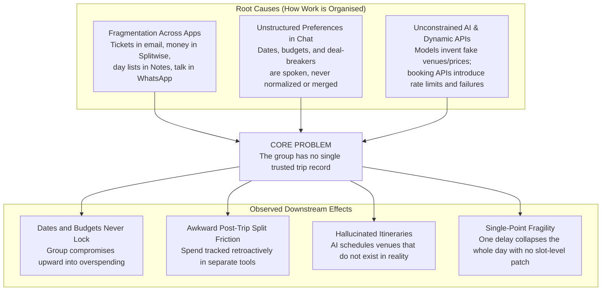
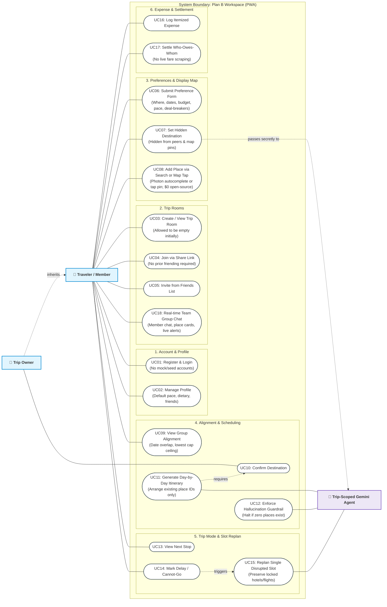
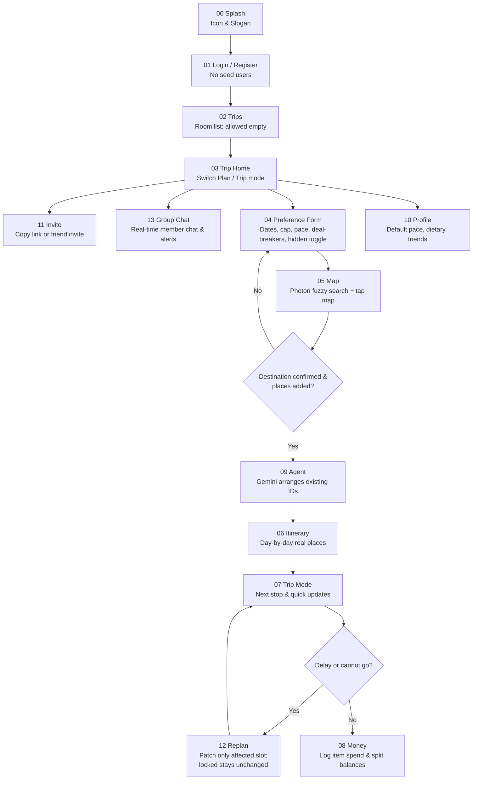
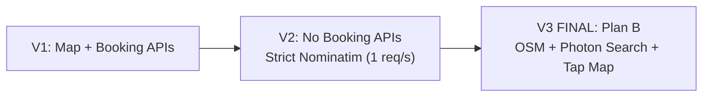
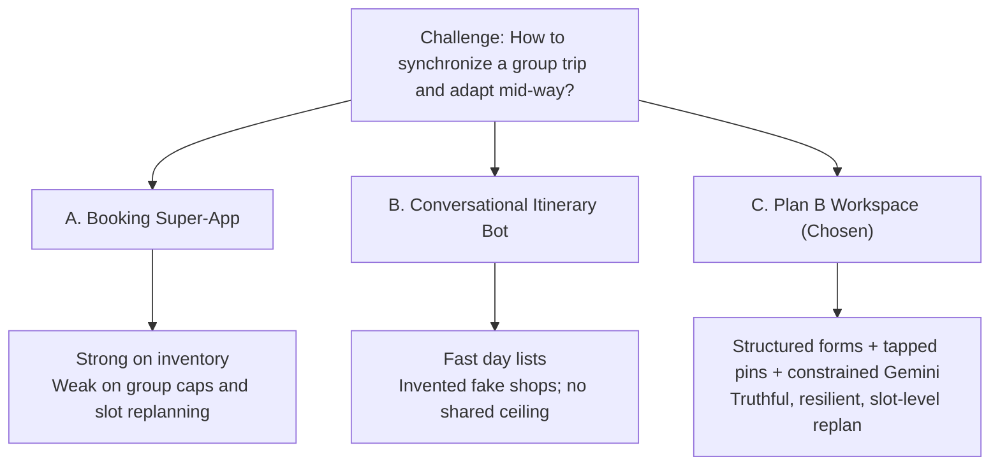
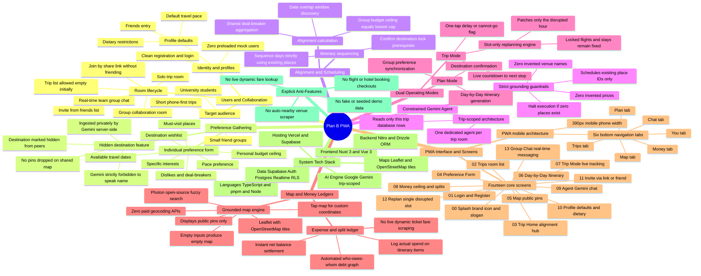

# Plan B — Ideation & System Architecture (Mermaid)

**Team:** We Are The Champions
**Track:** Lifestyle · Planning an Escape
**Slogan:** When plan A fails, Plan B saves the trip.

This document serves as the central ideation asset for the Plan B public GitHub repository. All diagrams are natively rendered in GitHub Flavored Markdown via Mermaid. For slides, pitch decks, and visual exports, open [diagrams.html](diagrams.html) in any browser.

---

## 1. Problem Tree

**Logic:** Three root organizational failures combine into one core breakdown: **the lack of a single trusted trip record**. This single gap causes all downstream symptoms that judges and travelers know well: overspending, unaligned schedules, hallucinated/fake venues, and total trip collapse after a minor delay.



| Layer | Component | Deep Rationale |
| --- | --- | --- |
| **Root Cause** | Fragmentation across apps | Bookings, shared money, and daily agendas never live in one shared state, forcing manual human synchronization. |
| **Root Cause** | Preferences lost in chat | Availability windows, budget ceilings, and hard deal-breakers are discussed informally, making automated alignment impossible. |
| **Root Cause** | Unconstrained AI & fragile APIs | Allowing an LLM to invent venues or relying on live booking APIs creates broken schedules and demo fragility. |
| **Core Problem** | **No single trusted trip record** | No participant can point to one authoritative ground truth for people, dates, budget ceiling, map pins, and schedule rows. |
| **Effect** | Endless negotiation & overspend | Without a computed group ceiling (minimum individual cap), groups default to the highest spender's wishes. |
| **Effect** | Post-trip settlement friction | Disconnected receipts produce awkward calculations days after returning home. |
| **Effect** | Fake shops and hallucinated venues | Itineraries look full on paper but fail on the ground. |
| **Effect** | Domino-effect trip failure | A missed train or closed cafe breaks the entire remaining schedule because there is no mechanism to patch just that hour. |

---

## 2. Use Case Diagram

**Logic:** Represents the complete behavioral boundary of the Plan B PWA. It distinguishes between standard **Traveler / Members**, the **Trip Owner**, and the autonomous, trip-scoped **Gemini Agent**.



| Use Case ID | Name | Actor(s) | Preconditions & Business Rules |
| --- | --- | --- | --- |
| **UC01** | Register & Login | Traveler | Clean user authentication via Supabase Auth. Zero pre-seeded or fake users. |
| **UC02** | Manage Profile | Traveler | Sets personal defaults for travel pace, dietary requirements, and access to friends. |
| **UC03** | Create / View Room | Traveler | Can create solo trips or group rooms. Trips list is allowed to be empty initially. |
| **UC04** | Join via Share Link | Traveler | Anyone with the link can join; mutual friending is explicitly not required. |
| **UC05** | Invite from Friends | Traveler | Pulls from the user's friend connection list. |
| **UC06** | Submit Preference Form | Traveler | Submits destination wish, date window, budget ceiling, pace, interests, deal-breakers, and must-visits. |
| **UC07** | Set Hidden Destination | Traveler | Destination toggle hides the place from peers and map display. Only Gemini reads it server-side. |
| **UC08** | Add Place (Search / Tap) | Traveler | Search places with free Photon fuzzy autocomplete (OSM) or click map to drop custom pin. $0 cost, zero API keys. |
| **UC09** | View Group Alignment | Traveler | Shows computed date overlaps, the group budget ceiling (`min(individual caps)`), and deal-breakers. |
| **UC10** | Confirm Destination | Trip Owner / Group | Prerequisite: Destination must be locked before daily itinerary generation is unlocked. |
| **UC11** | Generate Itinerary | Gemini Agent | Sequences member-added place IDs into days. Gemini is forbidden from inventing place names or prices. |
| **UC12** | Enforce Guardrail | Gemini Agent | If zero member-added places exist, agent halts immediately and asks members to add places. |
| **UC13** | View Next Stop | Traveler | Displays current stop, arrival time, and countdown in Trip Mode. |
| **UC14** | Mark Delay / Cannot-Go | Traveler | Flags a specific itinerary slot as disrupted during transit. |
| **UC15** | Replan Single Slot | Gemini Agent | Rewrites *only* the affected time block using remaining valid place IDs. Locked stays and flights remain fixed. |
| **UC16** | Log Itemized Expense | Traveler | Logs actual spend tied directly to an itinerary item. |
| **UC17** | Settle Who-Owes-Whom | Traveler | Computes debt graph and splits without dynamic ticket lookup. |
| **UC18** | Team Group Chat | Traveler | Real-time chat powered by Supabase Realtime; share place cards, discuss plans, and receive live system disruption notices. |

---

## 3. Activity Diagram

**Logic:** Swimlane activity diagram mapping the end-to-end lifecycle across the **Traveler**, the **Plan B System Engine**, and the **Trip-Scoped Gemini Agent**, highlighting guardrails, hidden destination isolation, and single-slot replanning.

```mermaid
flowchart TD
  subgraph MEMBER["👤 Traveler / Trip Member"]
    Start(["Start"]) --> Auth["Login / Register<br/>(No seed users)"]
    Auth --> Profile["Update Profile Defaults<br/>(Pace, Dietary, Friends list)"]
    Profile --> RoomAction{"Create or Join Trip?"}
    RoomAction -->|Create Solo or Group| Create["Create Empty Trip Room"]
    RoomAction -->|Join via Share Link| JoinLink["Join Trip via Link<br/>(No prior friendship required)"]
    RoomAction -->|Join via Friend Invite| JoinFriend["Accept Friend Invite"]

    Create --> FillPrefs["Submit Member Preference Form<br/>(Where, dates, budget cap, pace,<br/>interests, deal-breakers, must-visit)"]
    JoinLink --> FillPrefs
    JoinFriend --> FillPrefs

    FillPrefs --> HideToggle{"Hide Destination?"}
    HideToggle -->|Yes| MarkHidden["Toggle 'Hide from members'<br/>(Omitted from shared map pins)"]
    HideToggle -->|No| MarkPublic["Keep Destination Public"]

    MarkHidden --> AddPlace["Add Place: Search via Photon<br/>OR Tap Map for Custom Pin"]
    MarkPublic --> AddPlace

    AddPlace --> CheckAlign["Review Group Alignment Dashboard"]
  end

  subgraph SYSTEM["⚙️ Plan B System Engine"]
    CheckAlign --> RunAlign["Compute Alignment Metrics:<br/>1. Find date overlap windows<br/>2. Budget ceiling = lowest individual cap<br/>3. Aggregate shared deal-breakers"]
    RunAlign --> DestConfirm{"Destination Confirmed<br/>by Group?"}
    DestConfirm -->|No| CheckAlign
    DestConfirm -->|Yes| ValidatePlaces{"Member-Added Place IDs > 0?"}
  end

  subgraph GEMINI["🤖 Trip-Scoped Gemini Agent"]
    ValidatePlaces -->|No| Halt["STOP SCHEDULING<br/>(Zero fake venues or prices invented.<br/>Prompts members to add places)"]
    Halt -.-> AddPlace

    ValidatePlaces -->|Yes| IngestData["Ingest Trip Data Server-Side:<br/>- Allowed place IDs<br/>- Hidden destination (Secretly)<br/>- Group budget cap & Pace"]
    IngestData --> ScheduleDays["Generate Day-by-Day Itinerary<br/>(Restricted to existing place IDs;<br/>NEVER reveals hidden destination name)"]
  end

  subgraph TRIP_MONEY["🚀 Trip Execution & Expense Settlement"]
    ScheduleDays --> SwitchTrip["Switch to Trip Mode"]
    SwitchTrip --> NextStop["Display Next Stop & Countdown"]

    NextStop --> EventCheck{"Trip Status"}
    EventCheck -->|Normal Progress| LogSpend["Log Actual Expense<br/>on Itinerary Item"]
    EventCheck -->|Disruption Occurs| MarkIssue["Mark Slot: Delay / Cannot Go"]

    MarkIssue --> LockTrip["Lock Remaining Itinerary:<br/>Flights & booked stays untouched"]
    LockTrip --> ReplanSlot["Gemini: Replan ONLY Disrupted Slot<br/>using available valid place IDs"]
    ReplanSlot --> NextStop

    LogSpend --> DebtCalc["Calculate Debt Graph:<br/>Settle who owes whom (No live fares)"]
    DebtCalc --> EndTrip(["Trip Complete & Settled"])
  end
```



| Lifecycle Phase | Key Actions & System Enforcement | Failure / Boundary Handling |
| --- | --- | --- |
| **1. Identity & Rooms** | Clean auth; empty room creation or link-based join. | No mock data seeded; link requires no prior friendship. |
| **2. Preference Input** | Members submit 7-point form; can mark destination hidden. | Hidden destination is never rendered as a pin on peers' maps. |
| **3. Alignment Calculation** | System calculates overlap window and minimum personal budget cap. | Daily scheduling blocked until destination is formally confirmed. |
| **4. Gemini Scheduling** | Ingests allowed place IDs server-side + hidden destination. | **Hard Stop:** If 0 place IDs exist, agent halts immediately. Never invents shops. |
| **5. Trip Mode Execution** | Displays next stop and active timeline. | Clean UI separation between planning and live execution. |
| **6. Mid-Trip Replan** | Member flags delay or cancellation on an active slot. | **Slot-only replanning:** Locked stays and flights are strictly preserved. |
| **7. Money & Split** | Expenses logged directly on itinerary items. | Offline math computes debt graph; no live fare scraping. |

---

## 4. User Flow

**Logic:** Strict sequential flow across all 14 screens. Users cannot trigger Gemini generation until destination is confirmed and real places exist.



Bottom navigation tabs (always accessible): **Trips · Map · Plan · Money · You · Chat** (Chat positioned to the right of You)

---

## 5. Idea Evolution

**Logic:** Each pivot deliberately removed a **source of untrue data**. Product guardrails (no fake pins, no invented shops, no live fares) are the deliberate outcome of this architectural progression.



| Architecture | What We Explored | Why It Failed / Was Discarded | Source of Untrue Data Removed |
| --- | --- | --- | --- |
| **V1** | Integrated live flight, hotel, and attraction booking APIs | API keys fail, rate limits hit, and failure modes produce fake prices and broken demo flows. | In-app ticket checkout, dynamic live fares, fake availability counters. |
| **V2** | Free-text search geocoded via public Nominatim / Google Places | Public Nominatim enforces 1 req/s, fails on informal names, and drops pins in the wrong country. | Unreliable commercial geocoding APIs and misplaced coordinate pins. |
| **V3 (Final)** | User searches via **open-source Photon (OSM autocomplete)** or **taps map** for custom spots. Gemini schedules **only existing place IDs**. | User-friendly search without paying for Google Maps; zero API breakage; 100% truthful data under hackathon conditions. | Hallucinated shops, invented venue names, seed cities, fake reviews. |

V3 stack: Nuxt 3 PWA, Vue 3, Drizzle ORM, Nitro server engine, pnpm, Node, Supabase Auth/Postgres/RLS, Google Gemini, Leaflet + OSM tiles + Photon fuzzy geocoder (`<ClientOnly>`).

---

## 6. Alternative Ideas Comparison

**Logic:** Evaluated three distinct paradigms for the hackathon brief. Idea C (Plan B Workspace) was selected because it directly solves the organizational gap without relying on fragile external data.



| Evaluation Criteria | A. Booking Super-App | B. Conversational Itinerary Bot | **C. Plan B Workspace (Chosen)** |
| --- | --- | --- | --- |
| **Core Job** | Purchase flights and hotel stays | Generate full travel text from a prompt | Maintain one trusted record, then rearrange it |
| **Data Source** | Live commercial booking APIs | LLM parametric weights | Member preference forms + tapped map pins |
| **Group Sync** | Poor (individual checkout only) | None (single-user chat session) | **Native** (Solo or group, join by link) |
| **Budget Handling** | Shows price per item; ignores caps | Ignores collective financial constraints | **Strict ceiling** (`min(individual caps)`) |
| **Disruption Replan** | Start inventory search over again | Regenerates entire multi-day prompt | **Patches only the single affected slot** |
| **Data Honesty** | Fragile API failure modes | High rate of hallucinated shops & places | **Zero hallucinations** (hard halt if 0 places) |
| **Hackathon Viability** | High quota cost, brittle live demo | Looks neat, breaks on inspection | **100% buildable, reliable, and truthful** |

---

## 7. Mindmap

**Logic:** High-density, fully validated Mermaid mindmap capturing the complete Plan B system topology across 8 cohesive structural pillars: Users & Collaboration, Preference Gathering, Alignment & Scheduling, Constrained Gemini Agent, Dual Operating Modes, Map & Money Ledgers, PWA Interface & Screens, and Explicit Anti-Features.



### Mindmap Pillar Summary

```text
Plan B System Topology
├── 1. Users & Collaboration: Students & friends | Solo or group | Real-time chat | Link join (no friending) | Clean auth
├── 2. Preference Gathering: 7-point form | Hidden destination (no map pin, Gemini reads privately)
├── 3. Alignment & Scheduling: Date overlaps | Budget ceiling = min(caps) | Destination lock prerequisite
├── 4. Constrained Gemini Agent: Scoped to single trip | Existing place IDs only | Stop on 0 places | Zero fake shops
├── 5. Dual Operating Modes: Plan Mode (align/schedule) | Trip Mode (next stop, delay flag, single-slot replan, stay lock)
├── 6. Map & Money Ledgers: Photon search + tap-to-pin ($0 OSM) | Itemized spend | Debt graph who-owes-whom (no live fares)
├── 7. PWA Interface & Screens: 390px mobile layout | 6 bottom tabs (Trips, Map, Plan, Money, You, Chat) | 14 screens (00-13)
├── 8. System Tech Stack: Nuxt 3 + Vue 3 | Nitro Server | Drizzle ORM | Supabase (RLS, Realtime) | Gemini | Leaflet OSM
└── 9. Explicit Anti-Features: No seed users/trips | No booking checkout APIs | No auto venue scraping | No dynamic fares
```
